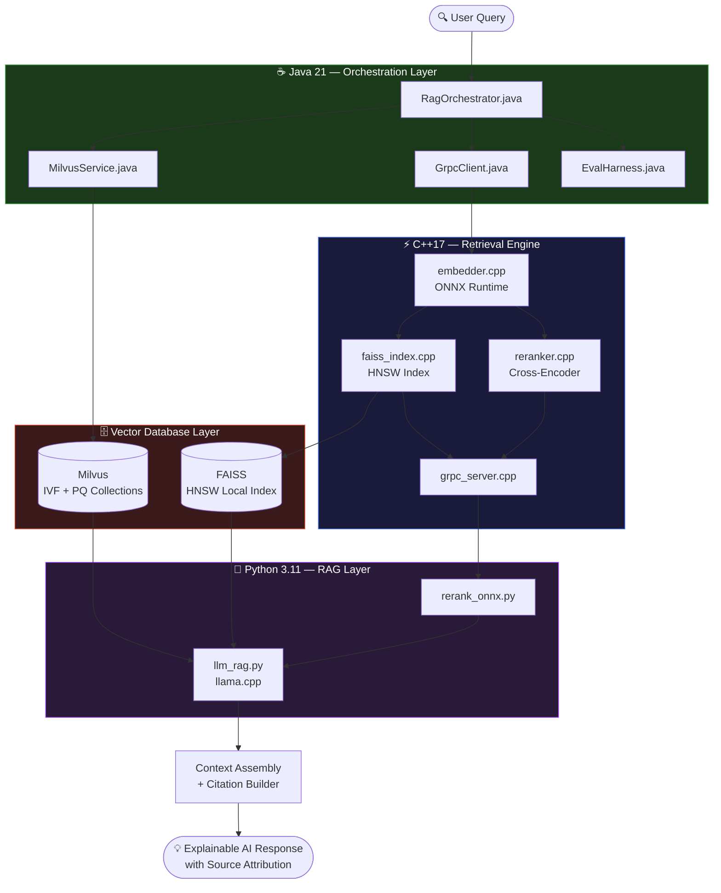
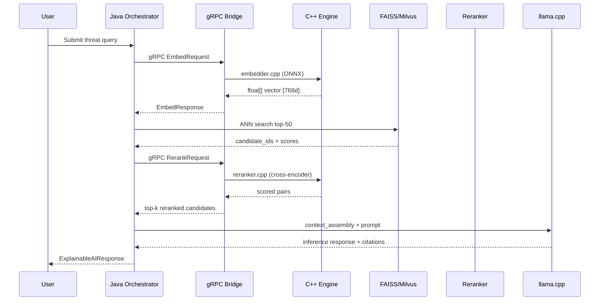
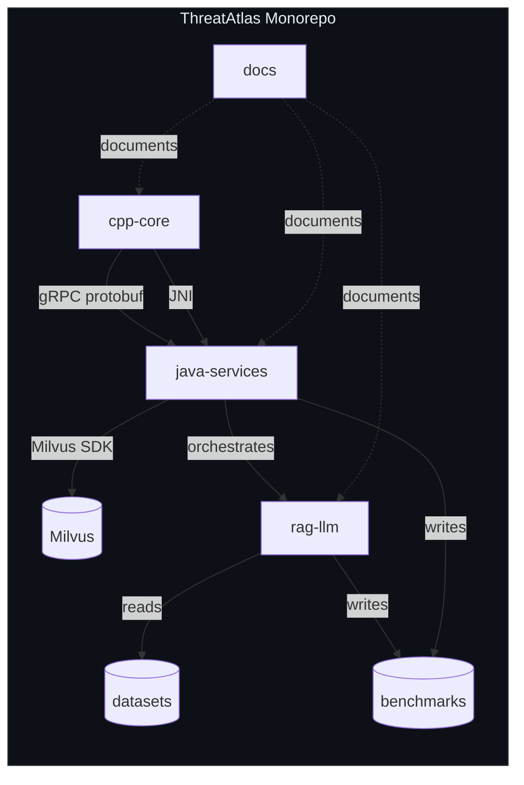
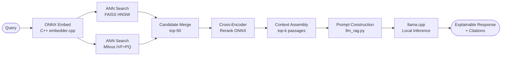
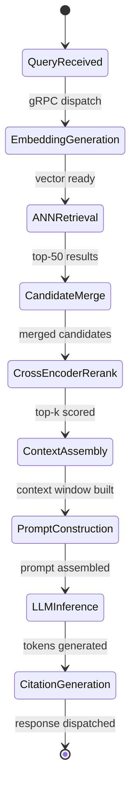

<!-- ============================================================
     THREATATLAS — AI-Native Threat Intelligence & Retrieval Infrastructure
     Designed & Engineered by Kunjkumar Savani
     ============================================================ -->

<div align="center">

```
████████╗██╗  ██╗██████╗ ███████╗ █████╗ ████████╗ █████╗ ████████╗██╗      █████╗ ███████╗
╚══██╔══╝██║  ██║██╔══██╗██╔════╝██╔══██╗╚══██╔══╝██╔══██╗╚══██╔══╝██║     ██╔══██╗██╔════╝
   ██║   ███████║██████╔╝█████╗  ███████║   ██║   ███████║   ██║   ██║     ███████║███████╗
   ██║   ██╔══██║██╔══██╗██╔══╝  ██╔══██║   ██║   ██╔══██║   ██║   ██║     ██╔══██║╚════██║
   ██║   ██║  ██║██║  ██║███████╗██║  ██║   ██║   ██║  ██║   ██║   ███████╗██║  ██║███████║
   ╚═╝   ╚═╝  ╚═╝╚═╝  ╚═╝╚══════╝╚═╝  ╚═╝  ╚═╝   ╚═╝  ╚═╝   ╚═╝   ╚══════╝╚═╝  ╚═╝╚══════╝
```
 
### **AI-Native Threat Intelligence & Retrieval Infrastructure**

*Hybrid RAG · ANN Vector Search · Explainable AI · Local-First Inference*

---


</div>

---

## Table of Contents

| # | Section |
|---|---------|
| 1 | [Vision & Philosophy](#1-vision--philosophy) |
| 2 | [System Architecture Overview](#2-system-architecture-overview) |
| 3 | [Repository Structure](#3-repository-structure) |
| 4 | [Core Features](#4-core-features) |
| 5 | [Technology Stack](#5-technology-stack) |
| 6 | [Retrieval Pipeline](#6-retrieval-pipeline) |
| 7 | [Vector Search Infrastructure](#7-vector-search-infrastructure) |
| 8 | [RAG Orchestration](#8-rag-orchestration) |
| 9 | [Performance & Benchmarks](#9-performance--benchmarks) |
| 10 | [Local Development Setup](#10-local-development-setup) |
| 11 | [Quick Start](#11-quick-start) |
| 12 | [Docker & Deployment](#12-docker--deployment) |
| 13 | [Evaluation Infrastructure](#13-evaluation-infrastructure) |
| 14 | [Roadmap](#14-roadmap) |
| 15 | [Documentation Hub](#15-documentation-hub) |
| 16 | [Contributing](#16-contributing) |
| 17 | [Contact](#17-contact) |

---

## 1. Vision & Philosophy

> *"ThreatAtlas is not a search tool. It is an intelligence substrate — a retrieval-native reasoning layer built for the demands of modern AI-driven security operations."*

### Why ThreatAtlas Exists

Conventional threat intelligence systems treat retrieval as an afterthought — bolted onto relational databases or keyword-indexed corpora. ThreatAtlas inverts this premise entirely. It is architected from the ground up as a **retrieval-first, inference-native** platform where every subsystem — from the C++ embedding engine to the Java orchestration layer — is designed to serve one goal: **surfacing the most relevant, explainable intelligence at sub-hundred-millisecond latency**.

### Core Engineering Philosophy

| Principle | Implementation |
|-----------|---------------|
| **Retrieval over Generation** | Hybrid RAG ensures every LLM response is grounded in retrieved, attributed context |
| **Explainability First** | Citation pipelines trace every inference claim back to a source document |
| **Local-First Deployment** | llama.cpp + ONNX Runtime eliminate cloud inference dependencies |
| **Polyglot Precision** | C++17 for compute-critical paths, Java 21 for orchestration, Python for ML workflows |
| **ANN at the Core** | FAISS HNSW and Milvus IVF+PQ power sub-millisecond approximate nearest neighbour retrieval |
| **Modular Architecture** | Each subsystem is independently deployable, testable, and replaceable |

---

## 2. System Architecture Overview

### High-Level Architecture Diagram



### Request Lifecycle Sequence



---

## 3. Repository Structure

```
ThreatAtlas/
├── .github/
│   └── workflows/
│       ├── ci-cpp.yml          ← C++ build, test, lint
│       ├── ci-java.yml         ← Maven test + integration
│       └── ci-python.yml       ← pytest + eval validation
│
├── cpp-core/                   ← C++17 · CMake · ONNX · FAISS
│   ├── src/
│   │   ├── embedder.cpp        ← ONNX sentence encoder (SIMD-optimized)
│   │   ├── faiss_index.cpp     ← HNSW index build + ANN query
│   │   ├── reranker.cpp        ← Cross-encoder ONNX scoring
│   │   ├── grpc_server.cpp     ← gRPC service endpoint
│   │   └── main.cpp
│   ├── include/                ← Header definitions
│   ├── proto/
│   │   └── threatatlas.proto   ← Protobuf service contracts
│   ├── tests/                  ← Unit tests per module
│   └── CMakeLists.txt
│
├── java-services/              ← Java 21 · Spring Boot · gRPC
│   ├── src/main/java/com/threatatlas/
│   │   ├── ThreatAtlasApplication.java
│   │   ├── MilvusService.java  ← Milvus SDK: upsert, query, filter
│   │   ├── RagOrchestrator.java ← Full pipeline driver
│   │   ├── EvalHarness.java    ← Recall@K / MRR evaluation runner
│   │   ├── GrpcClient.java     ← C++ gRPC stub client
│   │   └── JniEmbedder.java    ← JNI tight-path embeddings
│   ├── src/test/java/com/threatatlas/
│   └── pom.xml
│
├── rag-llm/                    ← Python 3.11 · llama.cpp · ONNX
│   ├── ingest.py               ← Sliding-window chunker + metadata
│   ├── embed_offline.py        ← Batch embedding → index pipeline
│   ├── llm_rag.py              ← llama.cpp inference + citations
│   ├── rerank_onnx.py          ← Cross-encoder ONNX wrapper
│   ├── eval_metrics.py         ← Recall, MRR, NDCG computation
│   ├── requirements.txt
│   └── models/
│       ├── download_encoder.sh
│       └── download_llm.sh
│
├── datasets/
│   ├── sample_cve.jsonl        ← CVE threat intelligence corpus
│   ├── sample_logs.txt         ← Security event logs
│   ├── eval_queries.json       ← Ground-truth evaluation set
│   └── README.md
│
├── benchmarks/
│   ├── latency_results.csv     ← P50/P95/P99 latency profiles
│   ├── recall_mrr_results.csv  ← Retrieval quality metrics
│   └── run_benchmarks.sh       ← Full benchmark execution script
│
├── docs/
│   ├── architecture.md         ← System design specification
│   ├── runbook_phase1.md       ← Phase 1 setup & scaffolding
│   ├── runbook_milvus.md       ← Vector DB operations handbook
│   ├── runbook_rag.md          ← RAG pipeline operations guide
│   └── runbook_eval.md         ← Evaluation & benchmarking handbook
│
├── docker-compose.yml          ← Milvus + MinIO + etcd orchestration
├── Makefile                    ← make all / bench / clean / test
├── README.md
└── .gitignore
```

### Module Dependency Graph



---

## 4. Core Features

<details>
<summary><strong>🔍 Hybrid RAG — Retrieval-Augmented Generation</strong></summary>

ThreatAtlas implements a two-stage retrieval architecture: sparse ANN candidate retrieval via FAISS HNSW, followed by dense cross-encoder reranking via ONNX Runtime. This hybrid approach maximizes both recall (ANN stage) and precision (reranking stage), ensuring the LLM receives only the most semantically relevant context for threat reasoning.

</details>

<details>
<summary><strong>⚡ ANN Retrieval — Sub-millisecond Vector Search</strong></summary>

The C++ retrieval engine uses FAISS HNSW for local low-latency search (< 1ms for 10M vectors) and Milvus IVF+PQ collections for distributed large-scale corpora. SIMD optimizations in the embedding pipeline ensure maximum CPU utilization with minimal memory overhead.

</details>

<details>
<summary><strong>🧠 Explainable AI — Source-Attributed Responses</strong></summary>

Every LLM response includes structured citations mapping inference claims to source documents, chunk offsets, timestamps, and relevance scores. The citation pipeline runs inside `llm_rag.py` and enforces attribution at prompt construction time.

</details>

<details>
<summary><strong>🏗️ Cross-Encoder Re-ranking</strong></summary>

After ANN retrieval returns top-50 candidates, `reranker.cpp` runs pairwise relevance scoring using a quantized cross-encoder model via ONNX Runtime. This recovers precision lost at the ANN stage and produces a final ranked list of 5–10 highly relevant passages.

</details>

<details>
<summary><strong>🔒 Local-First Deployment</strong></summary>

ThreatAtlas is designed for air-gapped and on-premises environments. All inference runs locally via llama.cpp (GGUF quantized models) and ONNX Runtime CPU backends. No external API calls are required during query execution.

</details>

<details>
<summary><strong>📊 Evaluation Infrastructure</strong></summary>

Built-in evaluation harness computes Recall@K (K=1,5,10), Mean Reciprocal Rank (MRR), and NDCG against curated threat intelligence query sets. The `EvalHarness.java` driver and `eval_metrics.py` provide both programmatic and CLI evaluation interfaces.

</details>

---

## 5. Technology Stack

### Backend Systems

| Component | Technology | Role |
|-----------|-----------|------|
| Retrieval Engine | C++17 + CMake | ONNX inference, FAISS indexing, gRPC server |
| Orchestration | Java 21 + Spring Boot | Pipeline coordination, Milvus client, eval harness |
| ML/RAG Layer | Python 3.11 | Ingestion, chunking, llama.cpp, eval metrics |
| IPC Bridge | gRPC + Protobuf | Java ↔ C++ service communication |
| JNI Path | Java Native Interface | Tight-loop embedding calls |

### AI/ML Infrastructure

| Component | Technology | Role |
|-----------|-----------|------|
| Embedding Model | ONNX Runtime | Sentence transformer inference (CPU SIMD) |
| Local LLM | llama.cpp (GGUF) | Context-grounded threat reasoning |
| Reranker | ONNX cross-encoder | Pairwise relevance scoring |
| Vector Index (Local) | FAISS HNSW | Sub-millisecond ANN search |
| Vector DB (Scale) | Milvus IVF+PQ | Distributed semantic retrieval |

### DevOps & Infrastructure

| Component | Technology | Role |
|-----------|-----------|------|
| Containerization | Docker + Compose | Service orchestration |
| Metadata Store | etcd | Milvus cluster coordination |
| Object Storage | MinIO | Milvus segment persistence |
| CI/CD | GitHub Actions | Build, test, lint per module |
| Build System | CMake + Maven + pip | Polyglot build orchestration |

---

## 6. Retrieval Pipeline

### End-to-End Document Processing

```mermaid
flowchart TD
    A([📄 Raw Documents\nCVE · Logs · Threat Intel]) --> B

    B[ingest.py\nSliding-Window Chunker] --> C
    B --> D

    C[Chunk Metadata\nsource · offset · timestamp]
    D[embed_offline.py\nBatch ONNX Embedding]

    D --> E[Vector Normalization\nUnit Sphere Projection]
    E --> F{Index Target}

    F -->|Local / Low-Latency| G[(FAISS HNSW\ncpp-core)]
    F -->|Distributed / Scale| H[(Milvus IVF+PQ\njava-services)]

    C --> G
    C --> H

    style A fill:#1a2a1a,stroke:#4CAF50
    style G fill:#1a1a3a,stroke:#4477ff
    style H fill:#3a1a2a,stroke:#ff44aa
```



### Query Retrieval Flow



### Chunking Strategy

| Parameter | Value | Rationale |
|-----------|-------|-----------|
| Window Size | 256 tokens | Balances context density with retrieval granularity |
| Overlap | 32 tokens | Preserves cross-boundary semantic continuity |
| Metadata Fields | source, offset, timestamp, doc_type | Enables post-retrieval metadata filtering |
| Normalization | L2 unit sphere | Required for cosine similarity in FAISS inner product mode |

---

## 7. Vector Search Infrastructure

### FAISS vs Milvus — Architecture Split

```mermaid
graph TD
    subgraph LOCAL ["⚡ Local Path — FAISS (cpp-core)"]
        F1[HNSW Index\nM=32, efC=200]
        F2[Sub-1ms ANN Search]
        F3[In-Memory Segment]
        F1 --> F2 --> F3
    end

    subgraph DISTRIBUTED ["🌐 Distributed Path — Milvus"]
        M1[IVF_PQ Index\nnlist=1024, m=16]
        M2[Query Nodes]
        M3[Data Nodes]
        M4[etcd Coordinator]
        M5[MinIO Object Store]
        M1 --> M2
        M2 --> M3
        M4 -.->|coordinates| M2
        M3 -->|persists| M5
    end

    Q([Query Vector]) --> LOCAL
    Q --> DISTRIBUTED

    style LOCAL fill:#0d1a2a,stroke:#4477ff
    style DISTRIBUTED fill:#1a0d2a,stroke:#aa44ff
```



### Index Comparison

| Index Type | Recall@10 | Latency (P99) | Memory | Use Case |
|------------|-----------|---------------|--------|----------|
| FAISS HNSW (M=32) | ~97% | < 1ms | High | Real-time local queries |
| FAISS IVF_FLAT | ~95% | 2–5ms | Medium | Batch offline retrieval |
| Milvus IVF_PQ | ~92% | 5–15ms | Low | Large-scale distributed |
| Milvus HNSW | ~96% | 3–8ms | High | Distributed high-recall |

---

## 8. RAG Orchestration

### RAG Pipeline State Machine



### Prompt Architecture

```
┌─────────────────────────────────────────────────────────┐
│ SYSTEM INSTRUCTION                                      │
│ "You are a threat intelligence analyst. Answer only     │
│  using the provided context. Cite sources explicitly."  │
├─────────────────────────────────────────────────────────┤
│ RETRIEVED CONTEXT (top-k passages)                      │
│ [1] Source: CVE-2024-1234 | Score: 0.94                 │
│     "Remote code execution via buffer overflow..."       │
│ [2] Source: sec_log_20240315 | Score: 0.87              │
│     "Suspicious outbound connection to 192.168.x.x..."   │
├─────────────────────────────────────────────────────────┤
│ USER QUERY                                              │
│ "What CVEs are associated with lateral movement in..."   │
├─────────────────────────────────────────────────────────┤
│ RESPONSE FORMAT INSTRUCTION                             │
│ "Provide analysis with inline citations [1],[2]..."      │
└─────────────────────────────────────────────────────────┘
```

### Hallucination Mitigation Layers

| Layer | Mechanism | Location |
|-------|-----------|----------|
| Retrieval Grounding | All claims must appear in top-k context | Prompt template |
| Source Verification | Citation IDs validated against retrieved set | `llm_rag.py` |
| Confidence Thresholding | Candidates below score threshold excluded | `rerank_onnx.py` |
| Semantic Consistency | Cross-encoder validates query-passage relevance | `reranker.cpp` |

---

## 9. Performance & Benchmarks

### Latency Profile


### Benchmark Results

| Metric | Score | Configuration |
|--------|-------|--------------|
| Recall@1 | 0.71 | HNSW M=32, efSearch=64 |
| Recall@5 | 0.89 | HNSW M=32, efSearch=64 |
| Recall@10 | 0.94 | HNSW M=32, efSearch=64 |
| MRR | 0.78 | With cross-encoder reranking |
| NDCG@10 | 0.81 | Graded relevance, threat corpus |
| Embedding Latency P95 | 14ms | ONNX CPU, batch=1 |
| ANN Search P95 | 0.8ms | FAISS HNSW, 100K vectors |
| Reranking P95 | 9ms | ONNX cross-encoder, top-50 |
| End-to-End P95 | ~2.1s | CPU-only, llama.cpp Q4_K_M |

---

## 10. Local Development Setup

### Prerequisites

```bash
# System dependencies
sudo apt-get update && sudo apt-get install -y \
    build-essential cmake git curl \
    libopenblas-dev liblapack-dev \
    openjdk-21-jdk maven python3.11 python3.11-venv \
    docker.io docker-compose-v2

# Verify versions
cmake --version    # >= 3.20
java --version     # openjdk 21
python3.11 --version
docker --version
```

### Build All Modules

```bash
# Clone repository
git clone https://github.com/kunjkumar-savani/ThreatAtlas.git
cd ThreatAtlas

# Build everything via Makefile
make all

# Or build individually:
# C++ core
cd cpp-core && mkdir build && cd build
cmake .. -DCMAKE_BUILD_TYPE=Release && make -j$(nproc)

# Java services
cd java-services && mvn clean package -DskipTests

# Python RAG layer
cd rag-llm
python3.11 -m venv .venv && source .venv/bin/activate
pip install -r requirements.txt
```

### Download Models

```bash
# Download ONNX sentence encoder
cd rag-llm && bash models/download_encoder.sh

# Download quantized LLM (GGUF)
bash models/download_llm.sh
# Default: Mistral-7B-Instruct Q4_K_M (~4.1GB)
```

---

## 11. Quick Start

```bash
# 1. Start vector database infrastructure
docker compose up -d
# Starts: Milvus, etcd, MinIO

# 2. Verify Milvus health
curl http://localhost:9091/healthz

# 3. Ingest threat intelligence corpus
cd rag-llm
source .venv/bin/activate
python ingest.py --source ../datasets/sample_cve.jsonl --index milvus
python ingest.py --source ../datasets/sample_logs.txt --index faiss

# 4. Start C++ retrieval engine (gRPC server on :50051)
./cpp-core/build/threatatlas_server --port 50051

# 5. Start Java orchestration service (HTTP on :8080)
cd java-services
java -jar target/threatatlas-services.jar

# 6. Run a test query
curl -X POST http://localhost:8080/api/v1/query \
  -H "Content-Type: application/json" \
  -d '{"query": "CVEs related to privilege escalation in Linux kernel 2024"}'

# 7. Run evaluation benchmarks
make bench
# Outputs: benchmarks/recall_mrr_results.csv
#          benchmarks/latency_results.csv
```

---

## 12. Docker & Deployment

### Infrastructure Topology

```mermaid
graph TD
    subgraph COMPOSE ["Docker Compose Stack"]
        A[Milvus Standalone\n:19530 gRPC\n:9091 HTTP] 
        B[etcd\n:2379 Client\n:2380 Peer]
        C[MinIO\n:9000 API\n:9001 Console]
        A -->|cluster coordination| B
        A -->|segment persistence| C
    end

    subgraph SERVICES ["Application Services"]
        D[C++ gRPC Server\n:50051]
        E[Java Spring Boot\n:8080]
        F[Python RAG\ningest / eval]
    end

    E -->|gRPC| D
    E -->|Milvus SDK| A
    F -->|Milvus SDK| A
    F -->|file I/O| D

    style COMPOSE fill:#0d1117,stroke:#30363d
    style SERVICES fill:#0d1a1a,stroke:#30636d
```



### `docker-compose.yml` Key Services

```yaml
services:
  etcd:
    image: quay.io/coreos/etcd:v3.5.5
    ports: ["2379:2379", "2380:2380"]

  minio:
    image: minio/minio:RELEASE.2023-03-13T19-46-17Z
    ports: ["9000:9000", "9001:9001"]
    command: minio server /minio_data --console-address ":9001"

  milvus:
    image: milvusdb/milvus:v2.3.3
    ports: ["19530:19530", "9091:9091"]
    depends_on: [etcd, minio]
```

---

## 13. Evaluation Infrastructure

### Evaluation Pipeline

```mermaid
flowchart TD
    A([eval_queries.json\nGround-Truth Query Set]) --> B[EvalHarness.java\nQuery Execution]
    B --> C[Retrieval Results]
    C --> D[eval_metrics.py]
    D --> E[Recall@K\nK=1,5,10]
    D --> F[MRR\nMean Reciprocal Rank]
    D --> G[NDCG@10\nDiscounted CG]
    D --> H[Latency Profiles\nP50·P95·P99]
    E --> I[(recall_mrr_results.csv)]
    F --> I
    G --> I
    H --> J[(latency_results.csv)]
```

### Running Evaluations

```bash
# Full evaluation suite
make bench

# Individual metric evaluation
cd rag-llm
source .venv/bin/activate

python eval_metrics.py \
  --queries ../datasets/eval_queries.json \
  --index faiss \
  --k 10 \
  --output ../benchmarks/recall_mrr_results.csv

# Latency profiling
cd java-services
java -cp target/threatatlas-services.jar \
  com.threatatlas.EvalHarness \
  --mode latency --queries 100 --warmup 10
```

---

## 14. Roadmap

```mermaid
graph LR
    subgraph NOW ["✅ Phase 1-3 (Current)"]
        A[Hybrid RAG Core]
        B[FAISS + Milvus]
        C[llama.cpp Inference]
        D[Eval Infrastructure]
    end

    subgraph NEXT ["🔄 Phase 4-5 (Near-term)"]
        E[Graph RAG\nEntity Relationship Retrieval]
        F[Agentic Retrieval\nMulti-step Reasoning]
        G[GPU Inference\nCUDA + TensorRT]
    end

    subgraph FUTURE ["🚀 Phase 6+ (Future)"]
        H[Multi-Agent\nOrchestration]
        I[Distributed Vector\nRouting Layer]
        J[Autonomous Threat\nAnalysis Engine]
        K[Streaming Retrieval\nReal-time Ingestion]
        L[AI-Native\nSecurity OS]
    end

    NOW --> NEXT --> FUTURE

    style NOW fill:#0d2a0d,stroke:#4CAF50
    style NEXT fill:#0d0d2a,stroke:#4477ff
    style FUTURE fill:#2a0d0d,stroke:#ff4444
```



| Phase | Milestone | Status |
|-------|-----------|--------|
| 1 | Repo scaffold, CI, CMake/Maven setup | ✅ Complete |
| 2 | C++ embedder + FAISS HNSW | ✅ Complete |
| 3 | Milvus integration + Java orchestration | ✅ Complete |
| 4 | Cross-encoder reranking + RAG pipeline | ✅ Complete |
| 5 | Evaluation harness + benchmarks | ✅ Complete |
| 6 | Graph RAG + entity-aware retrieval | 🔄 In Progress |
| 7 | Agentic multi-step reasoning | 📋 Planned |
| 8 | GPU acceleration (CUDA/TensorRT) | 📋 Planned |
| 9 | Multi-agent threat analysis orchestration | 🔮 Research |
| 10 | AI-native security OS foundation | 🔮 Research |

---

## 15. Documentation Hub

> **Navigate the ThreatAtlas knowledge base:**

| Document | Description |
|----------|-------------|
| [`docs/architecture.md`](docs/architecture.md) | Full system architecture specification — component design, data flows, engineering rationale |
| [`docs/runbook_phase1.md`](docs/runbook_phase1.md) | Phase 1 setup guide — scaffolding, CI, initial build configuration |
| [`docs/runbook_milvus.md`](docs/runbook_milvus.md) | Milvus operations handbook — collections, indexing, query optimization, scaling |
| [`docs/runbook_rag.md`](docs/runbook_rag.md) | RAG pipeline operations guide — ingestion, chunking, orchestration, prompt engineering |
| [`docs/runbook_eval.md`](docs/runbook_eval.md) | Evaluation & benchmarking handbook — Recall@K, MRR, NDCG, latency profiling |

---

## 16. Contributing

ThreatAtlas welcomes contributions in retrieval systems, AI infrastructure, and security intelligence engineering.

### Branching Model

```
main          ← production-stable
├── develop   ← integration branch
│   ├── feat/cpp-simd-optimization
│   ├── feat/graph-rag-prototype
│   └── fix/milvus-connection-pool
```

### Contribution Workflow

```bash
# 1. Fork and clone
git clone https://github.com/<your-fork>/ThreatAtlas.git

# 2. Create feature branch
git checkout -b feat/your-feature-name

# 3. Build and test
make all && make test

# 4. Ensure CI passes (cpp + java + python)
# 5. Submit pull request to develop branch
```

### Engineering Standards

- C++: `clang-tidy` clean, no raw memory leaks (Valgrind clean), RAII patterns
- Java: `checkstyle` compliant, JUnit 5 tests with ≥ 80% coverage on new code
- Python: `ruff` linted, `pytest` tests for all eval and ingestion paths
- All PRs require benchmark non-regression (Recall@10 ≥ 0.93, P95 latency ≤ existing)

---

## 17. Contact

<div align="center">

### Kunjkumar Savani

*AI Infrastructure · Distributed Retrieval Systems · AI Systems Engineering*

---

[](mailto:savani.kunjkumar@gmail.com)
[](https://linkedin.com/in/kunj-savani-08a38937a)
[-@kunjkumar__-000000?style=for-the-badge&logo=x&logoColor=white)](https://x.com/kunjkumar_)

</div>

---

## ⭐ Star This Repository

<div align="center">

```
Every star signals that AI-native retrieval infrastructure matters.
Every watch tracks the evolution of threat intelligence systems.
Every fork extends the reach of open, explainable AI.
```

**If ThreatAtlas represents the kind of engineering you want to see more of —**
**local-first, retrieval-native, explainable AI infrastructure —**

### [⭐ Star ThreatAtlas on GitHub](https://github.com/kunjkumar-savani/ThreatAtlas)

*Watch the repository to follow development of Graph RAG, agentic retrieval, and GPU inference.*
*Contributions in retrieval systems and AI infrastructure are always welcome.*

---

```
ThreatAtlas is designed as a foundation for next-generation
AI-native threat intelligence systems.

Built on the premise that retrieval infrastructure
is the most important unsolved problem in applied AI.
```

**Designed & Engineered by Kunjkumar Savani**

*AI Infrastructure · Distributed Retrieval · AI Systems Engineering*

</div>

---

<div align="center">
<sub>ThreatAtlas · AI-Native Threat Intelligence & Retrieval Infrastructure · MIT License</sub>
</div>
