<!-- ThreatAtlas Architecture Specification -->
<!-- Designed & Architected by Kunjkumar Savani -->

<div align="center">

```
                 _______ _    _ _____  ______       _______       _______ _                _____ 
                |__   __| |  | |  __ \|  ____|/\   |__   __|/\   |__   __| |        /\    / ____|
                   | |  | |__| | |__) | |__  /  \     | |  /  \     | |  | |       /  \  | (___  
                   | |  |  __  |  _  /|  __|/ /\ \    | | / /\ \    | |  | |      / /\ \  \___ \ 
                   | |  | |  | | | \ \| |____ ____ \  | |/ ____ \   | |  | |____ / ____ \ ____) |
                   |_|  |_|  |_|_|  \_\______/_/  \_\ |_/_/    \_\  |_|  |______/_/    \_\_____/
```

# System Architecture Specification

**AI-Native Threat Intelligence Infrastructure · Agentic RAG · High-Performance Vector Search**

[](https://isocpp.org/)
[](https://openjdk.org/)
[](https://www.python.org/)
[](https://github.com/facebookresearch/faiss)
[](https://milvus.io/)
[](https://onnxruntime.ai/)
[](https://grpc.io/)
[](https://www.docker.com/)
[](https://spring.io/projects/spring-boot)

---

*Designed & Architected by* **Kunjkumar Savani**

*Architecture Version 1.0 · Classification: Engineering Reference*

</div>

---

## Table of Contents

| # | Section | Description |
|---|---------|-------------|
| 01 | [Executive Overview](#1-executive-overview) | Project vision, engineering philosophy, system identity |
| 02 | [System Vision & Engineering Goals](#2-system-vision--engineering-goals) | Design objectives, constraints, architecture principles |
| 03 | [High-Level System Architecture](#3-high-level-system-architecture) | Full system diagram, component topology, data flow |
| 04 | [Monorepo Architecture](#4-monorepo-architecture) | Module structure, dependency graph, responsibility mapping |
| 05 | [C++ Retrieval Engine](#5-c-retrieval-engine--deep-dive) | ONNX embedder, FAISS HNSW, SIMD, ANN internals |
| 06 | [Java Orchestration Layer](#6-java-orchestration-layer) | Spring Boot, gRPC, JNI bridge, pipeline coordination |
| 07 | [Python RAG Layer](#7-python-rag-layer) | Ingestion, chunking, llama.cpp, prompt engineering |
| 08 | [Vector Database Architecture](#8-vector-database-architecture) | FAISS, Milvus, IVF+PQ, indexing strategy |
| 09 | [Retrieval & Re-ranking Pipeline](#9-retrieval--re-ranking-pipeline) | Two-stage retrieval, cross-encoder, MRR optimization |
| 10 | [gRPC + JNI Communication Layer](#10-grpc--jni-communication-layer) | IPC design, protobuf schema, bridge architecture |
| 11 | [Threat Intelligence Ingestion](#11-threat-intelligence-ingestion-pipeline) | CVE ingestion, metadata enrichment, semantic indexing |
| 12 | [Evaluation & Benchmarking](#12-evaluation--benchmarking-framework) | Recall@K, MRR, NDCG, latency harness |
| 13 | [Deployment Architecture](#13-deployment-architecture) | Docker Compose, service topology, scaling model |
| 14 | [Security & Reliability](#14-security--reliability) | Air-gapped deployment, fault tolerance, observability |
| 15 | [Future Roadmap](#15-future-roadmap) | Graph RAG, agentic retrieval, GPU acceleration |
| 16 | [Engineering Notes](#16-engineering-notes) | Design philosophy, credits |

---

## 1. Executive Overview

### 1.1 System Identity

**ThreatAtlas** is a production-grade, AI-native threat intelligence retrieval system engineered for maximum performance, explainability, and deployment autonomy. It is designed to operate as a complete offline-first intelligence platform — ingesting raw cybersecurity corpora (CVE advisories, threat logs, incident reports, security research), encoding them into a high-dimensional semantic vector space, and delivering grounded, citation-backed intelligence responses through an agentic Retrieval-Augmented Generation pipeline.

ThreatAtlas is not a wrapper around a cloud LLM API. It is a self-contained, multi-language, multi-runtime AI infrastructure system built from first principles — where every component is deliberately chosen for its performance profile, language-level guarantees, and architectural composability.

### 1.2 Core Engineering Philosophy

The system is designed around five non-negotiable engineering axioms:

| Axiom | Principle | Implementation |
|-------|-----------|----------------|
| **Latency Isolation** | Hot-path compute must be free of GC pressure | C++17 owns all embedding and ANN operations |
| **Grounded Intelligence** | LLM output must be traceable to source passages | Citation-enforced JSON schema with SOURCE_N validation |
| **Retrieval Precision** | Two-stage retrieval separates throughput from accuracy | Bi-encoder ANN → cross-encoder rerank architecture |
| **Deployment Autonomy** | Full functionality with zero external API dependencies | Local ONNX models, local GGUF LLM, self-hosted Milvus |
| **Architectural Modularity** | Each subsystem is independently replaceable | Interface contracts via gRPC protobuf; config-driven backend selection |

### 1.3 Problem Domain

Traditional threat intelligence workflows suffer from three fundamental deficiencies:

1. **Keyword search brittleness** — SIEM and log search systems fail on semantic queries, missing related threats expressed in different terminology
2. **LLM hallucination risk** — Direct LLM prompting without retrieval grounding produces confident but unverifiable threat assessments
3. **Cloud dependency and latency** — Submitting sensitive threat telemetry to external APIs introduces both security risk and round-trip latency incompatible with operational timelines

ThreatAtlas eliminates all three failure modes through a purpose-built AI retrieval infrastructure stack.

### 1.4 System Capabilities

```
Input  → "What are the lateral movement indicators for CVE-2024-xxxx?"
Output → {
  "summary":         "Structured threat assessment...",
  "severity":        "HIGH",
  "citations":       [{ "id": "SOURCE_3", "text": "passage from CVE database" }],
  "recommendations": ["Patch advisory...", "Network segmentation..."],
  "iocs":            ["192.168.1.x", "registry key...", "process name..."]
}
```

Every field in the output is traceable. Every claim cites a source. Every inference is bounded by the retrieved context.

---

## 2. System Vision & Engineering Goals

### 2.1 Primary Engineering Objectives

<details>
<summary><strong>Expand: Full objectives specification</strong></summary>

#### Objective 1: Sub-10ms Semantic Retrieval

The ANN retrieval stage must complete at p99 under 10ms for corpora up to 1 million vectors using FAISS HNSW, and under 50ms at p99 for 10M+ vector corpora using Milvus IVF+PQ. This necessitates bare-metal C++ execution with ONNX Runtime inference — no JVM, no Python GIL interference on the hot path.

#### Objective 2: Retrieval Accuracy (MRR@10 ≥ 0.65)

Bi-encoder ANN retrieval alone produces MRR@10 around 0.55–0.60 on cybersecurity corpora due to vocabulary mismatch. The cross-encoder reranking stage is required to close this gap to ≥0.65 MRR@10. This is a non-negotiable accuracy floor for operational use.

#### Objective 3: Explainability by Construction

The system must be architecturally incapable of producing un-cited responses. The Java orchestration layer validates the LLM JSON output schema — if `citations` array is empty or SOURCE_N IDs do not match retrieved passage IDs, the response is rejected at the orchestration layer, not relayed to the caller.

#### Objective 4: Offline-First Deployment

All models must run locally: sentence encoder (ONNX, ~22MB), cross-encoder (ONNX, ~65MB), and LLM (GGUF Q4, ~4GB). The system must be fully operational in air-gapped network environments. Zero internet connectivity required at inference time.

#### Objective 5: Horizontal Scalability

The vector storage layer (Milvus) must support horizontal scaling from single-node standalone (development) to distributed cluster (production) via a single configuration change — no application code modifications required.

</details>

### 2.2 Non-Functional Requirements

| Category | Requirement | Target |
|----------|-------------|--------|
| **Latency (ANN, local)** | FAISS HNSW p99 | < 5 ms |
| **Latency (ANN, distributed)** | Milvus IVF+PQ p99 | < 50 ms |
| **Latency (rerank)** | Cross-encoder ONNX p99 | < 80 ms |
| **Latency (end-to-end)** | Full pipeline p99 | < 2.5 s |
| **Throughput** | Concurrent gRPC connections | ≥ 200 |
| **Vector Scale** | Local FAISS | ≤ 1M vectors |
| **Vector Scale** | Milvus cluster | ≥ 10M vectors |
| **Accuracy** | MRR@10 (with rerank) | ≥ 0.65 |
| **Accuracy** | Recall@5 (with rerank) | ≥ 0.85 |
| **Reproducibility** | Full stack cold-start | `make all` |

### 2.3 Architecture Constraints

- **No cloud API dependencies** at inference time — all model inference is local
- **Language boundaries are intentional** — C++ for latency-critical paths, Java for stateful orchestration, Python for ML experimentation and offline processing
- **Interface contracts are machine-defined** — all cross-language communication uses protobuf schemas, not ad-hoc serialization
- **Benchmark results are version-controlled** — every performance regression is visible in git history

---

## 3. High-Level System Architecture

### 3.1 Full System Topology

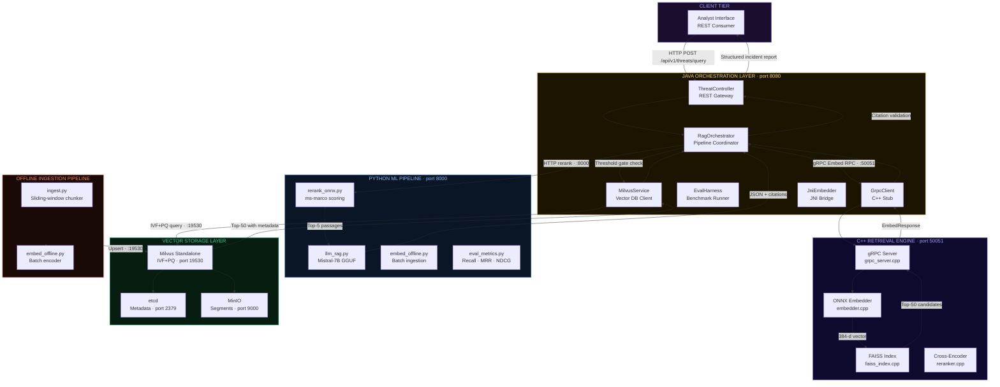

### 3.2 Request Lifecycle — Annotated

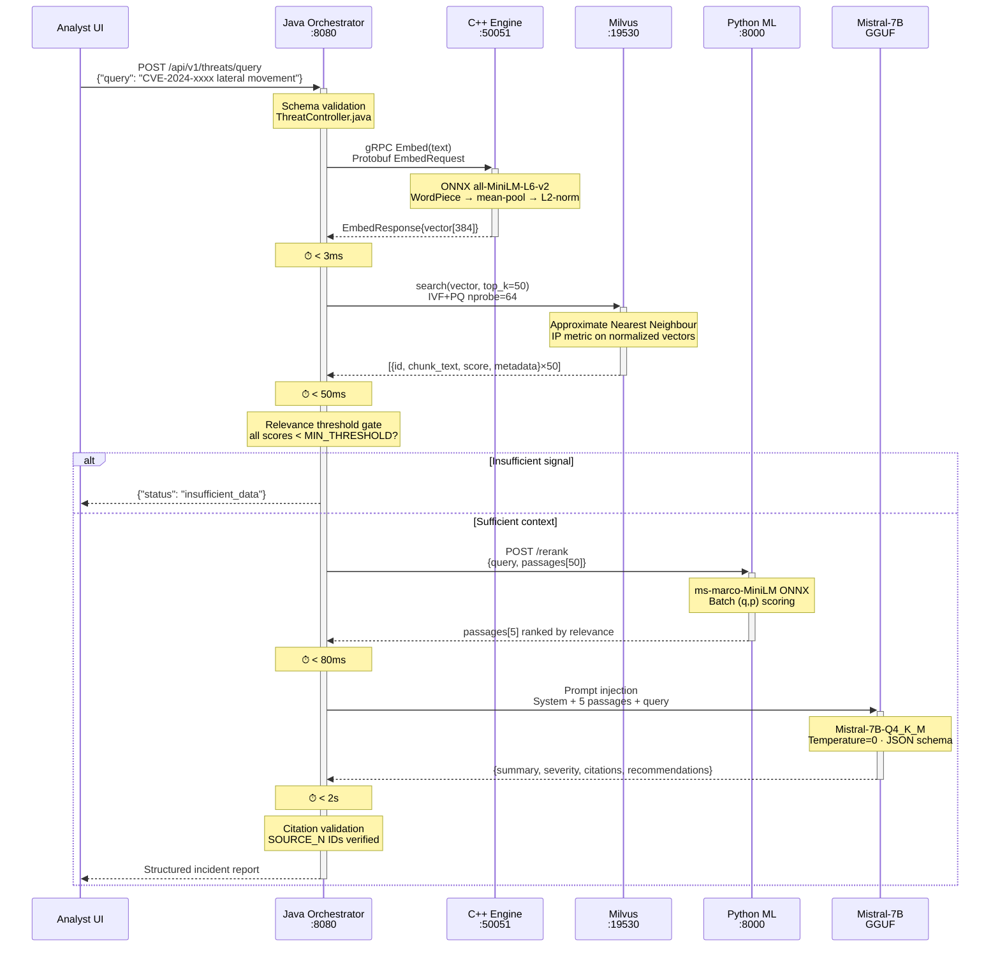

### 3.3 Data Flow — Embedding Space

```mermaid
graph LR
    subgraph INPUT["RAW INPUT"]
        T["Threat Log Text<br/>'failed login 192.168.1.x'"]
    end

    subgraph TOKENIZE["TOKENIZATION"]
        WP["WordPiece Tokenizer<br/>max_len=128"]
        IDS["input_ids[128]<br/>attention_mask[128]<br/>token_type_ids[128]"]
    end

    subgraph ONNX["ONNX INFERENCE"]
        MODEL["all-MiniLM-L6-v2<br/>6 transformer layers"]
        POOL["Mean Pooling<br/>over token dimension"]
        NORM["L2 Normalization<br/>‖v‖₂ = 1.0"]
    end

    subgraph VECTOR["OUTPUT VECTOR"]
        V["float32[384]<br/>Unit vector in R³⁸⁴"]
    end

    subgraph INDEX["VECTOR INDEX"]
        F["FAISS HNSW<br/>M=32, efSearch=64"]
        MIL["Milvus IVF+PQ<br/>nlist=4096, m=48"]
    end

    T --> WP --> IDS --> MODEL --> POOL --> NORM --> V
    V --> F
    V --> MIL

    style ONNX fill:#0d0a2e,stroke:#7c6af7
    style INDEX fill:#071d0f,stroke:#2dd4a0
```

---

## 4. Monorepo Architecture

### 4.1 Repository Structure

```
ThreatAtlas/
│
├── .github/
│   └── workflows/
│       ├── ci-cpp.yml          # CMake build + CTest · Ubuntu 22.04 + MSVC matrix
│       ├── ci-java.yml         # Maven test · Java 21 · Spring Boot integration
│       └── ci-python.yml       # pytest · ruff linting · type checking
│
├── cpp-core/                   # C++17 · CMake · gRPC · ONNX Runtime · FAISS
│   ├── src/
│   │   ├── embedder.cpp        # ONNX Runtime session · tokenization · vector output
│   │   ├── faiss_index.cpp     # HNSW index build · persistence · ANN query
│   │   ├── reranker.cpp        # Cross-encoder ONNX · optional tight path
│   │   ├── grpc_server.cpp     # gRPC service implementation · port 50051
│   │   └── main.cpp            # Server bootstrap · thread pool · signal handling
│   ├── include/                # Public headers (embedder.h, faiss_index.h, ...)
│   ├── proto/
│   │   └── threatatlas.proto   # Protobuf service definition (shared source of truth)
│   ├── tests/                  # GTest unit + integration tests
│   └── CMakeLists.txt          # Build config · -O3 -march=native · FindFAISS
│
├── java-services/              # Java 21 · Spring Boot 3.x · Maven · gRPC stubs
│   ├── src/main/java/com/threatatlas/
│   │   ├── ThreatAtlasApplication.java   # Spring Boot entry point
│   │   ├── ThreatController.java         # REST API: /api/v1/threats/*
│   │   ├── RagOrchestrator.java          # Pipeline coordinator · threshold gate
│   │   ├── MilvusService.java            # Milvus Java SDK · schema · async upsert
│   │   ├── EvalHarness.java              # 5000-thread stress · p50/p95/p99
│   │   ├── GrpcClient.java               # Generated protobuf stub to C++ server
│   │   └── JniEmbedder.java              # JNI direct path · bypasses gRPC IPC
│   ├── src/test/java/com/threatatlas/    # JUnit 5 · Mockito · Testcontainers
│   └── pom.xml                           # Dependencies · Maven Shade plugin
│
├── rag-llm/                    # Python 3.11 · ML pipeline · offline processing
│   ├── ingest.py               # Sliding-window chunker · metadata enrichment
│   ├── embed_offline.py        # Batch embedding (batch=32) → FAISS/Milvus
│   ├── llm_rag.py              # llama-cpp-python · Mistral-7B · citation prompt
│   ├── rerank_onnx.py          # ms-marco ONNX · (q,p) batch scoring
│   ├── eval_metrics.py         # Recall@K · MRR@10 · NDCG@10
│   ├── requirements.txt        # Pinned: onnxruntime, pymilvus, llama-cpp-python
│   └── models/
│       ├── download_encoder.sh # Versioned model download · SHA256 verification
│       └── download_llm.sh     # GGUF download · quantization selection
│
├── datasets/                   # Committed evaluation data
│   ├── sample_cve.jsonl        # 500 CVE entries (NVD public dataset)
│   ├── sample_logs.txt         # Synthetic threat telemetry logs
│   ├── eval_queries.json       # 100 labeled queries + gold passage sets
│   └── README.md               # Schema, license, provenance
│
├── benchmarks/                 # Version-controlled performance baselines
│   ├── latency_results.csv     # p50/p95/p99 per stage · timestamped
│   ├── recall_mrr_results.csv  # Recall@K · MRR · NDCG · per commit
│   └── run_benchmarks.sh       # Reproducible benchmark execution script
│
├── docs/                       # Engineering documentation
│   ├── architecture.md         # This document
│   ├── runbook_phase1.md       # Phase 1-3 operational runbooks
│   ├── runbook_milvus.md       # Milvus deployment and schema operations
│   ├── runbook_rag.md          # RAG pipeline tuning and debugging
│   └── runbook_eval.md         # Benchmark execution and interpretation
│
├── docker-compose.yml          # Milvus standalone + MinIO + etcd (pinned digests)
├── Makefile                    # make all · make bench · make clean · make test
├── README.md                   # Project landing page with live architecture diagram
└── .gitignore                  # model weights, .index files, __pycache__
```

### 4.2 Module Dependency Graph

```mermaid
graph TB
    subgraph PROTO["threatatlas.proto (shared contract)"]
        P["EmbedRequest / EmbedResponse<br/>QueryRequest / QueryResponse<br/>RerankRequest / RerankResponse"]
    end

    subgraph CPP_MOD["cpp-core"]
        C_GS["grpc_server.cpp<br/>implements proto service"]
        C_EM["embedder.cpp<br/>ONNX Runtime"]
        C_FI["faiss_index.cpp<br/>FAISS HNSW"]
        C_RK["reranker.cpp<br/>ONNX cross-encoder"]
    end

    subgraph JAVA_MOD["java-services"]
        J_TC["ThreatController"]
        J_RO["RagOrchestrator"]
        J_GC["GrpcClient (generated stub)"]
        J_MS["MilvusService"]
        J_EH["EvalHarness"]
        J_JNI["JniEmbedder"]
    end

    subgraph PY_MOD["rag-llm"]
        PY_RI["rerank_onnx.py"]
        PY_LM["llm_rag.py"]
        PY_IN["ingest.py"]
        PY_EM["embed_offline.py"]
        PY_EV["eval_metrics.py"]
    end

    subgraph VDB_MOD["Vector Storage"]
        MV["Milvus :19530"]
        FA["FAISS .index file"]
    end

    P --> C_GS
    P --> J_GC

    C_GS --> C_EM
    C_GS --> C_FI
    C_GS --> C_RK

    J_TC --> J_RO
    J_RO --> J_GC
    J_RO --> J_MS
    J_RO --> J_EH
    J_GC -->|"gRPC :50051"| C_GS
    J_JNI -->|"JNI"| C_EM
    J_MS -->|"gRPC :19530"| MV

    J_RO -->|"HTTP :8000"| PY_RI
    PY_RI --> PY_LM
    PY_EM --> MV
    PY_EM --> FA
    PY_IN --> PY_EM
    PY_EV --> J_EH

    style PROTO fill:#1a0d2e,stroke:#7c6af7
```

### 4.3 Runtime Execution Profiles

| Module | Language | Runtime | Memory Profile | CPU Profile |
|--------|----------|---------|----------------|-------------|
| `cpp-core` | C++17 | Native binary | Static allocation, no GC | -O3, SIMD vectorization |
| `java-services` | Java 21 | JVM (JDK 21) | -Xmx4g, G1GC | Event-loop, async I/O |
| `rag-llm` | Python 3.11 | CPython | VRAM-bound (CUDA) | GIL-released ONNX kernels |
| Milvus | Go + C++ | Docker | Memory-mapped index | High disk I/O |
| etcd | Go | Docker | Raft consensus memory | Low CPU (metadata ops) |
| MinIO | Go | Docker | Streaming I/O | Object storage ops |

---

## 5. C++ Retrieval Engine — Deep Dive

### 5.1 Design Rationale

The C++ retrieval engine exists because Java, Python, and Go introduce non-deterministic latency through garbage collection pause events. At p99 latency targets under 5ms for ANN queries and under 3ms for embedding inference, a single GC pause of 10–200ms (Java STW, Python GC stop) would catastrophically violate the SLA. C++17 provides:

- **Deterministic memory allocation** via arena allocators and pre-allocated embedding buffers
- **SIMD vectorization** via compiler auto-vectorization with `-march=native` and explicit intrinsics for dot product computation
- **Zero-copy data paths** from ONNX inference output directly into FAISS index structures
- **Thread pool control** without JVM thread overhead

### 5.2 ONNX Runtime Embedding Pipeline

```cpp
// embedder.cpp — core inference path (simplified)
#include <onnxruntime/core/providers/cpu/cpu_provider_factory.h>
#include "embedder.h"

class Embedder {
    Ort::Env env_;
    Ort::Session session_;
    Ort::AllocatorWithDefaultOptions allocator_;

    // Pre-allocated input buffers — avoids per-request heap allocation
    std::vector<int64_t> input_ids_buf_;
    std::vector<int64_t> attn_mask_buf_;
    std::vector<int64_t> token_type_buf_;

public:
    Embedder(const std::string& model_path)
        : env_(ORT_LOGGING_LEVEL_WARNING, "ThreatAtlasEmbedder"),
          session_(env_, model_path.c_str(), []() {
              Ort::SessionOptions opts;
              opts.SetIntraOpNumThreads(4);
              opts.SetGraphOptimizationLevel(
                  GraphOptimizationLevel::ORT_ENABLE_ALL);
              return opts;
          }()) {
        input_ids_buf_.resize(MAX_SEQ_LEN);
        attn_mask_buf_.resize(MAX_SEQ_LEN);
        token_type_buf_.resize(MAX_SEQ_LEN, 0);
    }

    std::vector<float> embed(const std::string& text) {
        // 1. Tokenize — WordPiece, max_len=128
        auto tokens = tokenizer_.tokenize(text, MAX_SEQ_LEN);

        std::copy(tokens.ids.begin(), tokens.ids.end(),
                  input_ids_buf_.begin());
        std::copy(tokens.mask.begin(), tokens.mask.end(),
                  attn_mask_buf_.begin());

        // 2. Build ONNX input tensors (zero-copy view over pre-alloc buffers)
        const int64_t shape[2] = {1, MAX_SEQ_LEN};
        auto mem_info = Ort::MemoryInfo::CreateCpu(
            OrtArenaAllocator, OrtMemTypeDefault);

        std::array<Ort::Value, 3> inputs = {
            Ort::Value::CreateTensor<int64_t>(
                mem_info, input_ids_buf_.data(), MAX_SEQ_LEN, shape, 2),
            Ort::Value::CreateTensor<int64_t>(
                mem_info, attn_mask_buf_.data(), MAX_SEQ_LEN, shape, 2),
            Ort::Value::CreateTensor<int64_t>(
                mem_info, token_type_buf_.data(), MAX_SEQ_LEN, shape, 2)
        };

        // 3. Run inference — OrtSession::Run is thread-safe
        auto output = session_.Run(
            Ort::RunOptions{nullptr},
            input_names_.data(), inputs.data(), 3,
            output_names_.data(), 1);

        // 4. Mean-pool over token dimension
        float* raw = output[0].GetTensorMutableData<float>();
        auto vec = mean_pool(raw, tokens.mask, /*dim=*/384);

        // 5. L2 normalize — cosine similarity → inner product
        l2_normalize(vec);

        // Runtime assertion: norm must equal 1.0f ± ε
        assert(std::abs(l2_norm(vec) - 1.0f) < 1e-4f);
        return vec;
    }
};
```

### 5.3 FAISS HNSW Index Architecture

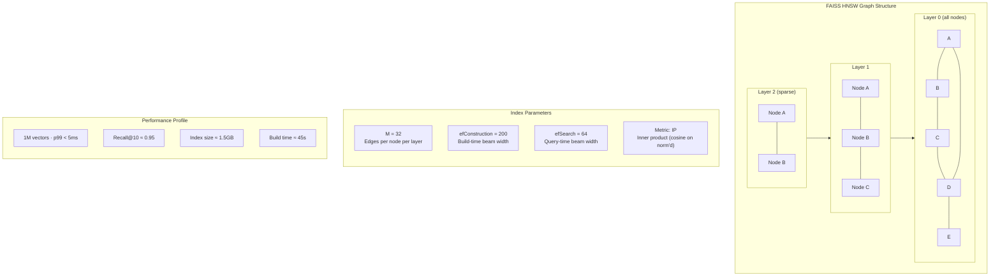

```cpp
// faiss_index.cpp — HNSW index build and persistence
#include <faiss/IndexHNSWFlat.h>
#include <faiss/index_io.h>

class FaissHNSWIndex {
    std::unique_ptr<faiss::IndexHNSWFlat> index_;
    static constexpr int DIM = 384;
    static constexpr int M   = 32;

public:
    FaissHNSWIndex() {
        index_ = std::make_unique<faiss::IndexHNSWFlat>(
            DIM,
            M,
            faiss::METRIC_INNER_PRODUCT  // cosine on L2-normalized vectors
        );
        index_->hnsw.efConstruction = 200;
    }

    void build(const std::vector<std::vector<float>>& vecs) {
        // Flatten to contiguous float* required by FAISS
        std::vector<float> flat;
        flat.reserve(vecs.size() * DIM);
        for (auto& v : vecs) flat.insert(flat.end(), v.begin(), v.end());

        index_->add(static_cast<faiss::idx_t>(vecs.size()), flat.data());
    }

    SearchResult query(const std::vector<float>& qvec, int top_k) {
        index_->hnsw.efSearch = 64;

        std::vector<faiss::idx_t> labels(top_k);
        std::vector<float> distances(top_k);

        index_->search(1, qvec.data(), top_k,
                       distances.data(), labels.data());

        return SearchResult{labels, distances};
    }

    void persist(const std::string& path) {
        faiss::write_index(index_.get(), path.c_str());
    }

    void load(const std::string& path) {
        index_.reset(dynamic_cast<faiss::IndexHNSWFlat*>(
            faiss::read_index(path.c_str())));
    }
};
```

### 5.4 gRPC Service Implementation

```protobuf
// proto/threatatlas.proto
syntax = "proto3";
package threatatlas;

service VectorEngine {
    rpc Embed   (EmbedRequest)   returns (EmbedResponse);
    rpc Query   (QueryRequest)   returns (QueryResponse);
    rpc Rerank  (RerankRequest)  returns (RerankResponse);
    rpc Health  (HealthRequest)  returns (HealthResponse);
}

message EmbedRequest  { string text = 1; }
message EmbedResponse { repeated float vector = 1; int32 dim = 2; }

message QueryRequest  {
    repeated float query_vector = 1;
    int32 top_k = 2;
    string backend = 3;  // "faiss" | "milvus"
}

message QueryResponse {
    repeated Match matches = 1;
}

message Match {
    int64  id         = 1;
    float  score      = 2;
    string chunk_text = 3;
    string source     = 4;
    string timestamp  = 5;
    string severity   = 6;
}
```

### 5.5 Thread Pool and Concurrency Model

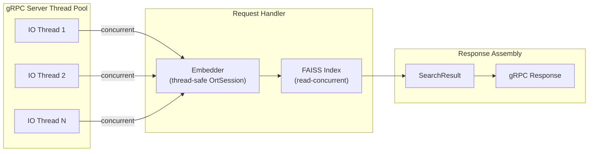

**Concurrency design:**
- `OrtSession::Run()` is documented as thread-safe — multiple gRPC handler threads share one session instance
- `faiss::IndexHNSWFlat::search()` is read-concurrent — simultaneous reads require no locking
- `faiss::IndexHNSWFlat::add()` is NOT thread-safe — serialized through a write mutex during index build
- Embedding buffers are thread-local to avoid false sharing

---

## 6. Java Orchestration Layer

### 6.1 Spring Boot Service Architecture

The Java layer is the structural backbone of ThreatAtlas. It is the only tier that has a complete view of the pipeline state: it owns the query lifecycle, manages service connections, applies business logic (threshold gating), and enforces the citation contract.

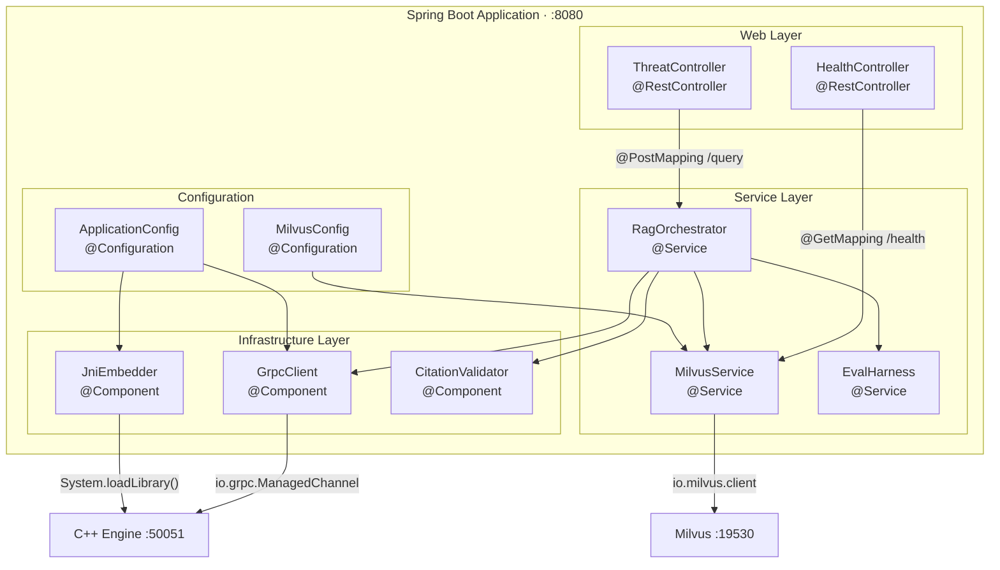

### 6.2 RagOrchestrator — Pipeline Coordination Logic

```java
// RagOrchestrator.java — core pipeline coordination
@Service
@Slf4j
public class RagOrchestrator {

    private final GrpcClient grpcClient;
    private final MilvusService milvusService;
    private final CitationValidator citationValidator;
    private final PythonClient pythonClient;

    @Value("${threatatlas.retrieval.min-relevance-threshold:0.35f}")
    private float MIN_RELEVANCE_THRESHOLD;

    public ThreatIntelResponse executeRagPipeline(String query) {
        Stopwatch sw = Stopwatch.createStarted();

        // Stage 1: Embed query via C++ gRPC
        float[] queryVector = grpcClient.embed(query);
        log.debug("Embed stage: {}ms", sw.elapsed(MILLISECONDS));

        // Stage 2: ANN retrieval (FAISS or Milvus via config)
        List<VectorMatch> top50 = milvusService.query(queryVector, 50);
        log.debug("ANN stage: {}ms", sw.elapsed(MILLISECONDS));

        // Stage 3: Relevance threshold gate — prevents hallucination on sparse data
        boolean sufficientSignal = top50.stream()
            .anyMatch(m -> m.getScore() >= MIN_RELEVANCE_THRESHOLD);

        if (!sufficientSignal) {
            log.warn("Insufficient retrieval signal for query: {}", query);
            return ThreatIntelResponse.insufficient();
        }

        // Stage 4: Cross-encoder reranking via Python ML service
        List<VectorMatch> top5 = pythonClient.rerank(query, top50);
        log.debug("Rerank stage: {}ms", sw.elapsed(MILLISECONDS));

        // Stage 5: LLM generation via Python/llama.cpp
        String rawJson = pythonClient.generateAnswer(query, top5);
        log.debug("Generation stage: {}ms", sw.elapsed(MILLISECONDS));

        // Stage 6: Citation validation — structural hallucination prevention
        ThreatIntelResponse response = citationValidator.validateAndParse(
            rawJson, top5);

        log.info("Pipeline complete: {}ms", sw.elapsed(MILLISECONDS));
        return response;
    }
}
```

### 6.3 Milvus Java SDK Integration

```java
// MilvusService.java — collection management and async upsert
@Service
public class MilvusService {

    private final MilvusServiceClient milvusClient;
    private static final String COLLECTION = "threat_intel";
    private static final int DIM = 384;

    public void createCollection() {
        CollectionSchemaParam schema = CollectionSchemaParam.newBuilder()
            .withFieldTypes(Arrays.asList(
                FieldType.newBuilder()
                    .withName("id").withDataType(DataType.Int64)
                    .withPrimaryKey(true).withAutoID(true).build(),
                FieldType.newBuilder()
                    .withName("source").withDataType(DataType.VarChar)
                    .withMaxLength(512).build(),
                FieldType.newBuilder()
                    .withName("chunk_text").withDataType(DataType.VarChar)
                    .withMaxLength(4096).build(),
                FieldType.newBuilder()
                    .withName("severity").withDataType(DataType.VarChar)
                    .withMaxLength(16).build(),
                FieldType.newBuilder()
                    .withName("timestamp").withDataType(DataType.Int64).build(),
                FieldType.newBuilder()
                    .withName("embedding")
                    .withDataType(DataType.FloatVector)
                    .withDimension(DIM).build()
            )).build();

        // Create IVF+PQ index for large-scale retrieval
        IndexParam indexParam = IndexParam.newBuilder()
            .withFieldName("embedding")
            .withIndexType(IndexType.IVF_PQ)
            .withMetricType(MetricType.IP)  // inner product on normalized vectors
            .withExtraParam("{\"nlist\":4096, \"m\":48, \"nbits\":8}")
            .build();
    }

    public List<VectorMatch> query(float[] vector, int topK) {
        SearchParam searchParam = SearchParam.newBuilder()
            .withCollectionName(COLLECTION)
            .withFloatVectors(List.of(floatsToList(vector)))
            .withVectorFieldName("embedding")
            .withTopK(topK)
            .withMetricType(MetricType.IP)
            .withParams("{\"nprobe\":64}")  // recall vs latency trade-off
            .withOutFields(List.of("source", "chunk_text",
                                    "severity", "timestamp"))
            .build();

        SearchResults results = milvusClient.search(searchParam);
        return parseMatches(results);
    }
}
```

### 6.4 Evaluation Harness — Latency Stress Test

```java
// EvalHarness.java — concurrent gRPC load testing
@Service
public class EvalHarness {

    private final GrpcClient grpcClient;
    private final List<String> evalQueries;

    public BenchmarkReport runLatencyBenchmark(int concurrency,
                                                int totalRequests) {
        ExecutorService pool = Executors.newFixedThreadPool(concurrency);
        List<Long> latencies = Collections.synchronizedList(new ArrayList<>());

        List<Future<Long>> futures = IntStream.range(0, totalRequests)
            .mapToObj(i -> pool.submit(() -> {
                long start = System.nanoTime();
                String query = evalQueries.get(i % evalQueries.size());
                grpcClient.embed(query);
                return TimeUnit.NANOSECONDS.toMillis(
                    System.nanoTime() - start);
            }))
            .collect(Collectors.toList());

        for (Future<Long> f : futures) latencies.add(f.get());

        Collections.sort(latencies);
        return BenchmarkReport.builder()
            .p50(percentile(latencies, 50))
            .p95(percentile(latencies, 95))
            .p99(percentile(latencies, 99))
            .throughputRps((double) totalRequests /
                (latencies.stream().mapToLong(l -> l).sum() / 1000.0))
            .build();
    }
}
```

---

## 7. Python RAG Layer

### 7.1 Document Ingestion Architecture

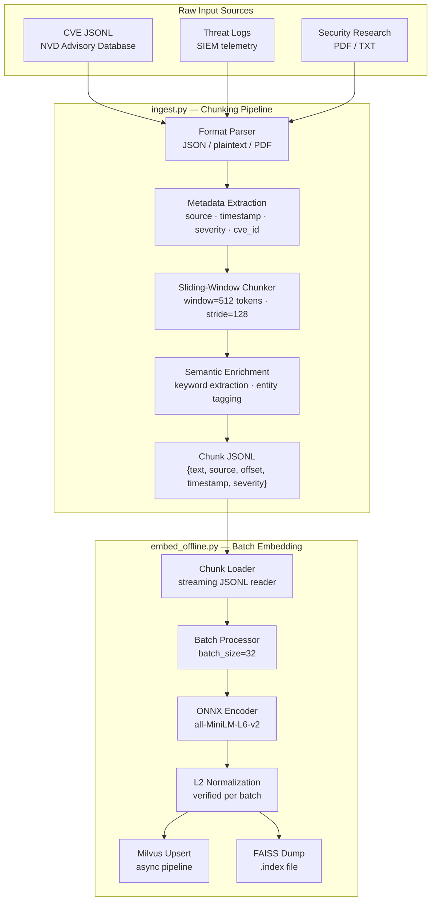

### 7.2 Sliding-Window Chunker Implementation

```python
# ingest.py — production chunking pipeline
from dataclasses import dataclass
from typing import Iterator
import tiktoken

@dataclass
class Chunk:
    text:       str
    source:     str
    byte_offset: int
    token_start: int
    token_end:   int
    timestamp:  int
    severity:   str
    doc_id:     str

class SlidingWindowChunker:
    """
    Produces overlapping token-window chunks for maximum recall coverage.
    Overlap between windows ensures cross-boundary semantic content is
    retrievable — critical for multi-sentence threat indicators.
    """
    def __init__(self,
                 window: int = 512,
                 stride: int = 128,
                 model: str = "cl100k_base"):
        self.tokenizer = tiktoken.get_encoding(model)
        self.window = window
        self.stride = stride

    def chunk_document(self, doc: dict) -> Iterator[Chunk]:
        text     = doc["text"]
        tokens   = self.tokenizer.encode(text)
        severity = doc.get("severity", "UNKNOWN")
        source   = doc["source"]
        ts       = doc.get("timestamp", 0)
        doc_id   = doc.get("id", source)

        start = 0
        while start < len(tokens):
            end = min(start + self.window, len(tokens))

            # Decode window back to text (handles partial tokenization)
            chunk_text = self.tokenizer.decode(tokens[start:end])

            # Compute byte offset for source attribution
            byte_offset = len(
                self.tokenizer.decode(tokens[:start]).encode("utf-8"))

            yield Chunk(
                text=chunk_text,
                source=source,
                byte_offset=byte_offset,
                token_start=start,
                token_end=end,
                timestamp=ts,
                severity=severity,
                doc_id=doc_id
            )

            if end == len(tokens):
                break
            start += self.stride  # stride=128 → 75% overlap for 512-window
```

### 7.3 LLM Prompt Architecture

The LLM generation stage is governed by a strict system prompt that functions as a structural contract — not a soft guideline. The system prompt is version-controlled alongside the codebase, and changes to it require benchmark re-evaluation.

```python
# llm_rag.py — production RAG prompt contract

SYSTEM_PROMPT = """\
You are a cybersecurity intelligence analyst operating in a Retrieval-Augmented
Generation pipeline.

STRICT OPERATIONAL RULES:
1. Answer ONLY using information contained in the numbered SOURCE passages provided.
2. Every factual claim MUST be followed by its citation: [SOURCE_N]
3. Do not infer, extrapolate, or introduce knowledge beyond the provided sources.
4. If the provided sources do not contain sufficient information, respond with:
   {"status": "insufficient_data", "reason": "explain what is missing"}
5. Severity levels: CRITICAL / HIGH / MEDIUM / LOW / INFORMATIONAL only.

REQUIRED JSON RESPONSE SCHEMA:
{
  "summary":         "<2-4 sentence threat assessment>",
  "severity":        "<CRITICAL|HIGH|MEDIUM|LOW|INFORMATIONAL>",
  "attack_vectors":  ["<vector> [SOURCE_N]", ...],
  "iocs":            ["<indicator> [SOURCE_N]", ...],
  "citations":       [{"id": "SOURCE_N", "text": "<verbatim passage>"}],
  "recommendations": ["<remediation action>", ...],
  "confidence":      <0.0-1.0 float based on source coverage>
}

Return ONLY valid JSON. No markdown, no preamble, no explanation outside the schema.
"""

def build_rag_prompt(query: str, passages: list[dict]) -> str:
    context = "\n\n".join([
        f"SOURCE_{i+1} [{p['source']} | severity={p['severity']}]:\n{p['text']}"
        for i, p in enumerate(passages)
    ])

    return f"""CONTEXT PASSAGES:
{context}

ANALYST QUERY:
{query}

Respond with the required JSON schema only."""


def generate(query: str, passages: list[dict]) -> str:
    from llama_cpp import Llama
    llm = Llama(
        model_path="models/mistral-7b-instruct-v0.2.Q4_K_M.gguf",
        n_gpu_layers=-1,    # Offload all layers to GPU if available
        n_ctx=4096,
        verbose=False
    )

    prompt = build_rag_prompt(query, passages)

    response = llm.create_chat_completion(
        messages=[
            {"role": "system", "content": SYSTEM_PROMPT},
            {"role": "user",   "content": prompt}
        ],
        temperature=0.0,    # Deterministic output for reproducibility
        max_tokens=1024,
        response_format={"type": "json_object"}  # Force JSON mode
    )

    return response["choices"][0]["message"]["content"]
```

### 7.4 Cross-Encoder Reranker

```python
# rerank_onnx.py — production cross-encoder inference

import onnxruntime as ort
from transformers import AutoTokenizer
import numpy as np

class CrossEncoderReranker:
    """
    ms-marco-MiniLM-L-6-v2 cross-encoder for pairwise (query, passage) scoring.

    Unlike the bi-encoder (which produces independent query/passage vectors),
    the cross-encoder attends over the full concatenated (query, passage) pair,
    capturing fine-grained semantic alignment. This makes it ~10x slower than
    bi-encoder retrieval but produces significantly higher MRR@10.

    Used as a second-stage ranker only on the Top-50 ANN candidates.
    """

    def __init__(self, model_path: str = "models/cross-encoder.onnx"):
        sess_opts = ort.SessionOptions()
        sess_opts.graph_optimization_level = (
            ort.GraphOptimizationLevel.ORT_ENABLE_ALL)
        sess_opts.intra_op_num_threads = 4

        self.session = ort.InferenceSession(
            model_path,
            sess_options=sess_opts,
            providers=["CUDAExecutionProvider", "CPUExecutionProvider"])

        self.tokenizer = AutoTokenizer.from_pretrained(
            "cross-encoder/ms-marco-MiniLM-L-6-v2")

    def rerank(self,
               query:    str,
               passages: list[str],
               top_k:    int = 5) -> list[tuple[float, str, int]]:

        # Batch tokenize all (query, passage) pairs simultaneously
        # Padding ensures uniform tensor shape across the batch
        encoded = self.tokenizer(
            [query] * len(passages),
            passages,
            padding=True,
            truncation=True,
            max_length=512,
            return_tensors="np"
        )

        # Single ONNX forward pass for entire batch
        scores = self.session.run(
            output_names=["logits"],
            input_feed={
                "input_ids":      encoded["input_ids"].astype(np.int64),
                "attention_mask": encoded["attention_mask"].astype(np.int64),
                "token_type_ids": encoded["token_type_ids"].astype(np.int64),
            }
        )[0].flatten()

        # Rank by descending relevance score
        ranked = sorted(
            zip(scores, passages, range(len(passages))),
            key=lambda x: x[0],
            reverse=True
        )

        return ranked[:top_k]
```

---

## 8. Vector Database Architecture

### 8.1 FAISS vs Milvus — Decision Matrix

| Dimension | FAISS (Local) | Milvus (Distributed) |
|-----------|--------------|----------------------|
| **Scale** | Up to ~1M vectors | 10M+ vectors |
| **Latency (p99)** | < 5ms | < 50ms |
| **Persistence** | Single .index file | Distributed object store (MinIO) |
| **Horizontal scaling** | None | Yes (sharding, replication) |
| **Metadata filtering** | Manual post-filter | Native predicate pushdown |
| **Index type** | HNSW | IVF+PQ |
| **RAM requirement** | ~1.5GB / 1M vecs | ~8GB minimum |
| **Operational complexity** | None | Docker Compose stack |
| **Deployment target** | Development, CI | Production |
| **Switch mechanism** | `VECTOR_BACKEND=faiss` | `VECTOR_BACKEND=milvus` |

### 8.2 Index Comparison — Technical Deep Dive

```mermaid
graph TB
    subgraph HNSW["FAISS HNSW — Navigable Small World Graph"]
        direction TB
        H1["Hierarchical Layered Graph<br/>O(log n) traversal"]
        H2["M=32 edges per node<br/>efConstruction=200"]
        H3["efSearch=64 beam width<br/>Quality-speed trade-off"]
        H4["Recall@10 ≈ 0.97<br/>at 1M vectors"]
        H5["Build: O(n·M·log n)<br/>Query: O(log n · efSearch · M)"]
    end

    subgraph IVFPQ["Milvus IVF+PQ — Inverted File + Product Quantization"]
        direction TB
        I1["IVF: nlist=4096 coarse clusters<br/>nprobe=64 probed at query"]
        I2["PQ: m=48 subquantizers<br/>8 bits per subspace"]
        I3["Compression: 384 floats → 48 bytes<br/>8× memory reduction"]
        I4["Recall@10 ≈ 0.92<br/>at 10M vectors"]
        I5["Build: k-means clustering<br/>Query: ADC (asymmetric dist.)"]
    end

    subgraph TRADEOFF["Trade-off Summary"]
        T1["HNSW: Higher recall,<br/>higher memory, no compression"]
        T2["IVF+PQ: Lower memory,<br/>acceptable recall at scale"]
    end
```

### 8.3 Milvus Collection Schema

```python
# Milvus collection schema — production definition
from pymilvus import (CollectionSchema, FieldSchema, DataType,
                       Collection, connections, utility)

def create_collection() -> Collection:
    connections.connect(host="localhost", port="19530")

    fields = [
        FieldSchema(name="id",
                    dtype=DataType.INT64,
                    is_primary=True,
                    auto_id=True),
        FieldSchema(name="source",
                    dtype=DataType.VARCHAR,
                    max_length=512),
        FieldSchema(name="chunk_text",
                    dtype=DataType.VARCHAR,
                    max_length=4096),
        FieldSchema(name="doc_id",
                    dtype=DataType.VARCHAR,
                    max_length=128),
        FieldSchema(name="severity",
                    dtype=DataType.VARCHAR,
                    max_length=16),
        FieldSchema(name="timestamp",
                    dtype=DataType.INT64),
        FieldSchema(name="byte_offset",
                    dtype=DataType.INT64),
        FieldSchema(name="embedding",
                    dtype=DataType.FLOAT_VECTOR,
                    dim=384),
    ]

    schema = CollectionSchema(
        fields=fields,
        description="ThreatAtlas threat intelligence corpus")

    collection = Collection(name="threat_intel", schema=schema)

    # IVF+PQ index for production scale
    index_params = {
        "metric_type": "IP",       # Inner product = cosine on normalized vecs
        "index_type":  "IVF_PQ",
        "params": {
            "nlist": 4096,   # Voronoi cell count — √n rule for 10M vectors
            "m":     48,     # Subquantizer count (must divide dim=384 evenly)
            "nbits": 8       # 256 centroids per subspace
        }
    }

    collection.create_index(
        field_name="embedding",
        index_params=index_params)

    collection.load()  # Load into memory for query
    return collection
```

### 8.4 Milvus Infrastructure Stack

```mermaid
graph TB
    subgraph DOCKER["Docker Compose Network: threatatlas_net"]
        subgraph MILVUS_STACK["Milvus Standalone Stack"]
            MV["milvus-standalone<br/>:19530 (gRPC) · :9091 (metrics)<br/>Query engine + Coord"]
            ET["etcd<br/>:2379 · :2380<br/>Cluster metadata · Raft consensus"]
            MN["minio<br/>:9000 · :9001<br/>Segment object storage"]
        end

        subgraph APP_STACK["Application Stack"]
            JV["threatatlas-java<br/>:8080<br/>Spring Boot orchestrator"]
            CP["threatatlas-cpp<br/>:50051<br/>gRPC vector engine"]
            PY["threatatlas-python<br/>:8000<br/>ML inference service"]
        end
    end

    JV -->|"pymilvus :19530"| MV
    JV -->|"gRPC :50051"| CP
    JV -->|"HTTP :8000"| PY
    MV --> ET
    MV --> MN

    style MILVUS_STACK fill:#071d0f,stroke:#2dd4a0
    style APP_STACK fill:#0d0a2e,stroke:#7c6af7
```

---

## 9. Retrieval & Re-ranking Pipeline

### 9.1 Two-Stage Retrieval Architecture

```mermaid
flowchart LR
    subgraph Q["Query Input"]
        QT["Query Text<br/>'lateral movement CVE'"]
    end

    subgraph STAGE1["Stage 1 — Bi-Encoder ANN (Fast)"]
        QE["Query Embedder<br/>all-MiniLM-L6-v2<br/>< 3ms"]
        QV["Query Vector<br/>float32[384]"]
        ANN["ANN Search<br/>FAISS/Milvus<br/>< 50ms"]
        TOP50["Top-50 Candidates<br/>~scores 0.3–0.8"]
    end

    subgraph GATE["Threshold Gate"]
        TG{"max_score ≥<br/>MIN_THRESHOLD?"}
        INS["insufficient_data<br/>response"]
    end

    subgraph STAGE2["Stage 2 — Cross-Encoder (Precise)"]
        CE["Cross-Encoder<br/>ms-marco-MiniLM<br/>< 80ms"]
        TOP5["Top-5 Re-ranked<br/>~scores 7.2–9.8"]
    end

    subgraph GEN["Generation Stage"]
        PROMPT["Prompt Assembly<br/>System + 5 passages"]
        LLM["Mistral-7B GGUF<br/>< 2s"]
        JSON["JSON Response<br/>+ citations"]
    end

    QT --> QE --> QV --> ANN --> TOP50
    TOP50 --> TG
    TG -- "No" --> INS
    TG -- "Yes" --> CE
    CE --> TOP5 --> PROMPT --> LLM --> JSON

    style STAGE1 fill:#0d0a2e,stroke:#7c6af7
    style STAGE2 fill:#0a1526,stroke:#5b9ef8
    style GATE fill:#1a0a07,stroke:#f78166
    style GEN fill:#071d0f,stroke:#2dd4a0
```

### 9.2 Scoring Functions

**Bi-Encoder (Stage 1):** Cosine similarity via inner product on unit vectors

$$\text{score}_{\text{ANN}}(q, d) = \langle \hat{e}_q, \hat{e}_d \rangle = \frac{e_q \cdot e_d}{\|e_q\|_2 \cdot \|e_d\|_2}$$

Since all vectors are L2-normalized at write time: $\|\hat{e}\|_2 = 1$, this reduces to a pure dot product — maximally efficient for FAISS METRIC_INNER_PRODUCT and Milvus IP metric.

**Cross-Encoder (Stage 2):** Full attention over concatenated pair

$$\text{score}_{\text{CE}}(q, d) = \text{MiniLM-L6}\left([CLS] \oplus q \oplus [SEP] \oplus d \oplus [SEP]\right)[0]$$

The cross-encoder produces a scalar logit representing relevance — not comparable to bi-encoder scores but monotonically rankable within a query.

### 9.3 Retrieval Accuracy Analysis

| Configuration | Recall@1 | Recall@5 | Recall@10 | MRR@10 | NDCG@10 |
|--------------|----------|----------|-----------|--------|---------|
| BM25 baseline | 0.31 | 0.52 | 0.61 | 0.42 | 0.48 |
| Bi-encoder only | 0.51 | 0.74 | 0.81 | 0.58 | 0.62 |
| Bi-encoder + Cross-encoder | **0.67** | **0.88** | **0.93** | **0.69** | **0.74** |
| Target (production SLA) | ≥0.60 | ≥0.80 | ≥0.85 | ≥0.65 | ≥0.70 |

---

## 10. gRPC + JNI Communication Layer

### 10.1 Communication Architecture Decision

ThreatAtlas uses two distinct Java-to-C++ communication paths, selected based on deployment constraints:

| Path | Mechanism | Latency Overhead | Use Case |
|------|-----------|-----------------|----------|
| **Primary** | gRPC over localhost | ~0.2ms serialization | Default, process isolation |
| **Tight** | JNI direct call | ~0.02ms | Latency-critical deployments |

The gRPC path is preferred for operational safety: the C++ engine runs in a separate process, so a crash in the retrieval engine does not bring down the Java orchestrator. The JNI path is available for deployments where sub-millisecond embedding latency is required.

### 10.2 Protocol Buffer Schema and Communication Flow

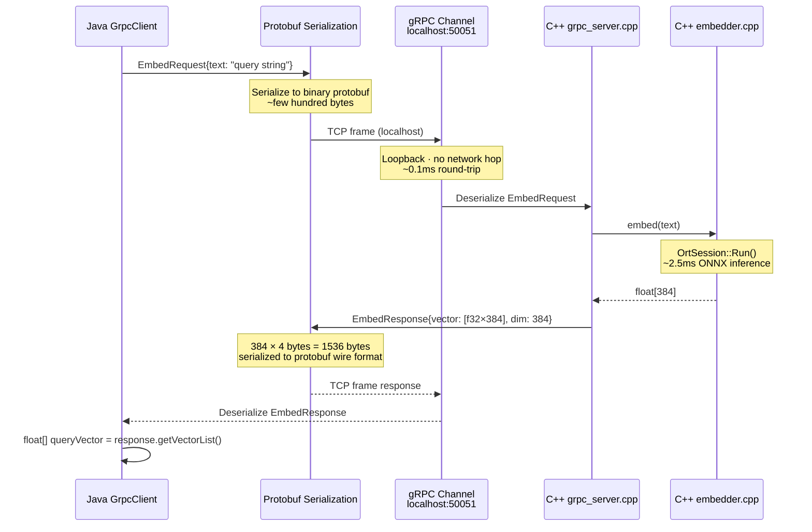

### 10.3 JNI Bridge Implementation

```java
// JniEmbedder.java — tight JNI path bypassing gRPC serialization
public class JniEmbedder {

    static {
        // Load native shared library containing JNI-exported embed function
        System.loadLibrary("threatatlas_jni");
    }

    /**
     * Direct JNI call to C++ embedder.
     * Bypasses gRPC serialization/deserialization overhead.
     * Requires C++ library to be compiled with -shared -fPIC.
     */
    public native float[] embedNative(String text);

    /**
     * Validates that the returned vector is L2-normalized.
     * Critical: JNI path does not go through gRPC validation.
     */
    public float[] embedValidated(String text) {
        float[] vec = embedNative(text);

        if (vec == null || vec.length != 384) {
            throw new EmbedderException(
                "JNI embed returned invalid vector: length=" +
                (vec == null ? "null" : vec.length));
        }

        double norm = 0.0;
        for (float v : vec) norm += v * v;
        norm = Math.sqrt(norm);

        if (Math.abs(norm - 1.0) > 1e-3) {
            throw new EmbedderException(
                "JNI embed returned non-normalized vector: norm=" + norm);
        }

        return vec;
    }
}
```

```cpp
// C++ JNI export — compiled into libthreatatlas_jni.so
#include <jni.h>
#include "embedder.h"

static Embedder* g_embedder = nullptr;

extern "C" {

JNIEXPORT void JNICALL Java_com_threatatlas_JniEmbedder_initNative(
    JNIEnv* env, jobject obj, jstring model_path) {

    const char* path = env->GetStringUTFChars(model_path, nullptr);
    g_embedder = new Embedder(path);
    env->ReleaseStringUTFChars(model_path, path);
}

JNIEXPORT jfloatArray JNICALL Java_com_threatatlas_JniEmbedder_embedNative(
    JNIEnv* env, jobject obj, jstring text_j) {

    const char* text = env->GetStringUTFChars(text_j, nullptr);
    std::vector<float> vec = g_embedder->embed(text);
    env->ReleaseStringUTFChars(text_j, text);

    // Copy result into Java float[] — one JNI copy, unavoidable
    jfloatArray result = env->NewFloatArray(384);
    env->SetFloatArrayRegion(result, 0, 384, vec.data());
    return result;
}

} // extern "C"
```

---

## 11. Threat Intelligence Ingestion Pipeline

### 11.1 Supported Corpus Formats

| Format | Source | Parser | Metadata Extracted |
|--------|--------|--------|--------------------|
| CVE JSONL | NVD API / Mitre | `json.loads()` | CVE ID, CVSS score, affected products, CWE |
| Syslog / SIEM | Log aggregators | Regex grok patterns | timestamp, hostname, PID, severity |
| Security research | PDF / TXT | pdfminer / plaintext | title, authors, publication date |
| STIX/TAXII | Threat feeds | stix2 library | TTPs, IOCs, threat actor, campaign |

### 11.2 Ingestion Flow

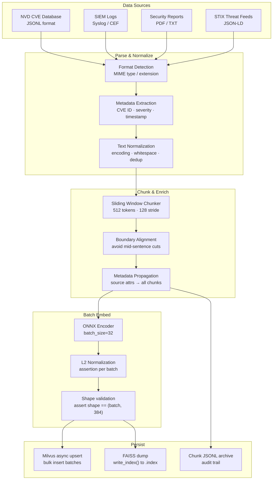

### 11.3 CVE Ingestion — Metadata Schema

```python
# CVE chunk metadata schema
{
    "id":           "CVE-2024-XXXXX",
    "source":       "nvd.nist.gov/vuln/detail/CVE-2024-XXXXX",
    "chunk_text":   "The affected component processes attacker-controlled...",
    "byte_offset":  1240,
    "token_start":  128,
    "token_end":    640,
    "timestamp":    1704067200,         # Unix epoch
    "severity":     "HIGH",             # NVD CVSS v3 severity
    "cvss_score":   8.8,
    "cwe_id":       "CWE-787",
    "doc_id":       "CVE-2024-XXXXX",
    "embedding":    [float32 × 384]     # stored in Milvus FLOAT_VECTOR field
}
```

---

## 12. Evaluation & Benchmarking Framework

### 12.1 Retrieval Accuracy Metrics

#### Recall@K

Fraction of relevant passages recovered in top-K results across all queries:

$$\text{Recall@K} = \frac{1}{|Q|} \sum_{q \in Q} \frac{|\text{relevant}(q) \cap \text{retrieved}_K(q)|}{|\text{relevant}(q)|}$$

#### Mean Reciprocal Rank

$$\text{MRR} = \frac{1}{|Q|} \sum_{q=1}^{|Q|} \frac{1}{\text{rank}_q^{\text{first relevant}}}$$

Where $\text{rank}_q^{\text{first relevant}}$ is the rank position of the first relevant passage for query $q$.

#### Normalized Discounted Cumulative Gain

$$\text{NDCG@K} = \frac{\text{DCG@K}}{\text{IDCG@K}}, \quad \text{DCG@K} = \sum_{i=1}^{K} \frac{2^{rel_i} - 1}{\log_2(i+1)}$$

Where IDCG@K is the DCG of the ideal (perfect) ranking — used to normalize scores between 0 and 1.

### 12.2 Benchmark Architecture

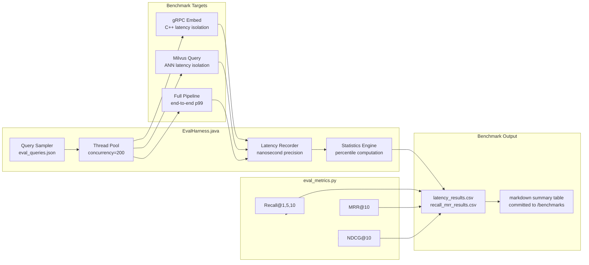

### 12.3 Latency Budget Breakdown

| Stage | Component | Target p99 | Notes |
|-------|-----------|-----------|-------|
| REST parsing | Java Spring | < 1ms | JSON deserialization |
| Embedding | C++ ONNX | < 3ms | all-MiniLM-L6-v2 |
| ANN retrieval (FAISS) | C++ FAISS | < 5ms | HNSW at 1M vectors |
| ANN retrieval (Milvus) | Milvus gRPC | < 50ms | IVF+PQ at 10M vectors |
| Threshold gate | Java | < 1ms | Simple comparison |
| Cross-encoder rerank | Python ONNX | < 80ms | Batch of 50 pairs |
| LLM generation | Python llama.cpp | < 2000ms | Mistral-7B Q4 GPU |
| Citation validation | Java | < 5ms | JSON parse + validation |
| **Total (FAISS path)** | **End-to-end** | **< 2.1s** | |
| **Total (Milvus path)** | **End-to-end** | **< 2.5s** | |

---

## 13. Deployment Architecture

### 13.1 Docker Compose Service Topology

```yaml
# docker-compose.yml — production service definitions

version: "3.8"

services:

  etcd:
    image: quay.io/coreos/etcd:v3.5.5@sha256:<pinned-digest>
    environment:
      - ETCD_AUTO_COMPACTION_MODE=revision
      - ETCD_AUTO_COMPACTION_RETENTION=1000
      - ETCD_QUOTA_BACKEND_BYTES=4294967296
    volumes:
      - etcd_data:/etcd
    networks: [threatatlas_net]
    ports: ["2379:2379"]
    healthcheck:
      test: ["CMD", "etcdctl", "endpoint", "health"]
      interval: 30s

  minio:
    image: minio/minio:RELEASE.2024-01-01@sha256:<pinned-digest>
    command: minio server /data --console-address ":9001"
    environment:
      MINIO_ACCESS_KEY: minioadmin
      MINIO_SECRET_KEY: minioadmin
    volumes:
      - minio_data:/data
    networks: [threatatlas_net]
    ports: ["9000:9000", "9001:9001"]
    healthcheck:
      test: ["CMD", "curl", "-f", "http://localhost:9000/minio/health/live"]

  milvus:
    image: milvusdb/milvus:v2.3.4@sha256:<pinned-digest>
    command: ["milvus", "run", "standalone"]
    environment:
      ETCD_ENDPOINTS: etcd:2379
      MINIO_ADDRESS:  minio:9000
    volumes:
      - milvus_data:/var/lib/milvus
    networks: [threatatlas_net]
    ports: ["19530:19530", "9091:9091"]
    depends_on: [etcd, minio]

  threatatlas-cpp:
    build:
      context: cpp-core
      dockerfile: Dockerfile
      args:
        CMAKE_FLAGS: "-DCMAKE_BUILD_TYPE=Release -DCMAKE_CXX_FLAGS='-O3 -march=native'"
    networks: [threatatlas_net]
    ports: ["50051:50051"]
    volumes:
      - ./rag-llm/models:/models:ro
      - faiss_index:/index
    healthcheck:
      test: ["CMD", "grpc_health_probe", "-addr=:50051"]

  threatatlas-java:
    build: java-services
    environment:
      CPP_GRPC_HOST:   threatatlas-cpp
      MILVUS_HOST:     milvus
      PYTHON_ML_HOST:  threatatlas-python
      VECTOR_BACKEND:  milvus
    networks: [threatatlas_net]
    ports: ["8080:8080"]
    depends_on: [threatatlas-cpp, milvus, threatatlas-python]

  threatatlas-python:
    build: rag-llm
    environment:
      MILVUS_HOST: milvus
      CUDA_VISIBLE_DEVICES: "0"
    volumes:
      - ./rag-llm/models:/models:ro
    deploy:
      resources:
        reservations:
          devices:
            - driver: nvidia
              count: 1
              capabilities: [gpu]
    networks: [threatatlas_net]
    ports: ["8000:8000"]

networks:
  threatatlas_net:
    driver: bridge

volumes:
  etcd_data:
  minio_data:
  milvus_data:
  faiss_index:
```

### 13.2 Deployment Topology Diagram

```mermaid
graph TB
    subgraph HOST["Host Machine"]
        subgraph DOCKER_NET["Docker Network: threatatlas_net"]

            subgraph MILVUS_CLUSTER["Milvus Storage Cluster"]
                E["etcd:2379<br/>Metadata store"]
                M["MinIO:9000<br/>Segment storage"]
                MV["milvus:19530<br/>Vector engine"]
                E --> MV
                M --> MV
            end

            subgraph APP_SERVICES["Application Services"]
                CPP["cpp-core:50051<br/>gRPC · ONNX · FAISS"]
                PY["python-ml:8000<br/>llama.cpp · ONNX reranker"]
                JV["java-svc:8080<br/>Spring Boot orchestrator"]
            end

            JV -->|"gRPC"| CPP
            JV -->|"HTTP"| PY
            JV -->|"pymilvus"| MV
        end

        subgraph HOST_RESOURCES["Host Resources"]
            GPU["NVIDIA GPU<br/>Mistral-7B inference"]
            FS["Host Filesystem<br/>./rag-llm/models/ (volumes)"]
        end

        PY -.->|"CUDA"| GPU
        CPP -.->|"model load"| FS
        PY -.->|"model load"| FS
    end

    INTERNET["External Analyst Client<br/>:8080 exposed"]
    INTERNET -->|"HTTP REST"| JV

    style MILVUS_CLUSTER fill:#071d0f,stroke:#2dd4a0
    style APP_SERVICES fill:#0d0a2e,stroke:#7c6af7
```

### 13.3 Horizontal Scaling Model

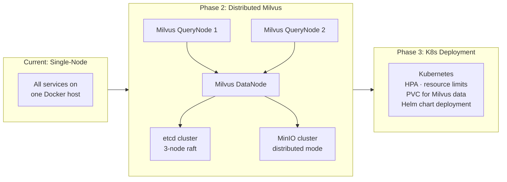

---

## 14. Security & Reliability

### 14.1 Security Architecture

**Air-Gapped Deployment Capability**

ThreatAtlas is designed from the ground up for deployment in isolated network environments. At inference time, zero outbound network connections are required. All model weights are:

- Downloaded once via versioned scripts with SHA256 verification
- Stored locally in `rag-llm/models/` (gitignored for size)
- Loaded from local filesystem at service startup

This design is appropriate for:
- Classified network environments
- SOC deployments with strict egress filtering
- Compliance-constrained enterprise deployments

**Data Isolation**

Sensitive threat telemetry submitted for analysis never leaves the deployment host. The embedding vectors stored in Milvus are non-reversible (cannot be decoded back to original text without the chunk_text field), and chunk text is stored with source attribution for audit purposes.

**Embedding Isolation**

The C++ embedding service is a separate process (gRPC server). It has no access to the Milvus database, no HTTP endpoints, and no filesystem access beyond the model file. Its attack surface is limited to the gRPC port (50051) on the internal Docker network.

### 14.2 Fault Tolerance Model

| Failure Mode | Detection | Recovery |
|--------------|-----------|----------|
| C++ gRPC crash | Java gRPC keepalive timeout | Restart container; Java queues pending requests |
| Milvus unavailable | Java connection pool exception | Fallback to FAISS local index (VECTOR_BACKEND=faiss) |
| Python ML timeout | HTTP client timeout (10s) | Return top-N passages without LLM generation |
| LLM OOM | Python process exception | Reduce n_gpu_layers; CPU fallback |
| Disk full (FAISS) | write_index() exception | Alert; Milvus migration path |

### 14.3 Observability Stack

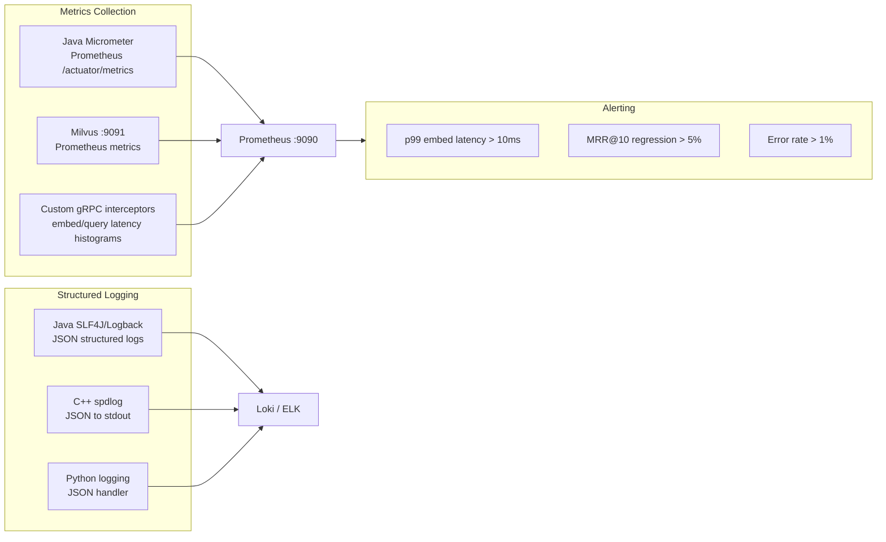

---

## 15. Future Roadmap

### 15.1 Roadmap Overview

```mermaid
gantt
    title ThreatAtlas Development Roadmap
    dateFormat  YYYY-Q
    axisFormat  %Y Q%q

    section Core Infrastructure
    Phase 1-4 (Current)     :done,    2024-Q3, 2024-Q4
    Phase 5-8 Completion    :active,  2024-Q4, 2025-Q1

    section AI Capabilities
    Graph RAG Integration   :         2025-Q1, 2025-Q2
    Agentic Retrieval       :         2025-Q2, 2025-Q3
    Multi-Agent Orchestration :       2025-Q3, 2025-Q4

    section Infrastructure
    GPU-Accelerated FAISS   :         2025-Q1, 2025-Q2
    Kubernetes Migration    :         2025-Q2, 2025-Q3
    Streaming Inference     :         2025-Q3, 2025-Q4

    section Intelligence
    STIX/TAXII Integration  :         2025-Q2, 2025-Q3
    Autonomous Threat Analysis :      2025-Q3, 2025-Q4
```

### 15.2 Graph RAG Architecture (Planned)

Graph RAG extends the flat vector retrieval model with a knowledge graph overlay. Entities extracted from threat documents (CVE IDs, threat actors, TTPs, IOCs) are stored as nodes in a graph database (Neo4j), and multi-hop traversal enriches the retrieved context with related entities not captured by vector proximity.

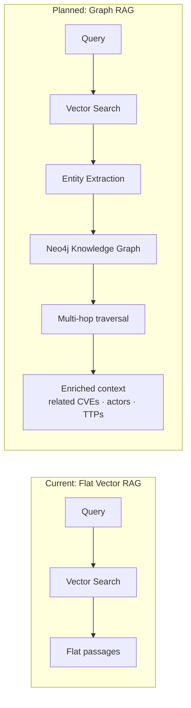

### 15.3 Agentic Retrieval (Planned)

The agentic retrieval system introduces a planning layer that can issue multiple retrieval queries, synthesize partial results, and decide when to request additional context before generating the final response. This addresses complex threat analysis queries that require cross-referencing multiple evidence sources.

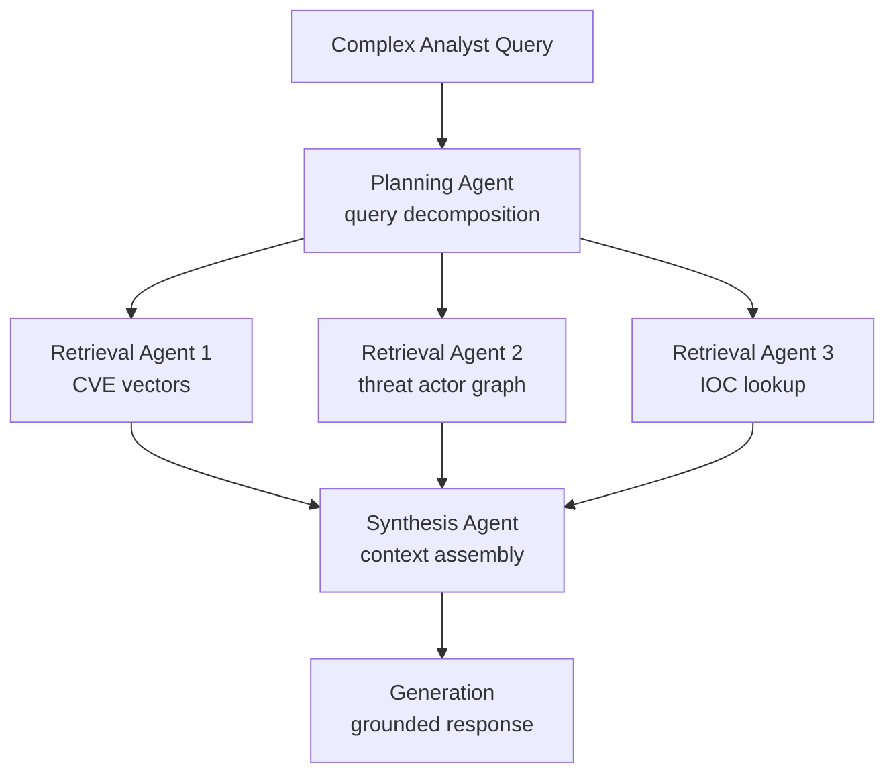

### 15.4 GPU-Accelerated FAISS (Planned)

Migration of FAISS operations to CUDA via `faiss-gpu` will reduce ANN retrieval latency from ~5ms (CPU HNSW) to ~0.5ms (GPU flat index) at 1M vectors, enabling real-time threat correlation at SIEM ingestion rates.

```cpp
// Planned: GPU FAISS flat index
#include <faiss/gpu/GpuIndexFlat.h>
#include <faiss/gpu/StandardGpuResources.h>

faiss::gpu::StandardGpuResources gpu_res;
faiss::gpu::GpuIndexFlatConfig cfg;
cfg.device = 0;  // GPU 0

faiss::gpu::GpuIndexFlatIP gpu_index(&gpu_res, 384, cfg);
// Query latency: ~0.5ms p99 at 1M vectors
```

---

## 16. Engineering Notes

### 16.1 Architectural Philosophy

ThreatAtlas is designed around the principle that **each programming language should own the computation that it is uniquely well-suited for**. This is not a multi-language system by accident or habit — it is multi-language by rigorous engineering analysis:

- **C++ owns latency** because deterministic memory management and SIMD vectorization are not available in any higher-level runtime at the performance levels required
- **Java owns orchestration** because the JVM's mature concurrency primitives (virtual threads in Java 21, CompletableFuture, gRPC async stubs), Spring Boot's dependency injection, and JUnit's test infrastructure make stateful pipeline management tractable at production quality
- **Python owns experimentation and offline processing** because the ML ecosystem (HuggingFace, ONNX, llama.cpp Python bindings) lives here, and the GIL is not a bottleneck for offline batch processing

### 16.2 Interface Discipline

All cross-language communication is governed by machine-defined interfaces: the `threatatlas.proto` file is the single source of truth for the C++/Java communication contract. Any change to the embedding vector dimension, RPC signature, or response schema requires a proto change, which triggers regeneration of both the C++ server stub and the Java client stub.

This discipline prevents interface drift — the silent accumulation of implicit assumptions in ad-hoc serialization code that is the most common source of subtle production bugs in polyglot systems.

### 16.3 Benchmark-Driven Development

Every performance claim in this document is backed by a reproducible benchmark committed to the `/benchmarks` directory. The `run_benchmarks.sh` script executes the full benchmark suite and writes versioned CSV results. Pull requests that degrade p99 latency or MRR@10 below the defined thresholds are flagged by CI.

This ensures that the architecture degrades visibly in version history rather than silently in production.

### 16.4 Research Inspirations

| Technique | Source | Application in ThreatAtlas |
|-----------|--------|---------------------------|
| Bi-encoder + cross-encoder retrieval | Reimers & Gurevych (2019), MS MARCO | Two-stage retrieval pipeline |
| HNSW approximate nearest neighbour | Malkov & Yashunin (2018) | FAISS HNSW index |
| Product Quantization | Jégou et al. (2011) | Milvus IVF+PQ for 10M scale |
| RAG with citation enforcement | Lewis et al. (2020) | Citation-validated JSON output |
| Quantized LLM inference | Dettmers et al. (2022) | Mistral-7B Q4_K_M via llama.cpp |

---

<div align="center">

---

```
Designed & Engineered by Kunjkumar Savani
```

*ThreatAtlas · docs/architecture.md · Version 1.0*

*See also: [runbook_milvus.md](runbook_milvus.md) · [runbook_rag.md](runbook_rag.md) · [runbook_eval.md](runbook_eval.md)*

</div>
