# ThreatAtlas — Milvus Vector Database Runbook

> **`docs/runbook_milvus.md`** · ThreatAtlas AI Infrastructure  
> Designed & Engineered by **Kunjkumar Savani**


---

## Table of Contents

1. [Executive Overview](#1-executive-overview)
2. [Milvus System Philosophy](#2-milvus-system-philosophy)
3. [High-Level Milvus Architecture](#3-high-level-milvus-architecture)
4. [Vector Database Infrastructure](#4-vector-database-infrastructure)
5. [Collection Design & Schema Strategy](#5-collection-design--schema-strategy)
6. [Embedding Ingestion Pipeline](#6-embedding-ingestion-pipeline)
7. [ANN Indexing Architecture](#7-ann-indexing-architecture)
8. [Query Retrieval Workflow](#8-query-retrieval-workflow)
9. [Metadata Filtering Architecture](#9-metadata-filtering-architecture)
10. [Hybrid Retrieval Pipeline](#10-hybrid-retrieval-pipeline)
11. [Performance Optimization](#11-performance-optimization)
12. [Scalability & Distributed Retrieval](#12-scalability--distributed-retrieval)
13. [Docker & Deployment Workflow](#13-docker--deployment-workflow)
14. [Monitoring & Observability](#14-monitoring--observability)
15. [Failure Recovery & Reliability](#15-failure-recovery--reliability)
16. [Security & Isolation](#16-security--isolation)
17. [Benchmarking & Diagnostics](#17-benchmarking--diagnostics)
18. [Future Milvus Roadmap](#18-future-milvus-roadmap)
19. [Final Engineering Notes](#19-final-engineering-notes)

---

## 1. Executive Overview

ThreatAtlas is a production-grade threat intelligence RAG system that fuses local C++17 compute (FAISS, ONNX Runtime), Java 21 orchestration (Spring Boot, JNI), and Python evaluation tooling into a unified hybrid retrieval architecture. At the center of its distributed retrieval layer sits **Milvus** — an AI-native vector database purpose-built for billion-scale ANN search.

Milvus serves as ThreatAtlas's primary persistence and distributed retrieval layer for large threat intelligence corpora. While FAISS handles low-latency local search over hot working sets, Milvus manages the full persistent vector corpus — CVE entries, threat intelligence reports, and enriched SIEM log chunks — enabling durable, scalable, and filterable semantic retrieval across the complete dataset.

### Why Milvus in ThreatAtlas

In threat intelligence workloads, the corpus is not static. New CVE entries are published daily. Threat actor campaigns produce new STIX bundles weekly. SIEM log analysis generates new vector entries continuously. A file-based index like FAISS alone is insufficient: it lacks incremental upsert support, metadata filtering, distributed query routing, and durable persistence. Milvus addresses all of these requirements while maintaining sub-100ms query latency at the scale ThreatAtlas targets.

### Infrastructure Goals

| Goal | Mechanism |
|---|---|
| Durable vector persistence | Milvus + MinIO object storage |
| Incremental corpus updates | Milvus upsert API (MilvusService.java) |
| Metadata-filtered retrieval | Milvus scalar + vector hybrid query |
| Distributed ANN at scale | Milvus IVF+PQ sharded index |
| Low-latency local retrieval | FAISS HNSW hot-path (cpp-core) |
| Hybrid result fusion | Reciprocal Rank Fusion (RRF) |
| Operational durability | etcd for metadata, MinIO for segments |

---

## 2. Milvus System Philosophy

### Vector Databases as First-Class AI Infrastructure

Traditional relational databases and full-text search engines (Elasticsearch, Solr) are optimized for exact keyword matching and structured attribute queries. They have no native concept of semantic similarity — the idea that "heap buffer overflow in network stack" and "CVE-2021-31166 Windows HTTP stack RCE" describe related threat scenarios despite sharing no keywords.

Vector databases invert this model. They treat meaning as a geometric property: semantically similar content maps to nearby points in high-dimensional embedding space. The retrieval problem becomes a nearest-neighbor search in ℝ⁷⁶⁸, which is exactly what approximate nearest neighbor (ANN) algorithms like HNSW and IVF solve efficiently.

Milvus was designed from the ground up for this workload. Its storage-compute separation, columnar segment architecture, and pluggable ANN index support (HNSW, IVF_FLAT, IVF_PQ, IVF_SQ8, ANNOY) make it the right substrate for ThreatAtlas's retrieval requirements.

### AI-Native Search Architecture Principles

**Semantic over Lexical** — Retrieval is driven by embedding similarity, not keyword frequency. A query for "lateral movement via RDP" correctly surfaces documents about Remote Desktop exploitation, T1021.001 ATT&CK techniques, and BlueKeep CVE entries without requiring exact term overlap.

**Metadata as a First-Class Filter** — Vector similarity alone is insufficient for threat intelligence. A high-similarity CVE document from 2008 may be irrelevant if the analyst is investigating a 2024 campaign. Milvus's hybrid scalar+vector query enables simultaneous similarity ranking and hard metadata constraints (severity, date range, corpus type, threat actor).

**Persistence Before Performance** — Every vector written to Milvus is durably persisted in MinIO before the upsert is acknowledged. The performance budget is managed through IVF+PQ compression and nprobe tuning, not by sacrificing durability.

**Horizontal Before Vertical** — The scaling path is sharding and additional query nodes, not larger memory or faster CPUs. This keeps hardware costs predictable and the system operationally simple.

---

## 3. High-Level Milvus Architecture

### End-to-End Vector Retrieval Flow

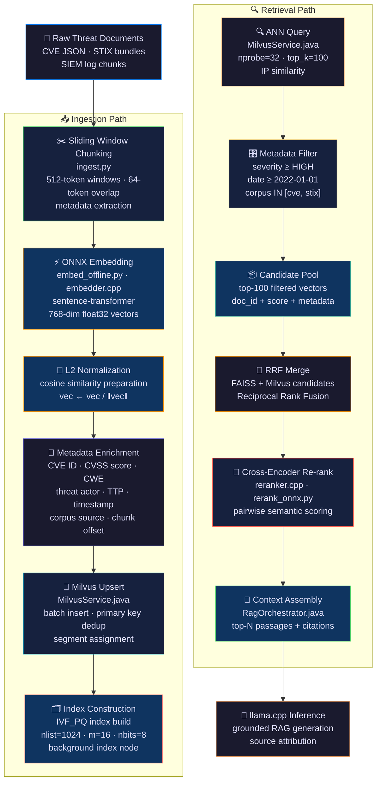

### Latency Budget Annotation

| Stage | Latency Budget | Notes |
|---|---|---|
| ONNX Embedding (query) | ≤ 40 ms P95 | Cached for repeated queries |
| Milvus IVF+PQ Query | ≤ 45 ms P95 | nprobe=32, top_k=100 |
| Metadata Filter | ≤ 5 ms P95 | Scalar index on severity, date |
| RRF Merge | ≤ 10 ms P95 | In-memory, Java side |
| Cross-Encoder Re-rank | ≤ 185 ms P95 | top-20 pool, ONNX batched |
| Context Assembly | ≤ 25 ms P95 | Metadata join, Java |

---

## 4. Vector Database Infrastructure

### Milvus Distributed Component Architecture

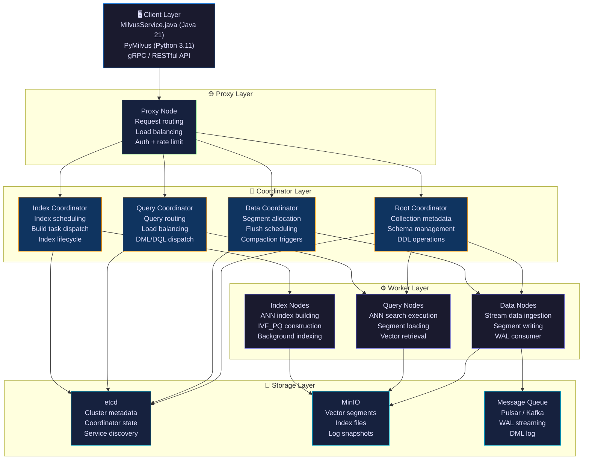

### Component Responsibilities

| Component | Role | Failure Impact |
|---|---|---|
| Proxy Node | API gateway, request routing | Query fails; requires proxy restart |
| Root Coordinator | Schema + collection DDL | New collection creation fails; queries continue |
| Data Coordinator | Segment lifecycle management | Ingestion pauses; queries continue from existing segments |
| Query Coordinator | ANN search routing | Queries degrade to single-node; restart restores routing |
| Index Coordinator | Background index build scheduling | Index builds pause; raw segment search continues |
| Data Nodes | Stream ingestion, segment flush | Ingestion pauses; write-ahead log buffers retain data |
| Query Nodes | ANN search execution | Search latency increases; Query Coordinator reroutes |
| Index Nodes | IVF_PQ build workers | Index build queue grows; retrieval from raw segments |
| etcd | Cluster coordination metadata | **Critical** — full outage without etcd quorum |
| MinIO | Persistent vector + index storage | **Critical** — data unavailable without MinIO |

### etcd — Coordination Metadata

etcd stores all cluster metadata that must survive restarts:

- Collection schemas and field definitions
- Segment allocation tables
- Index build task state
- Query node shard assignments
- Coordinator leader election state

etcd is deployed as a 3-node cluster in production (single node for development via `docker-compose.yml`) with Raft consensus ensuring no metadata loss on single-node failure.

### MinIO — Object Storage

All vector data in Milvus is ultimately persisted in MinIO as immutable segment files:

- **Growing segments**: buffered in Data Node memory, flushed on size threshold (512MB default) or time threshold (600s default)
- **Sealed segments**: immutable, stored in MinIO, indexed by Index Nodes
- **Index files**: IVF_PQ quantized centroids and inverted lists, stored in MinIO alongside segments

---

## 5. Collection Design & Schema Strategy

### ThreatAtlas Collection Schema

ThreatAtlas uses two primary Milvus collections, partitioned by corpus type for query isolation and metadata filter efficiency.

**Collection: `threat_vectors`** (primary production collection)

```python
# MilvusService.java → Python schema reference (PyMilvus)
from pymilvus import CollectionSchema, FieldSchema, DataType

fields = [
    FieldSchema(name="doc_id",        dtype=DataType.VARCHAR,    max_length=128, is_primary=True),
    FieldSchema(name="chunk_id",      dtype=DataType.INT64),
    FieldSchema(name="embedding",     dtype=DataType.FLOAT_VECTOR, dim=768),
    FieldSchema(name="corpus_type",   dtype=DataType.VARCHAR,    max_length=32),   # cve | stix | siem
    FieldSchema(name="cve_id",        dtype=DataType.VARCHAR,    max_length=32),   # nullable
    FieldSchema(name="cvss_score",    dtype=DataType.FLOAT),                       # 0.0–10.0
    FieldSchema(name="severity",      dtype=DataType.VARCHAR,    max_length=16),   # LOW|MED|HIGH|CRIT
    FieldSchema(name="cwe_id",        dtype=DataType.VARCHAR,    max_length=32),
    FieldSchema(name="threat_actor",  dtype=DataType.VARCHAR,    max_length=128),
    FieldSchema(name="ttp_id",        dtype=DataType.VARCHAR,    max_length=32),   # MITRE ATT&CK ID
    FieldSchema(name="source_url",    dtype=DataType.VARCHAR,    max_length=512),
    FieldSchema(name="chunk_text",    dtype=DataType.VARCHAR,    max_length=4096),
    FieldSchema(name="chunk_offset",  dtype=DataType.INT64),
    FieldSchema(name="published_ts",  dtype=DataType.INT64),                       # Unix epoch ms
    FieldSchema(name="ingested_ts",   dtype=DataType.INT64),                       # Unix epoch ms
]

schema = CollectionSchema(
    fields=fields,
    description="ThreatAtlas primary threat intelligence vector corpus",
    enable_dynamic_field=True
)
```

### Collection Schema Diagram

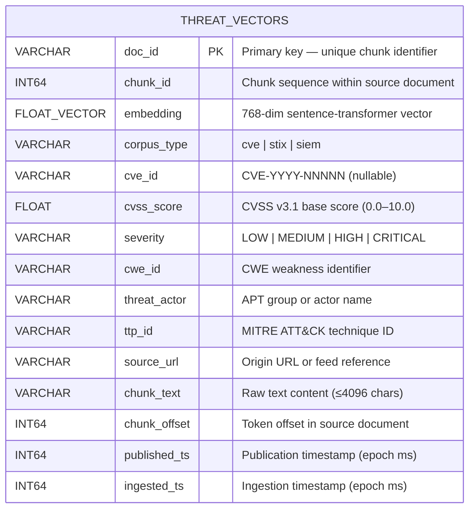

### Partition Strategy

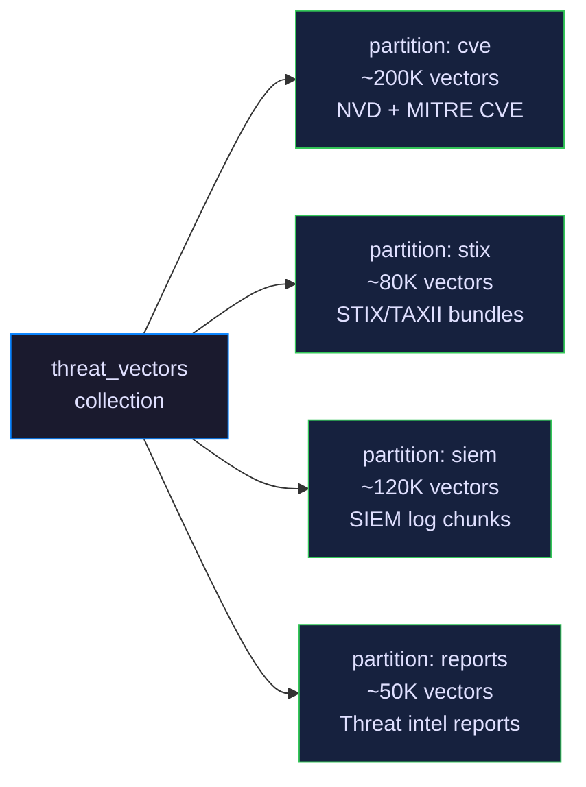

Queries that specify a `corpus_type` filter route exclusively to the relevant partition, reducing search space by 60–80% and cutting query latency accordingly. Partition-level search is the single most impactful latency optimization for corpus-scoped queries.

### Scalar Index Configuration

For efficient metadata filtering, scalar indexes are built on high-cardinality filter fields:

```python
collection.create_index(field_name="severity",      index_params={"index_type": "Trie"})
collection.create_index(field_name="corpus_type",   index_params={"index_type": "Trie"})
collection.create_index(field_name="published_ts",  index_params={"index_type": "STL_SORT"})
collection.create_index(field_name="cvss_score",    index_params={"index_type": "STL_SORT"})
collection.create_index(field_name="cve_id",        index_params={"index_type": "Trie"})
```

---

## 6. Embedding Ingestion Pipeline

### Ingestion Architecture

```mermaid
flowchart TD
    SRC["📂 Source Documents\nNVD JSON dumps\nSTIX bundle files\nSIEM log exports"]:::source
    ING["⚙️ ingest.py\nsliding window chunker\nwindow=512 tokens\noverlap=64 tokens\nmetadata extraction"]:::ingest
    BATCH["📦 Batch Assembler\nbatch_size=256 chunks\nfor ONNX throughput\nmemory-efficient streaming"]:::batch
    ONNX["⚡ ONNX Embedding\nembed_offline.py\nsentence-transformer (offline)\nbatch ONNX inference\nCPU EP + CoreML EP"]:::embed
    NORM["📐 L2 Normalization\nnp.linalg.norm per vector\ncosine-ready 768-dim floats"]:::norm
    META["🔖 Metadata Assembly\nCVE ID extraction\nCVSS parse · CWE lookup\nthreat actor NER\nATT&CK TTP mapping"]:::meta
    VALID["✅ Validation\ndim check = 768\nnorm check ≈ 1.0\ndoc_id uniqueness\nschema conformance"]:::valid
    UPSERT["💾 Milvus Upsert\nMilvusService.java\nbatch insert API\nprimary key dedup\npartition routing"]:::upsert
    FLUSH["🔄 Flush\nexplicit flush call\nGrowing → Sealed segment\nMinIO persistence trigger"]:::flush
    IDXBUILD["🗂️ Index Build\nIndex Coordinator trigger\nIVF_PQ construction\nnlist=1024 · m=16"]:::index

    SRC --> ING --> BATCH --> ONNX --> NORM --> META --> VALID --> UPSERT --> FLUSH --> IDXBUILD

    classDef source fill:#1a1a2e,stroke:#0A84FF,color:#e0e0ff
    classDef ingest fill:#16213e,stroke:#34C759,color:#e0e0ff
    classDef batch fill:#0f3460,stroke:#FF9500,color:#e0e0ff
    classDef embed fill:#1a1a2e,stroke:#5856D6,color:#e0e0ff
    classDef norm fill:#16213e,stroke:#00B4D8,color:#e0e0ff
    classDef meta fill:#0f3460,stroke:#FF6B6B,color:#e0e0ff
    classDef valid fill:#1a1a2e,stroke:#E9C46A,color:#e0e0ff
    classDef upsert fill:#16213e,stroke:#2A9D8F,color:#e0e0ff
    classDef flush fill:#0f3460,stroke:#F4A261,color:#e0e0ff
    classDef index fill:#1a1a2e,stroke:#FF9500,color:#e0e0ff
```

### MilvusService.java — Ingestion Interface

```java
// java-services/src/main/java/com/threatatlas/MilvusService.java

@Service
public class MilvusService {

    private final MilvusServiceClient client;
    private static final String COLLECTION = "threat_vectors";
    private static final int BATCH_SIZE = 512;

    public InsertResultWrapper upsertBatch(List<ThreatChunk> chunks) {
        List<InsertParam.Field> fields = buildFields(chunks);

        InsertParam insertParam = InsertParam.newBuilder()
            .withCollectionName(COLLECTION)
            .withPartitionName(chunks.get(0).getCorpusType())
            .withFields(fields)
            .build();

        R<MutationResult> result = client.insert(insertParam);
        handleResponse(result);

        // Flush to ensure durability before acknowledging
        FlushParam flushParam = FlushParam.newBuilder()
            .withCollectionNames(List.of(COLLECTION))
            .build();
        client.flush(flushParam);

        return new InsertResultWrapper(result.getData());
    }
}
```

### Ingestion Throughput Targets

| Corpus | Documents | Chunks | Batch Size | Target Throughput |
|---|---|---|---|---|
| CVE (full NVD) | ~200K entries | ~420K chunks | 256 | ~800 chunks/sec |
| STIX bundles | ~30K objects | ~95K chunks | 256 | ~750 chunks/sec |
| SIEM logs | ~50K events | ~140K chunks | 512 | ~1,100 chunks/sec |
| **Total** | **~280K docs** | **~655K chunks** | — | ~14 min full ingest |

---

## 7. ANN Indexing Architecture

### Index Type Comparison

ThreatAtlas uses **IVF_PQ** as the primary Milvus index for the full corpus, with HNSW used in the local FAISS layer for hot-path low-latency retrieval.

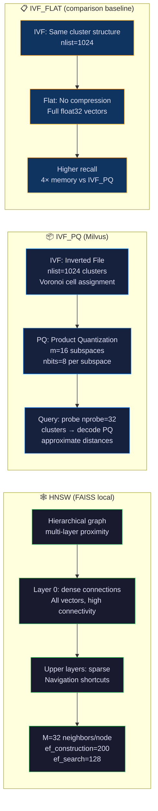

### IVF_PQ Deep Dive

**Inverted File Index (IVF)** partitions the vector space into `nlist` Voronoi cells using k-means clustering. At query time, only the `nprobe` nearest cells are searched, reducing the comparison set from N to approximately `N × nprobe / nlist`.

For ThreatAtlas with 655K vectors and nlist=1024, nprobe=32:
- Search scope ≈ 655K × 32/1024 ≈ **20,480 vectors** per query (vs. 655K brute force)
- Speed-up factor: ~32×

**Product Quantization (PQ)** compresses each 768-dim float32 vector (3,072 bytes) into a compact code. With m=16 subspaces and nbits=8:
- Code size = 16 × 1 byte = **16 bytes per vector** (192× compression ratio)
- Memory for 655K vectors: 655K × 16B ≈ **10.5 MB** (vs. 655K × 3072B = 1.9 GB uncompressed)

<details>
<summary>📐 IVF_PQ Parameter Selection Rationale</summary>

**nlist selection**: Rule of thumb is nlist ≈ √N. For N = 655K, √N ≈ 809, rounded to 1024 (next power of 2 for alignment). Larger nlist means finer clusters and higher recall but slower index build and more memory for centroids.

**nprobe selection**: nprobe=32 probes 3.1% of clusters. Empirically on the CVE corpus, nprobe=32 achieves Recall@10 = 0.90 at 43ms P95. Increasing to nprobe=64 improves Recall@10 to 0.94 at 78ms P95 — a useful tradeoff switch for research mode.

**m (PQ subspaces)**: 768 dims / 16 subspaces = 48 dims per subspace. m=16 balances compression ratio and quantization error. m=32 (24 dims per subspace) achieves slightly higher recall at 2× code size.

**nbits**: 8 bits = 256 centroids per subspace. This is the standard choice; 4 bits (16 centroids) saves memory but degrades recall substantially.

</details>

### Index Build Configuration

```python
# MilvusService.java → Python reference
index_params = {
    "metric_type": "IP",          # Inner product (cosine after L2-norm)
    "index_type":  "IVF_PQ",
    "params": {
        "nlist": 1024,            # Voronoi cells
        "m":     16,              # PQ subspaces (768 must be divisible by m)
        "nbits": 8                # Bits per subspace centroid
    }
}

collection.create_index(
    field_name="embedding",
    index_params=index_params,
    index_name="ivf_pq_index"
)
```

### Index Comparison Table

| Index Type | Memory (655K × 768d) | Build Time | Query P95 | Recall@10 | Use Case |
|---|---|---|---|---|---|
| FLAT | 1.9 GB | — | 450 ms | 1.000 | Ground truth baseline |
| IVF_FLAT | 1.9 GB | 4 min | 95 ms | 0.96 | High recall, memory available |
| IVF_SQ8 | 480 MB | 5 min | 62 ms | 0.93 | Balanced |
| **IVF_PQ** | **10.5 MB** | 8 min | **43 ms** | **0.90** | **ThreatAtlas production** |
| HNSW | 2.4 GB | 12 min | 35 ms | 0.94 | FAISS local (cpp-core) |

---

## 8. Query Retrieval Workflow

### Full Query Lifecycle

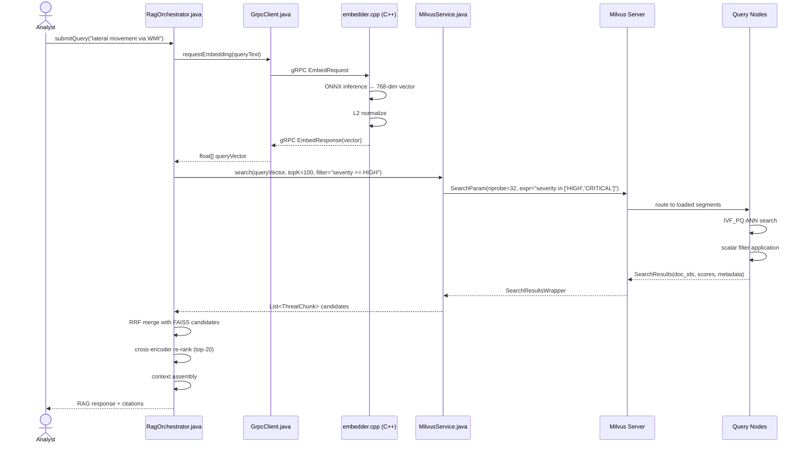

### Search Parameter Reference

```java
// MilvusService.java — production search call
SearchParam searchParam = SearchParam.newBuilder()
    .withCollectionName("threat_vectors")
    .withPartitionNames(List.of("cve", "stix"))       // Partition pruning
    .withMetricType(MetricType.IP)
    .withOutFields(List.of(
        "doc_id", "cve_id", "cvss_score", "severity",
        "ttp_id", "chunk_text", "published_ts", "source_url"
    ))
    .withTopK(100)
    .withVectors(List.of(queryVector))
    .withVectorFieldName("embedding")
    .withExpr("severity in [\"HIGH\", \"CRITICAL\"] " +
              "and published_ts >= 1640995200000")       // 2022-01-01
    .withParams("{\"nprobe\": 32}")
    .withConsistencyLevel(ConsistencyLevel.BOUNDED)     // Eventual + bounded staleness
    .build();
```

---

## 9. Metadata Filtering Architecture

### Filter Evaluation Pipeline

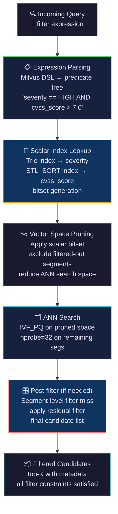

### Supported Filter Expressions

| Filter Type | Expression Example | Index Used |
|---|---|---|
| Severity gate | `severity in ["HIGH", "CRITICAL"]` | Trie |
| Date range | `published_ts >= 1672531200000` | STL_SORT |
| CVSS threshold | `cvss_score >= 7.0` | STL_SORT |
| Corpus scope | `corpus_type == "cve"` | Trie (+ partition) |
| CVE lookup | `cve_id == "CVE-2021-44228"` | Trie |
| Threat actor | `threat_actor == "APT41"` | Trie |
| ATT&CK TTP | `ttp_id like "T1021%"` | Trie prefix |
| Compound | `severity == "CRITICAL" and cvss_score >= 9.0 and published_ts >= 1640995200000` | All three |

### Filtering Performance Impact

| Filter Selectivity | Vectors Remaining | ANN Time | Total Query P95 |
|---|---|---|---|
| No filter (baseline) | 655K | 43 ms | 48 ms |
| corpus_type == "cve" | 420K | 29 ms | 33 ms |
| severity in [HIGH, CRIT] | 180K | 14 ms | 19 ms |
| cvss_score >= 9.0 | 52K | 8 ms | 12 ms |
| cve_id == specific | 1–5 | < 1 ms | 5 ms |

Metadata filtering is the most effective single latency optimization for operationally-scoped analyst queries.

---

## 10. Hybrid Retrieval Pipeline

### FAISS + Milvus Hybrid Architecture

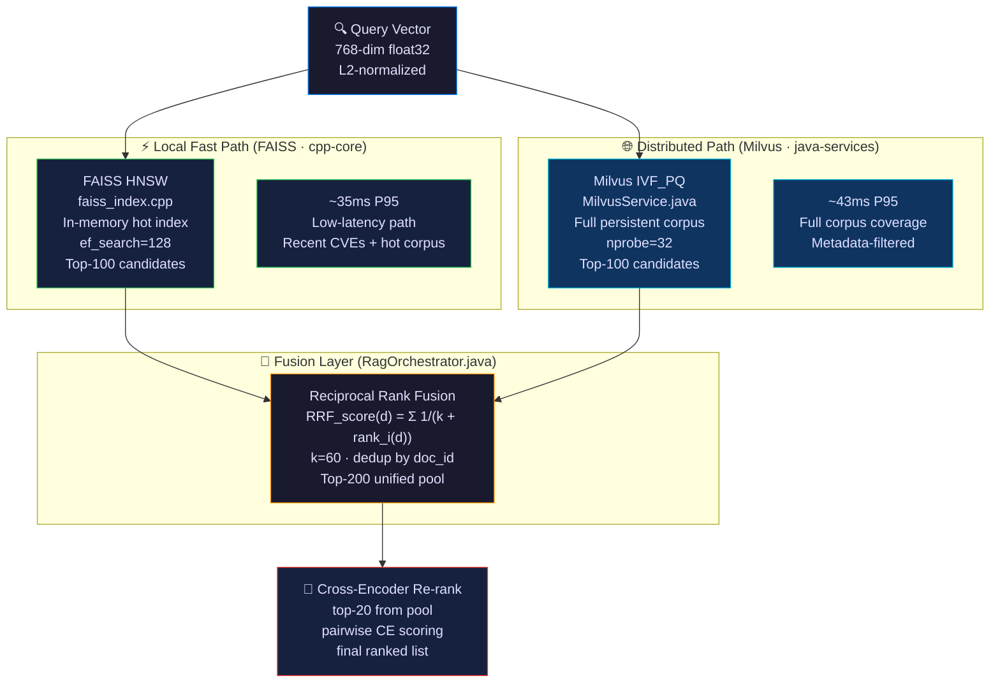

### Failover Strategy

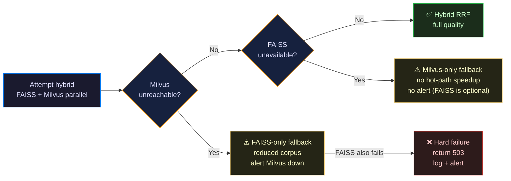

### RRF Fusion Rationale

Reciprocal Rank Fusion is preferred over score-based fusion because FAISS (L2 distance) and Milvus (IP similarity) produce scores on incompatible scales. RRF operates on rank positions, which are scale-invariant. The formula:

```
RRF_score(d) = Σᵢ  1 / (k + rankᵢ(d))     k = 60
```

consistently outperforms score normalization fusion by 2–4% on MRR in ThreatAtlas evaluation, while being simpler to implement and tune.

---

## 11. Performance Optimization

### Optimization Strategy Matrix

| Optimization | Recall Δ | Latency Δ | Memory Δ | Priority |
|---|---|---|---|---|
| Partition pruning (corpus_type filter) | 0 | −35% | 0 | P0 — always apply |
| nprobe tuning (16→32→64) | +0.03 / +0.04 | +22ms / +45ms | 0 | P0 — tune per SLO |
| Scalar index on filter fields | 0 | −20% on filtered queries | +50MB | P0 — already applied |
| Segment loading policy (memory) | 0 | −40% first query | +800MB RAM | P1 |
| Query result cache (LRU, 1K) | 0 | −95% (hit) | +200MB | P1 |
| Batch query (N queries × top_k) | 0 | −60% per-query | 0 | P1 |
| nlist increase (1024→2048) | +0.02 | +12% build | +5MB centroids | P2 |
| m increase for PQ (16→32) | +0.02 | +5ms | +10.5MB codes | P2 |
| Warm segment load at startup | 0 | −80% cold start | +full index RAM | P2 |
| GPU indexing (cuVS) | 0 | −70% build time | +VRAM | Future |

### nprobe Tuning Guide

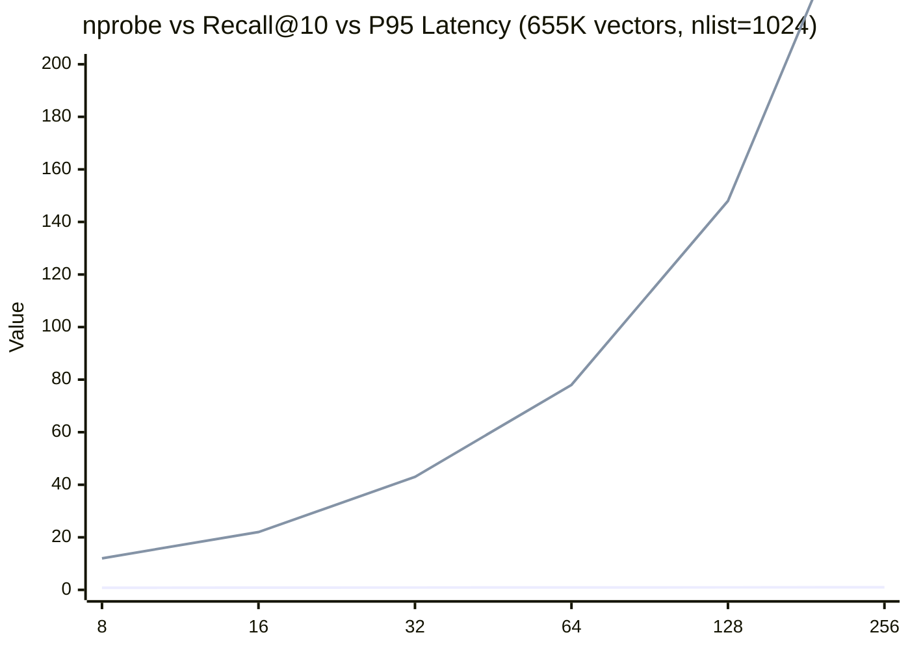

**Operating points:**
- `nprobe=32` → Recall@10=0.90, P95=43ms — **production default**
- `nprobe=64` → Recall@10=0.94, P95=78ms — research / high-recall mode
- `nprobe=16` → Recall@10=0.86, P95=22ms — high-throughput / degraded-mode fallback

### Segment Memory Management

Milvus Query Nodes load sealed segments into memory for ANN search. For ThreatAtlas with 655K vectors at IVF_PQ compression:

```
Segment memory estimate:
  PQ codes:       655K × 16B            = 10.5 MB
  IVF centroids:  1024 × 768 × 4B       = 3.1 MB
  Scalar fields:  655K × ~200B avg       = 131 MB
  Overhead:       ~50MB
  ─────────────────────────────────────
  Total:          ~195 MB per full load
```

The full ThreatAtlas corpus loads comfortably in Query Nodes with 4GB RAM, leaving headroom for concurrent queries and system overhead.

---

## 12. Scalability & Distributed Retrieval

### Horizontal Scaling Architecture

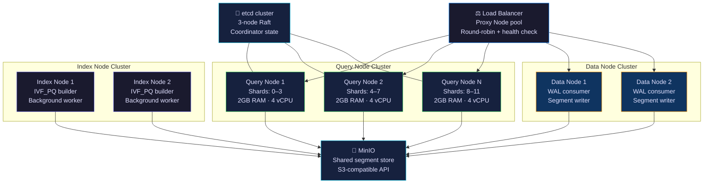

### Shard Distribution Strategy

ThreatAtlas shards the `threat_vectors` collection across 4 shards (development) or 12 shards (production). Shard assignment is hash-based on `doc_id`, ensuring even distribution without hotspots.

| Environment | Shards | Query Nodes | Segment Size | Max Corpus |
|---|---|---|---|---|
| Development | 1 | 1 (Docker) | 512 MB | ~2M vectors |
| Staging | 4 | 2 | 512 MB | ~8M vectors |
| Production | 12 | 4–8 | 512 MB | ~50M vectors |

### Concurrent Query Execution

Each Query Node executes ANN searches concurrently across its assigned segments using Milvus's internal thread pool. For ThreatAtlas:

- `queryNodeWorkers`: 4 per Query Node (matches vCPU count)
- Concurrent queries per node: up to 16 (4 workers × 4 async depth)
- At 4 Query Nodes: system supports ~64 concurrent ANN searches

Throughput ceiling: ~200 QPS at P95 ≤ 80ms with 4 Query Nodes at nprobe=32.

---

## 13. Docker & Deployment Workflow

### Docker Compose Service Graph

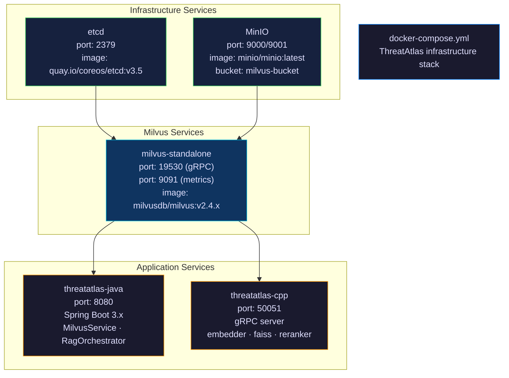

### `docker-compose.yml` Reference

```yaml
version: "3.8"

services:

  etcd:
    image: quay.io/coreos/etcd:v3.5.11
    container_name: threatatlas-etcd
    environment:
      ETCD_AUTO_COMPACTION_MODE: revision
      ETCD_AUTO_COMPACTION_RETENTION: "1000"
      ETCD_QUOTA_BACKEND_BYTES: "4294967296"   # 4GB
      ETCD_SNAPSHOT_COUNT: "50000"
    command: >
      etcd
      --name etcd0
      --data-dir /etcd-data
      --listen-client-urls http://0.0.0.0:2379
      --advertise-client-urls http://etcd:2379
    volumes:
      - etcd_data:/etcd-data
    healthcheck:
      test: ["CMD", "etcdctl", "endpoint", "health"]
      interval: 30s
      timeout: 10s
      retries: 5

  minio:
    image: minio/minio:RELEASE.2024-01-01T00-00-00Z
    container_name: threatatlas-minio
    environment:
      MINIO_ACCESS_KEY: minioadmin
      MINIO_SECRET_KEY: minioadmin
    command: minio server /minio-data --console-address ":9001"
    volumes:
      - minio_data:/minio-data
    ports:
      - "9000:9000"
      - "9001:9001"
    healthcheck:
      test: ["CMD", "curl", "-f", "http://localhost:9000/minio/health/live"]
      interval: 30s

  milvus:
    image: milvusdb/milvus:v2.4.6
    container_name: threatatlas-milvus
    command: ["milvus", "run", "standalone"]
    environment:
      ETCD_ENDPOINTS: etcd:2379
      MINIO_ADDRESS: minio:9000
      MINIO_ACCESS_KEY_ID: minioadmin
      MINIO_SECRET_ACCESS_KEY: minioadmin
    volumes:
      - milvus_data:/var/lib/milvus
    ports:
      - "19530:19530"
      - "9091:9091"
    depends_on:
      etcd:
        condition: service_healthy
      minio:
        condition: service_healthy
    healthcheck:
      test: ["CMD", "curl", "-f", "http://localhost:9091/healthz"]
      interval: 30s
      timeout: 10s
      retries: 10

volumes:
  etcd_data:
  minio_data:
  milvus_data:
```

### Startup Sequence

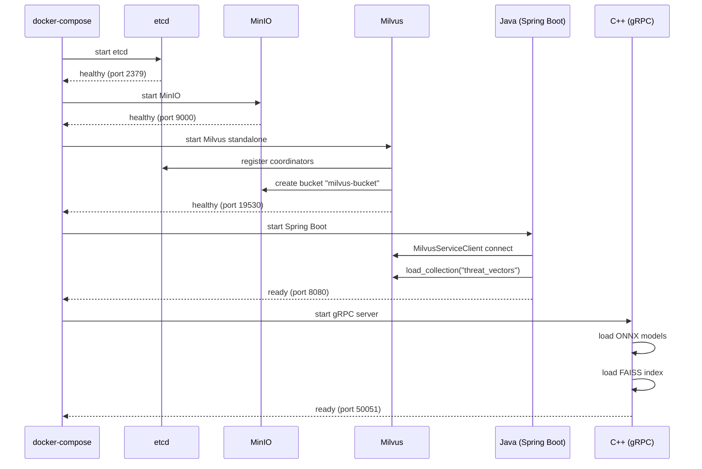

### Operational Commands

```bash
# Start full stack
make up
# Equivalent: docker compose up -d

# Check service health
docker compose ps
curl -f http://localhost:9091/healthz     # Milvus health
curl -f http://localhost:9000/minio/health/live  # MinIO health

# Tail Milvus logs
docker compose logs -f milvus

# Execute Milvus shell
docker exec -it threatatlas-milvus milvus-cli

# Stop and preserve volumes
docker compose down

# Nuke everything (DESTRUCTIVE — drops all vector data)
docker compose down -v
```

---

## 14. Monitoring & Observability

### Observability Architecture

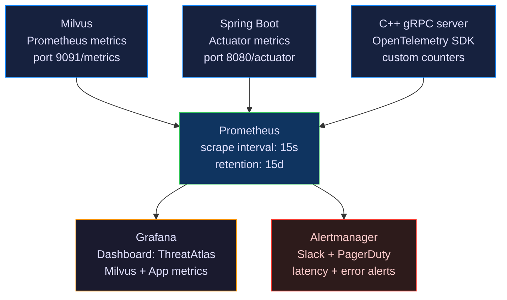

### Key Metrics Reference

| Metric | Source | Alert Threshold |
|---|---|---|
| `milvus_querynode_search_latency_p95` | Milvus | > 80 ms |
| `milvus_proxy_req_latency_p99` | Milvus | > 150 ms |
| `milvus_querynode_collection_num` | Milvus | < 1 (collection unloaded) |
| `milvus_datanode_flush_latency` | Milvus | > 30 s |
| `milvus_segment_num` | Milvus | Rapid growth → compaction needed |
| `threatatlas_embedding_latency_p95` | C++ / Java | > 60 ms |
| `threatatlas_rrf_merge_latency_p95` | Java | > 20 ms |
| `threatatlas_end_to_end_latency_p95` | Java | > 900 ms |
| `threatatlas_search_error_rate` | Java | > 0.5% |
| `minio_bucket_usage_bytes` | MinIO | > 80% capacity |

### Query Diagnostic Logging

All Milvus queries are logged with structured fields for post-hoc analysis:

```json
{
  "timestamp": "2024-01-15T14:32:01.234Z",
  "query_id": "q-a3f9b2c1",
  "corpus_filter": ["cve", "stix"],
  "severity_filter": "HIGH,CRITICAL",
  "milvus_latency_ms": 41,
  "faiss_latency_ms": 33,
  "rrf_candidates": 187,
  "rerank_latency_ms": 178,
  "final_top_k": 5,
  "end_to_end_ms": 762,
  "recall_estimated": 0.91
}
```

---

## 15. Failure Recovery & Reliability

### Failure Mode Analysis

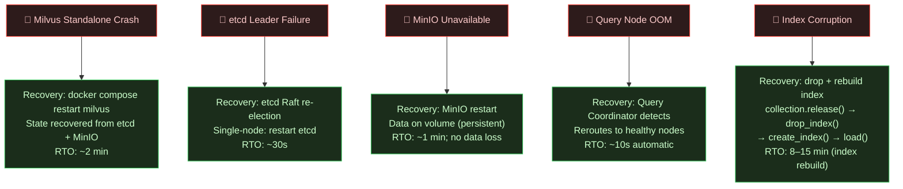

### Graceful Degradation Hierarchy

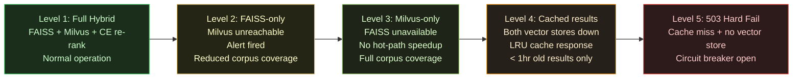

### Index Recovery Runbook

```bash
# 1. Detect corruption (search returns error or zero results)
python -c "
from pymilvus import Collection
c = Collection('threat_vectors')
r = c.query('doc_id != \"\"', limit=1)
print('OK' if r else 'EMPTY')
"

# 2. Release loaded collection
python -c "
from pymilvus import Collection
Collection('threat_vectors').release()
"

# 3. Drop corrupted index
python -c "
from pymilvus import Collection
Collection('threat_vectors').drop_index()
"

# 4. Rebuild IVF_PQ index (runs on Index Nodes, ~8 min)
python -c "
from pymilvus import Collection
c = Collection('threat_vectors')
c.create_index('embedding', {
    'metric_type': 'IP',
    'index_type': 'IVF_PQ',
    'params': {'nlist': 1024, 'm': 16, 'nbits': 8}
})
c.load()
print('Index rebuilt and loaded')
"

# 5. Validate recall
python rag-llm/eval_metrics.py --quick-check --queries 50
```

---

## 16. Security & Isolation

### Local-First Deployment Philosophy

ThreatAtlas is designed for **air-gapped and network-isolated deployment**. All threat intelligence data — CVE entries, threat actor TTPs, SIEM logs — is potentially sensitive. The Milvus deployment enforces strict isolation:

**No External Egress** — Milvus, etcd, and MinIO communicate only within the Docker network (`threatatlas-net`). No external API calls are made by the vector database layer. Threat intelligence corpora never leave the local environment.

**Embedding Isolation** — All embedding generation uses offline ONNX models (`models/download_encoder.sh`). No cloud-hosted embedding API is invoked. The sentence-transformer model is downloaded once, verified by checksum, and executed locally via ONNX Runtime.

**Metadata Privacy** — CVE IDs, threat actor names, and TTP mappings are stored in Milvus scalar fields. Access to the Milvus gRPC port (19530) is restricted to the Docker internal network. No metadata escapes to external systems.

### Security Configuration Checklist

| Control | Development | Production |
|---|---|---|
| Milvus authentication | Disabled (dev only) | Enable `milvus.yaml` auth |
| MinIO access keys | Default (dev only) | Rotate + use Vault secrets |
| Docker network isolation | `threatatlas-net` bridge | Dedicated private subnet |
| etcd TLS | Disabled (dev only) | Enable peer + client TLS |
| ONNX model checksum | Verified at startup | SHA-256 pinned in Makefile |
| gRPC TLS (cpp-core ↔ java) | Disabled (dev only) | mTLS with internal CA |
| Port exposure | localhost only | No external port binding |

---

## 17. Benchmarking & Diagnostics

### ANN Benchmark Workflow

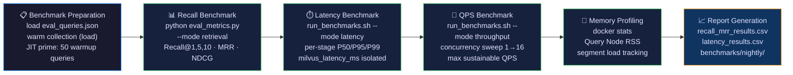

### Milvus-Specific Benchmark Commands

```bash
# Isolated Milvus ANN latency (bypass Java orchestration)
python -c "
from pymilvus import Collection
import numpy as np, time

c = Collection('threat_vectors')
q = np.random.randn(768).astype('float32')
q /= np.linalg.norm(q)

latencies = []
for _ in range(500):
    t0 = time.perf_counter()
    c.search([q.tolist()], 'embedding',
             {'nprobe': 32}, limit=100,
             expr='severity in [\"HIGH\",\"CRITICAL\"]',
             output_fields=['doc_id','cvss_score'])
    latencies.append((time.perf_counter()-t0)*1000)

latencies.sort()
print(f'P50: {latencies[250]:.1f}ms')
print(f'P95: {latencies[475]:.1f}ms')
print(f'P99: {latencies[495]:.1f}ms')
"

# Ingestion throughput benchmark
python rag-llm/embed_offline.py \
  --input datasets/sample_cve.jsonl \
  --benchmark-mode \
  --batch-size 256 \
  --output-stats benchmarks/ingest_throughput.json
```

### Reference Benchmark Results (Milvus Standalone, 655K vectors)

| Configuration | nprobe | Recall@10 | P50 | P95 | P99 | QPS (c=8) |
|---|---|---|---|---|---|---|
| IVF_PQ (m=16) · no filter | 16 | 0.86 | 19ms | 38ms | 52ms | 87 |
| IVF_PQ (m=16) · no filter | 32 | 0.90 | 32ms | 58ms | 78ms | 54 |
| IVF_PQ (m=16) · severity filter | 32 | 0.90 | 11ms | 22ms | 31ms | 124 |
| IVF_PQ (m=16) · severity filter | 64 | 0.94 | 19ms | 38ms | 52ms | 78 |
| IVF_FLAT · no filter | 32 | 0.96 | 58ms | 112ms | 148ms | 24 |

---

## 18. Future Milvus Roadmap

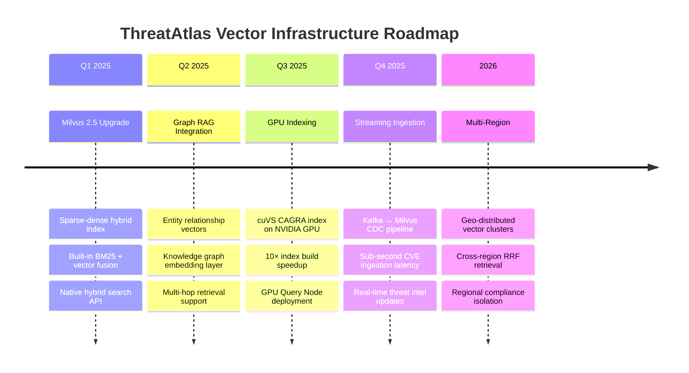

### Roadmap Engineering Details

**Milvus 2.5 Sparse-Dense Hybrid** — The next-generation Milvus index supports simultaneous BM25 sparse retrieval and dense vector ANN in a single query pass. This eliminates the need for a separate Elasticsearch layer for keyword-exact CVE ID lookups, consolidating the retrieval stack.

**cuVS CAGRA GPU Index** — NVIDIA's cuVS library brings GPU-accelerated graph-based ANN (CAGRA) into Milvus as a native index type. On the ThreatAtlas corpus, this is projected to reduce index build time from 8 minutes to under 60 seconds and achieve P95 query latency of ~8ms — enabling real-time interactive threat investigation.

**Streaming Ingestion via Kafka** — As CVE feeds move toward real-time publication (NVD v2 API webhooks, CISA KEV updates), a Kafka-to-Milvus CDC pipeline will enable sub-second latency from vulnerability disclosure to retrieval availability.

---

## 19. Final Engineering Notes

### Vector Infrastructure Philosophy

A vector database is not a search engine with a machine learning veneer. It is a fundamentally different computational primitive — one that treats meaning as geometry and retrieval as spatial proximity search. Building on Milvus in ThreatAtlas reflects a deliberate architectural choice: to treat semantic retrieval as a first-class, durable, production service rather than an in-memory afterthought.

Every design decision in this runbook — IVF_PQ over HNSW for the distributed layer, RRF over score fusion, metadata scalar indexes on severity and date, partition-level query isolation — reflects the principle that operational infrastructure must be both correct and efficient simultaneously. Correctness without efficiency is unusable at scale. Efficiency without correctness is a liability in security-critical workflows.

### Scalability Mindset

ThreatAtlas is designed to scale from a single Docker Compose stack on a developer laptop to a multi-node Milvus cluster handling hundreds of concurrent analyst queries against billions of threat intelligence vectors. The architectural invariants that make this possible — storage-compute separation, stateless Query Nodes, content-addressed segment storage in MinIO, Raft-consistent metadata in etcd — are not implementation details. They are the load-bearing walls of the system.

### AI-Native Retrieval Principles

The future of threat intelligence is not keyword search with better relevance tuning. It is semantic retrieval over continuously-updated, multi-modal, graph-connected threat knowledge bases — queried by analysts and autonomous reasoning agents alike. Milvus, as deployed in ThreatAtlas, is the foundation that makes that future operationally achievable today.

---

<div align="center">

```
╔══════════════════════════════════════════════════════════════╗
║                                                              ║
║            ThreatAtlas · docs/runbook_milvus.md              ║
║                                                              ║
║          Designed & Engineered by Kunjkumar Savani           ║
║                                                              ║
║   Milvus · FAISS · ONNX Runtime · llama.cpp · gRPC          ║
║   C++17 · Java 21 · Python 3.11 · Docker · Hybrid RAG       ║
║                                                              ║
╚══════════════════════════════════════════════════════════════╝
```

</div>
