# ThreatAtlas — Phase 1 Infrastructure Runbook

> **docs/runbook_phase1.md** · Phase 1: Foundation & Monorepo Bootstrap

---

*Designed & Engineered by **Kunjkumar Savani***

---


---

## Table of Contents

1. [Executive Overview](#1-executive-overview)
2. [Phase 1 Architecture Goals](#2-phase-1-architecture-goals)
3. [Repository Bootstrap Architecture](#3-repository-bootstrap-architecture)
4. [Development Environment Setup](#4-development-environment-setup)
5. [Monorepo Folder Structure](#5-monorepo-folder-structure)
6. [C++ Infrastructure Bootstrap](#6-c-infrastructure-bootstrap)
7. [Java Service Bootstrap](#7-java-service-bootstrap)
8. [Python Infrastructure Setup](#8-python-infrastructure-setup)
9. [Docker & Infrastructure Bootstrap](#9-docker--infrastructure-bootstrap)
10. [CI/CD Bootstrap Pipeline](#10-cicd-bootstrap-pipeline)
11. [Local Development Workflow](#11-local-development-workflow)
12. [Initial Testing Framework](#12-initial-testing-framework)
13. [Engineering Standards](#13-engineering-standards)
14. [Operational Diagnostics](#14-operational-diagnostics)
15. [Scalability Preparation](#15-scalability-preparation)
16. [Phase 1 Deliverables](#16-phase-1-deliverables)
17. [Transition to Phase 2](#17-transition-to-phase-2)
18. [Final Engineering Notes](#18-final-engineering-notes)

---

## 1. Executive Overview

ThreatAtlas is a production-grade, AI-native threat intelligence infrastructure platform engineered from the ground up on a polyglot, modular foundation. Phase 1 is not a prototype — it is the deliberate, engineering-first establishment of the systems, conventions, tooling, and architecture that will carry ThreatAtlas through embedding pipelines, distributed vector retrieval, Hybrid RAG orchestration, and production AI inference workloads.

### Why Infrastructure-First Design

In AI infrastructure projects, teams that skip foundational design accumulate irreversible technical debt by Phase 2. ThreatAtlas deliberately inverts this: infrastructure quality is the product in Phase 1. Every decision made here — monorepo boundaries, build system choices, language isolation strategy, environment reproducibility — directly governs the velocity, correctness, and scalability of every subsequent phase.

The engineering philosophy behind ThreatAtlas rests on four pillars:

**Modularity** — Each language runtime and service boundary is explicitly isolated. C++ owns compute-intensive inference and embedding kernels. Java owns service orchestration, gRPC transport, and Milvus integration. Python owns ingestion pipelines, RAG orchestration, and evaluation harnesses. These boundaries are not conventions — they are enforced architectural contracts.

**Reproducibility** — Every developer, every CI runner, and every production environment must arrive at an identical build state from a cold clone. This is achieved through pinned dependency manifests, containerized infrastructure, and environment validation scripts.

**Scalability-First** — Phase 1 is designed with Phase 4 in mind. Vector index sharding, GPU-accelerated ANN retrieval, distributed gRPC services, and Graph RAG compatibility are not afterthoughts; they are design constraints that shape the folder structure, build system, and service API surfaces from day one.

**Production-Grade Baseline** — No throwaway scaffolding. Every file committed in Phase 1 is production-intent code: formatted, linted, tested, and documented.

---

## 2. Phase 1 Architecture Goals

### 2.1 Monorepo Architecture Philosophy

ThreatAtlas is structured as a monorepo — a single version-controlled repository containing all language modules, services, datasets, benchmarks, and documentation. This is a deliberate architectural choice with significant engineering implications.

A monorepo enables atomic cross-module commits, unified CI/CD pipelines, shared dependency governance, and zero-friction cross-language refactoring. It eliminates the coordination overhead of multi-repository workflows while maintaining strict service boundary isolation within the repository itself.

The monorepo is not a monolith. Service boundaries are enforced by directory structure, build system isolation, and explicit interface definitions. C++ binaries are never imported directly by Python — they are exposed via gRPC service contracts or JNI bridges through the Java service layer.

### 2.2 Language Separation Strategy

| Runtime | Responsibility | Build System | Interface Surface |
|---|---|---|---|
| C++17 | Embedding kernels, FAISS ANN, ONNX inference | CMake 3.20+ | JNI / gRPC |
| Java 21 | Spring Boot services, Milvus client, gRPC server | Maven | REST / gRPC |
| Python 3.11 | Ingestion, RAG orchestration, evaluation | pip / venv | CLI / API calls |

### 2.3 Modular Service Boundaries

Each module owns its source code, build configuration, test suite, and dependency manifest. No module may directly import from another module's source tree — all cross-module communication occurs via defined interfaces (gRPC protobuf contracts, REST endpoints, or explicit JNI bridge headers).

### 2.4 Scalability-First Design

The directory structure and build system are designed to accommodate future concerns including:

- GPU-accelerated FAISS via CUDA build flags in CMake
- Milvus cluster deployment via Docker Compose service extension
- Distributed gRPC service mesh via Kubernetes Helm chart overlay
- Horizontal ingestion pipeline scaling via Python multiprocessing and async IO

---

## 3. Repository Bootstrap Architecture

### 3.1 High-Level Repository Topology

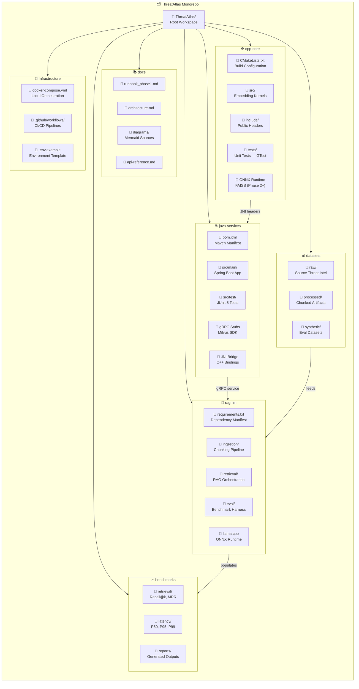

### 3.2 Module Dependency Graph

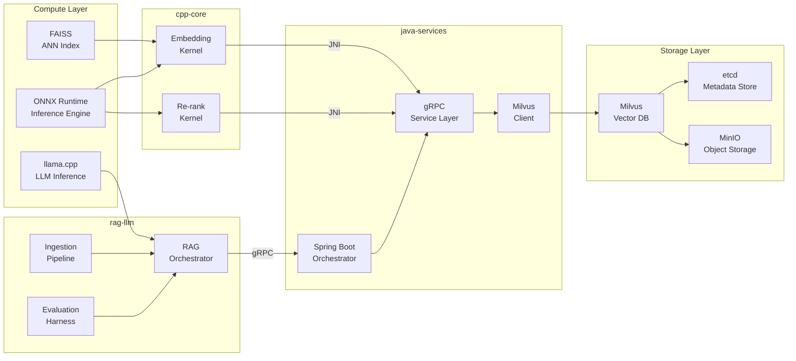

---

## 4. Development Environment Setup

### 4.1 System Prerequisites Matrix

| Component | Minimum Version | Recommended | Notes |
|---|---|---|---|
| OS | Ubuntu 22.04 / macOS 13 / Windows 11 WSL2 | Ubuntu 22.04 LTS | WSL2 required on Windows |
| GCC / Clang | GCC 11 / Clang 14 | GCC 13 | C++17 required |
| Java JDK | 21 LTS | Amazon Corretto 21 | Records, pattern matching |
| Python | 3.11 | 3.11.8 | Match CI runner exactly |
| CMake | 3.20 | 3.28 | FetchContent support |
| Maven | 3.9 | 3.9.6 | Wrapper preferred |
| Docker | 24.0 | Latest stable | Compose V2 required |
| Git | 2.40 | Latest | Sparse checkout support |

### 4.2 Environment Setup Lifecycle

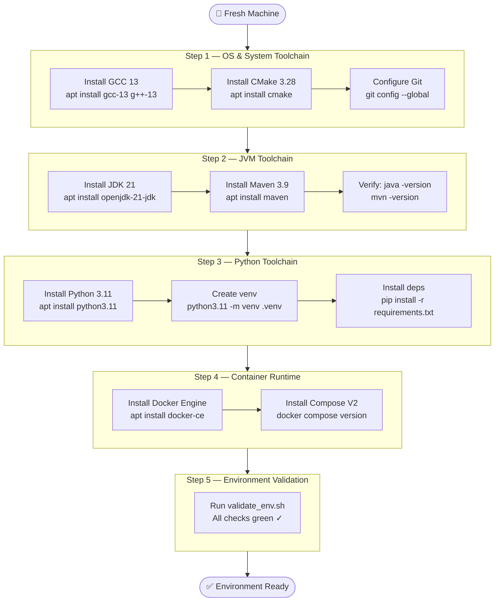

### 4.3 Ubuntu 22.04 Setup

```bash
# ── System Update ─────────────────────────────────────────────────────────────
sudo apt update && sudo apt upgrade -y

# ── C++ Toolchain ─────────────────────────────────────────────────────────────
sudo apt install -y gcc-13 g++-13 clang-14 cmake ninja-build build-essential
sudo update-alternatives --install /usr/bin/gcc gcc /usr/bin/gcc-13 130
sudo update-alternatives --install /usr/bin/g++ g++ /usr/bin/g++-13 130

# Verify
gcc --version   # gcc (Ubuntu) 13.x
cmake --version # cmake version 3.x

# ── Java 21 ───────────────────────────────────────────────────────────────────
sudo apt install -y openjdk-21-jdk
export JAVA_HOME=/usr/lib/jvm/java-21-openjdk-amd64
export PATH=$JAVA_HOME/bin:$PATH
java -version  # openjdk 21.x

# ── Maven ─────────────────────────────────────────────────────────────────────
sudo apt install -y maven
mvn -version   # Apache Maven 3.x

# ── Python 3.11 ───────────────────────────────────────────────────────────────
sudo apt install -y python3.11 python3.11-venv python3.11-dev python3-pip
python3.11 --version  # Python 3.11.x

# ── Docker Engine ─────────────────────────────────────────────────────────────
curl -fsSL https://get.docker.com | sudo sh
sudo usermod -aG docker $USER
newgrp docker
docker compose version  # Docker Compose version v2.x
```

### 4.4 macOS Setup

```bash
# ── Homebrew (if not installed) ───────────────────────────────────────────────
/bin/bash -c "$(curl -fsSL https://raw.githubusercontent.com/Homebrew/install/HEAD/install.sh)"

# ── C++ Toolchain ─────────────────────────────────────────────────────────────
brew install llvm cmake ninja
export PATH="$(brew --prefix llvm)/bin:$PATH"

# ── Java 21 ───────────────────────────────────────────────────────────────────
brew install openjdk@21
export JAVA_HOME=$(brew --prefix openjdk@21)
export PATH=$JAVA_HOME/bin:$PATH

# ── Maven ─────────────────────────────────────────────────────────────────────
brew install maven

# ── Python 3.11 ───────────────────────────────────────────────────────────────
brew install python@3.11
python3.11 -m pip install --upgrade pip

# ── Docker Desktop ────────────────────────────────────────────────────────────
brew install --cask docker
# Launch Docker Desktop from Applications
```

### 4.5 Git Configuration

```bash
git config --global user.name  "Kunjkumar Savani"
git config --global user.email "your@email.com"
git config --global core.autocrlf input       # Unix line endings
git config --global pull.rebase true          # Rebase on pull
git config --global init.defaultBranch main
git config --global core.editor "code --wait" # VSCode as editor
```

### 4.6 IDE Recommendations

| IDE | Language | Extensions / Plugins |
|---|---|---|
| VSCode | All | C/C++ Extension Pack, Extension Pack for Java, Python, Docker |
| IntelliJ IDEA Ultimate | Java, Python | Maven Helper, gRPC plugin, Docker plugin |
| CLion | C++ | CMake Tools, Valgrind integration |

---

## 5. Monorepo Folder Structure

### 5.1 Complete Repository Layout

```
ThreatAtlas/
├── .github/
│   └── workflows/
│       ├── ci-cpp.yml              # C++ build + GTest
│       ├── ci-java.yml             # Maven build + JUnit
│       ├── ci-python.yml           # pytest + lint
│       └── ci-integration.yml      # End-to-end smoke tests
│
├── cpp-core/
│   ├── CMakeLists.txt              # Root CMake configuration
│   ├── cmake/
│   │   ├── FindONNXRuntime.cmake   # ONNX Runtime discovery
│   │   └── CompilerFlags.cmake     # C++17 flags, sanitizers
│   ├── src/
│   │   ├── embedding/              # Sentence embedding kernels
│   │   ├── retrieval/              # FAISS ANN wrappers (Phase 2)
│   │   ├── rerank/                 # Cross-encoder ONNX inference
│   │   └── jni/                    # JNI bridge implementation
│   ├── include/
│   │   └── threatatlas/            # Public API headers
│   └── tests/
│       └── unit/                   # GTest suites
│
├── java-services/
│   ├── pom.xml                     # Maven root POM
│   ├── src/
│   │   ├── main/java/com/threatatlas/
│   │   │   ├── Application.java    # Spring Boot entry point
│   │   │   ├── controller/         # REST controllers
│   │   │   ├── service/            # Business logic
│   │   │   ├── grpc/               # gRPC service implementations
│   │   │   ├── milvus/             # Milvus client wrappers
│   │   │   └── jni/                # JNI loader + bindings
│   │   └── main/resources/
│   │       └── application.yml     # Spring configuration
│   └── src/test/                   # JUnit 5 tests
│
├── rag-llm/
│   ├── requirements.txt            # Pinned Python dependencies
│   ├── setup.py                    # Package manifest
│   ├── ingestion/
│   │   ├── chunker.py              # Sliding window chunking
│   │   ├── metadata_extractor.py   # Source/offset/timestamp
│   │   └── pipeline.py             # Ingestion orchestrator
│   ├── retrieval/
│   │   ├── rag_orchestrator.py     # Hybrid RAG flow
│   │   ├── reranker.py             # ONNX re-rank client
│   │   └── prompt_builder.py       # LLM prompt construction
│   ├── llm/
│   │   └── llamacpp_wrapper.py     # llama.cpp Python bindings
│   └── eval/
│       ├── benchmark.py            # Recall@k, MRR harness
│       └── synthetic_tasks.py      # Threat detection tasks
│
├── datasets/
│   ├── raw/                        # Source threat intelligence
│   ├── processed/                  # Chunked + embedded artifacts
│   └── synthetic/                  # Evaluation datasets
│
├── benchmarks/
│   ├── retrieval/                  # ANN retrieval benchmarks
│   ├── latency/                    # Latency profiling
│   └── reports/                    # Generated benchmark reports
│
├── docs/
│   ├── runbook_phase1.md           # This document
│   ├── architecture.md             # System architecture reference
│   ├── api-reference.md            # Service API documentation
│   └── diagrams/                   # Mermaid diagram sources
│
├── docker-compose.yml              # Local infrastructure orchestration
├── .env.example                    # Environment variable template
├── .gitignore                      # Repository hygiene rules
├── .editorconfig                   # Cross-editor formatting rules
└── README.md                       # Project entry point
```

### 5.2 Module Ownership Map

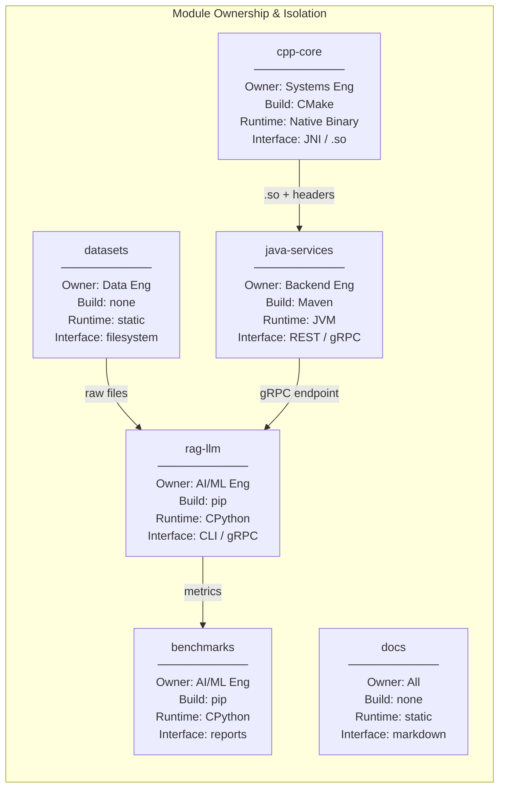

---

## 6. C++ Infrastructure Bootstrap

### 6.1 C++17 Design Rationale

The `cpp-core` module uses C++17 as its language standard. C++17 provides structured bindings, `std::optional`, `std::filesystem`, `if constexpr`, and parallel STL algorithms — all of which are material to high-performance embedding and retrieval kernel implementation. Dependency management is handled via CMake's `FetchContent` module and system package discovery via custom Find modules.

### 6.2 CMake Configuration

```cmake
# cpp-core/CMakeLists.txt

cmake_minimum_required(VERSION 3.20)
project(ThreatAtlasCore VERSION 0.1.0 LANGUAGES CXX)

# ── C++17 Standard ────────────────────────────────────────────────────────────
set(CMAKE_CXX_STANDARD 17)
set(CMAKE_CXX_STANDARD_REQUIRED ON)
set(CMAKE_CXX_EXTENSIONS OFF)

# ── Build Type ────────────────────────────────────────────────────────────────
if(NOT CMAKE_BUILD_TYPE)
  set(CMAKE_BUILD_TYPE Release CACHE STRING "Build type" FORCE)
endif()

# ── Compiler Flags ────────────────────────────────────────────────────────────
include(cmake/CompilerFlags.cmake)

# ── Dependencies ──────────────────────────────────────────────────────────────
include(cmake/FindONNXRuntime.cmake)
include(FetchContent)

FetchContent_Declare(
  googletest
  URL https://github.com/google/googletest/archive/refs/tags/v1.14.0.tar.gz
)
FetchContent_MakeAvailable(googletest)

# ── Source Targets ────────────────────────────────────────────────────────────
add_library(threatatlas_core SHARED
  src/embedding/embedding_kernel.cpp
  src/rerank/onnx_reranker.cpp
  src/jni/jni_bridge.cpp
)

target_include_directories(threatatlas_core
  PUBLIC  ${CMAKE_CURRENT_SOURCE_DIR}/include
  PRIVATE ${CMAKE_CURRENT_SOURCE_DIR}/src
)

target_link_libraries(threatatlas_core
  PRIVATE ONNXRuntime::ONNXRuntime
)

# ── Tests ─────────────────────────────────────────────────────────────────────
enable_testing()
add_subdirectory(tests)
```

### 6.3 Build Pipeline

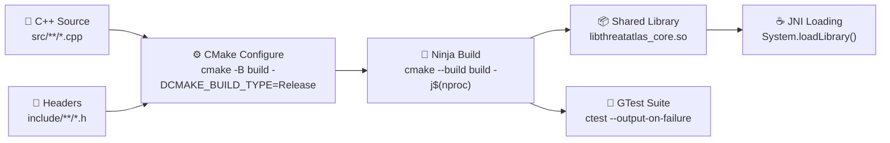

### 6.4 Build Commands

```bash
# ── Configure ────────────────────────────────────────────────────────────────
cd cpp-core
cmake -B build \
  -DCMAKE_BUILD_TYPE=Release \
  -DCMAKE_CXX_COMPILER=g++-13 \
  -G Ninja

# ── Build ─────────────────────────────────────────────────────────────────────
cmake --build build --parallel $(nproc)

# ── Run Tests ─────────────────────────────────────────────────────────────────
cd build && ctest --output-on-failure --parallel $(nproc)

# ── Debug Build ───────────────────────────────────────────────────────────────
cmake -B build-debug \
  -DCMAKE_BUILD_TYPE=Debug \
  -DCMAKE_CXX_FLAGS="-fsanitize=address,undefined" \
  -G Ninja
cmake --build build-debug
```

### 6.5 Directory Structure — cpp-core

```
cpp-core/
├── CMakeLists.txt
├── cmake/
│   ├── CompilerFlags.cmake          # -Wall -Wextra -Wpedantic -O3
│   └── FindONNXRuntime.cmake        # ONNX Runtime discovery module
├── include/
│   └── threatatlas/
│       ├── embedding.h              # Embedding kernel API
│       ├── reranker.h               # Re-rank API
│       └── jni_bridge.h             # JNI export declarations
├── src/
│   ├── embedding/
│   │   └── embedding_kernel.cpp     # Sentence transformer inference
│   ├── rerank/
│   │   └── onnx_reranker.cpp        # Cross-encoder ONNX inference
│   └── jni/
│       └── jni_bridge.cpp           # JNI implementation
└── tests/
    ├── CMakeLists.txt
    └── unit/
        ├── test_embedding.cpp
        └── test_reranker.cpp
```

---

## 7. Java Service Bootstrap

### 7.1 Spring Boot Application Architecture

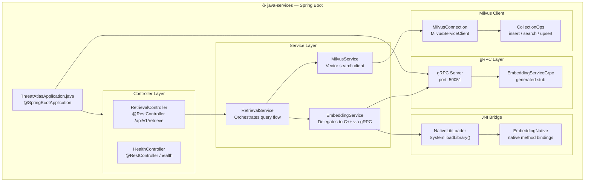

### 7.2 Maven POM Configuration

```xml
<!-- java-services/pom.xml -->
<project xmlns="http://maven.apache.org/POM/4.0.0">
  <modelVersion>4.0.0</modelVersion>

  <groupId>com.threatatlas</groupId>
  <artifactId>java-services</artifactId>
  <version>0.1.0-SNAPSHOT</version>
  <packaging>jar</packaging>

  <properties>
    <java.version>21</java.version>
    <spring.boot.version>3.2.4</spring.boot.version>
    <grpc.version>1.62.2</grpc.version>
    <milvus.sdk.version>2.3.4</milvus.sdk.version>
    <maven.compiler.source>21</maven.compiler.source>
    <maven.compiler.target>21</maven.compiler.target>
  </properties>

  <parent>
    <groupId>org.springframework.boot</groupId>
    <artifactId>spring-boot-starter-parent</artifactId>
    <version>3.2.4</version>
  </parent>

  <dependencies>
    <!-- Spring Boot Web -->
    <dependency>
      <groupId>org.springframework.boot</groupId>
      <artifactId>spring-boot-starter-web</artifactId>
    </dependency>

    <!-- gRPC -->
    <dependency>
      <groupId>io.grpc</groupId>
      <artifactId>grpc-netty-shaded</artifactId>
      <version>${grpc.version}</version>
    </dependency>
    <dependency>
      <groupId>io.grpc</groupId>
      <artifactId>grpc-protobuf</artifactId>
      <version>${grpc.version}</version>
    </dependency>
    <dependency>
      <groupId>io.grpc</groupId>
      <artifactId>grpc-stub</artifactId>
      <version>${grpc.version}</version>
    </dependency>

    <!-- Milvus Java SDK -->
    <dependency>
      <groupId>io.milvus</groupId>
      <artifactId>milvus-sdk-java</artifactId>
      <version>${milvus.sdk.version}</version>
    </dependency>

    <!-- Testing -->
    <dependency>
      <groupId>org.springframework.boot</groupId>
      <artifactId>spring-boot-starter-test</artifactId>
      <scope>test</scope>
    </dependency>
  </dependencies>
</project>
```

### 7.3 Package Structure

```
src/main/java/com/threatatlas/
├── Application.java                 # @SpringBootApplication entry
├── config/
│   ├── GrpcConfig.java              # gRPC channel configuration
│   └── MilvusConfig.java            # Milvus connection factory
├── controller/
│   ├── RetrievalController.java     # POST /api/v1/retrieve
│   └── HealthController.java        # GET /health
├── service/
│   ├── RetrievalService.java        # Query orchestration
│   ├── EmbeddingService.java        # Embedding delegation
│   └── MilvusService.java           # Vector DB operations
├── grpc/
│   ├── EmbeddingGrpcClient.java     # gRPC stub wrapper
│   └── proto/                       # Generated protobuf stubs
├── milvus/
│   ├── MilvusClientWrapper.java     # SDK abstraction
│   └── CollectionManager.java       # Schema + collection ops
└── jni/
    ├── NativeLibLoader.java         # Library loading + validation
    └── EmbeddingNative.java         # native method declarations
```

### 7.4 Startup Commands

```bash
# ── Build ─────────────────────────────────────────────────────────────────────
cd java-services
mvn clean package -DskipTests

# ── Run ───────────────────────────────────────────────────────────────────────
mvn spring-boot:run

# ── Run Tests ─────────────────────────────────────────────────────────────────
mvn test

# ── Build Docker Image ────────────────────────────────────────────────────────
mvn spring-boot:build-image -Dspring-boot.build-image.imageName=threatatlas/java-services:latest
```

---

## 8. Python Infrastructure Setup

### 8.1 Environment Architecture

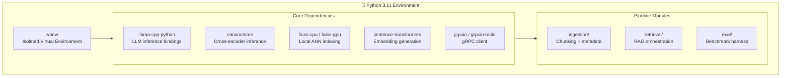

### 8.2 Virtual Environment Setup

```bash
# ── Create Virtual Environment ────────────────────────────────────────────────
cd rag-llm
python3.11 -m venv .venv

# ── Activate ──────────────────────────────────────────────────────────────────
source .venv/bin/activate          # Linux / macOS
# .venv\Scripts\activate           # Windows PowerShell

# ── Verify Interpreter ────────────────────────────────────────────────────────
which python    # should show .venv/bin/python
python --version  # Python 3.11.x

# ── Install Dependencies ──────────────────────────────────────────────────────
pip install --upgrade pip setuptools wheel
pip install -r requirements.txt

# ── Verify Installation ───────────────────────────────────────────────────────
python -c "import faiss; print('FAISS OK:', faiss.__version__)"
python -c "import onnxruntime; print('ONNX OK:', onnxruntime.__version__)"
python -c "import llama_cpp; print('llama.cpp OK')"
```

### 8.3 requirements.txt

```text
# ── Core ML / AI ──────────────────────────────────────────────────────────────
sentence-transformers==2.7.0
onnxruntime==1.18.0
faiss-cpu==1.8.0
llama-cpp-python==0.2.77

# ── gRPC ──────────────────────────────────────────────────────────────────────
grpcio==1.62.2
grpcio-tools==1.62.2
protobuf==4.25.3

# ── Milvus Python SDK ─────────────────────────────────────────────────────────
pymilvus==2.4.1

# ── Data Processing ───────────────────────────────────────────────────────────
numpy==1.26.4
pandas==2.2.1
tqdm==4.66.2

# ── Evaluation ────────────────────────────────────────────────────────────────
datasets==2.18.0
rouge-score==0.1.2

# ── Development ───────────────────────────────────────────────────────────────
pytest==8.1.1
black==24.3.0
ruff==0.3.5
mypy==1.9.0
```

### 8.4 Python Workflow Diagram

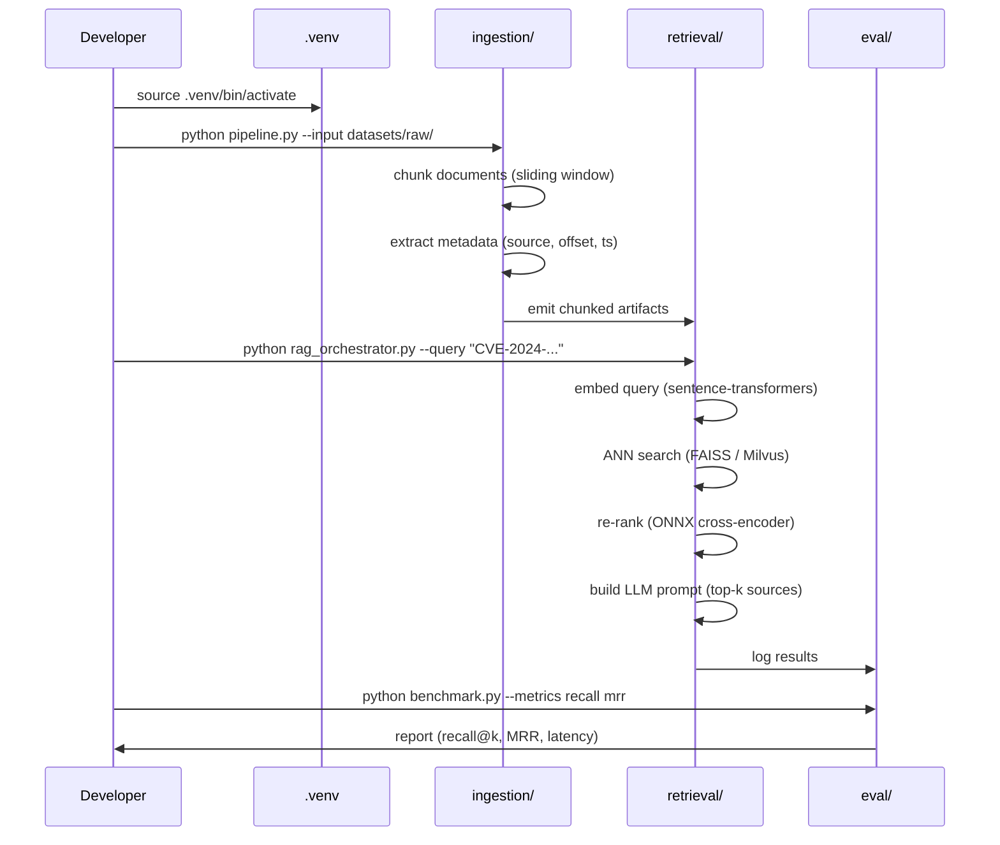

---

## 9. Docker & Infrastructure Bootstrap

### 9.1 Container Topology

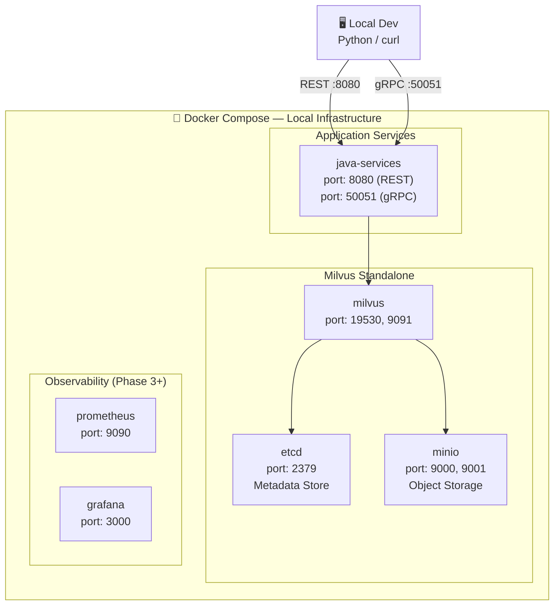

### 9.2 docker-compose.yml

```yaml
# docker-compose.yml — ThreatAtlas Local Infrastructure

version: '3.8'

services:
  # ── etcd — Milvus Metadata Store ────────────────────────────────────────────
  etcd:
    image: quay.io/coreos/etcd:v3.5.5
    environment:
      ETCD_AUTO_COMPACTION_MODE: revision
      ETCD_AUTO_COMPACTION_RETENTION: "1000"
      ETCD_QUOTA_BACKEND_BYTES: "4294967296"
    command: >
      etcd
      --advertise-client-urls=http://etcd:2379
      --listen-client-urls=http://0.0.0.0:2379
      --data-dir=/etcd
    volumes:
      - etcd_data:/etcd
    healthcheck:
      test: ["CMD", "etcdctl", "endpoint", "health"]
      interval: 30s
      timeout: 20s
      retries: 3

  # ── MinIO — Object Storage ───────────────────────────────────────────────────
  minio:
    image: minio/minio:RELEASE.2024-01-05T22-17-24Z
    environment:
      MINIO_ACCESS_KEY: minioadmin
      MINIO_SECRET_KEY: minioadmin
    command: minio server /data --console-address ":9001"
    volumes:
      - minio_data:/data
    ports:
      - "9000:9000"
      - "9001:9001"
    healthcheck:
      test: ["CMD", "curl", "-f", "http://localhost:9000/minio/health/live"]
      interval: 30s
      timeout: 20s
      retries: 3

  # ── Milvus Standalone ─────────────────────────────────────────────────────────
  milvus:
    image: milvusdb/milvus:v2.4.0
    command: ["milvus", "run", "standalone"]
    environment:
      ETCD_ENDPOINTS: etcd:2379
      MINIO_ADDRESS: minio:9000
    volumes:
      - milvus_data:/var/lib/milvus
    ports:
      - "19530:19530"
      - "9091:9091"
    depends_on:
      - etcd
      - minio
    healthcheck:
      test: ["CMD", "curl", "-f", "http://localhost:9091/healthz"]
      interval: 30s
      timeout: 20s
      retries: 5

volumes:
  etcd_data:
  minio_data:
  milvus_data:
```

### 9.3 Infrastructure Commands

```bash
# ── Start Infrastructure ──────────────────────────────────────────────────────
docker compose up -d

# ── Verify Services ───────────────────────────────────────────────────────────
docker compose ps
docker compose logs milvus --tail=50

# ── Health Checks ─────────────────────────────────────────────────────────────
curl http://localhost:9091/healthz    # Milvus
curl http://localhost:9001            # MinIO console
curl http://localhost:2379/health     # etcd

# ── Teardown ──────────────────────────────────────────────────────────────────
docker compose down
docker compose down -v   # destroy volumes (clean slate)
```

---

## 10. CI/CD Bootstrap Pipeline

### 10.1 CI Architecture

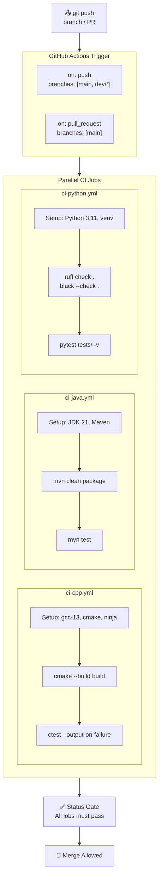

### 10.2 GitHub Actions — C++ CI

```yaml
# .github/workflows/ci-cpp.yml
name: CI — C++ Core

on:
  push:
    branches: [main, "dev/**"]
    paths: ["cpp-core/**"]
  pull_request:
    branches: [main]
    paths: ["cpp-core/**"]

jobs:
  build-and-test:
    runs-on: ubuntu-22.04
    steps:
      - uses: actions/checkout@v4

      - name: Install Toolchain
        run: |
          sudo apt update
          sudo apt install -y gcc-13 g++-13 cmake ninja-build
          sudo update-alternatives --install /usr/bin/gcc gcc /usr/bin/gcc-13 130
          sudo update-alternatives --install /usr/bin/g++ g++ /usr/bin/g++-13 130

      - name: Configure
        working-directory: cpp-core
        run: cmake -B build -DCMAKE_BUILD_TYPE=Release -G Ninja

      - name: Build
        working-directory: cpp-core
        run: cmake --build build --parallel 2

      - name: Test
        working-directory: cpp-core/build
        run: ctest --output-on-failure --parallel 2
```

### 10.3 GitHub Actions — Python CI

```yaml
# .github/workflows/ci-python.yml
name: CI — Python RAG

on:
  push:
    branches: [main, "dev/**"]
    paths: ["rag-llm/**"]
  pull_request:
    branches: [main]
    paths: ["rag-llm/**"]

jobs:
  lint-and-test:
    runs-on: ubuntu-22.04
    steps:
      - uses: actions/checkout@v4

      - name: Setup Python 3.11
        uses: actions/setup-python@v5
        with:
          python-version: "3.11"
          cache: pip

      - name: Install Dependencies
        working-directory: rag-llm
        run: |
          python -m venv .venv
          source .venv/bin/activate
          pip install -r requirements.txt

      - name: Lint
        working-directory: rag-llm
        run: |
          source .venv/bin/activate
          ruff check .
          black --check .

      - name: Test
        working-directory: rag-llm
        run: |
          source .venv/bin/activate
          pytest tests/ -v --tb=short
```

---

## 11. Local Development Workflow

### 11.1 Developer Lifecycle

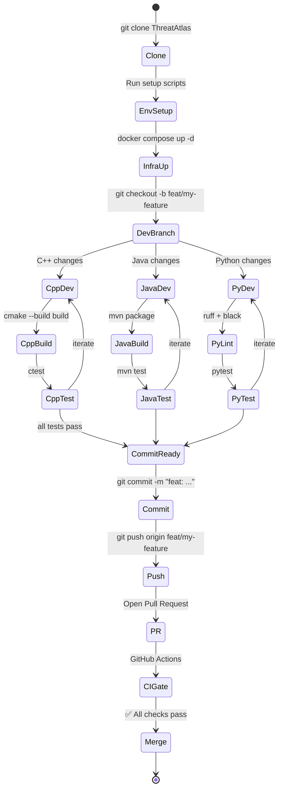

### 11.2 Branch Strategy

| Branch Pattern | Purpose | Merge Target | CI Required |
|---|---|---|---|
| `main` | Production-stable code | — | Always green |
| `dev/*` | Active development | `main` via PR | Full CI |
| `feat/*` | Feature branches | `dev/*` | Full CI |
| `fix/*` | Bug fixes | `main` or `dev/*` | Full CI |
| `chore/*` | Infra, docs, tooling | `dev/*` | Lint only |

### 11.3 Quick Reference Commands

```bash
# ── Clone & Initialize ────────────────────────────────────────────────────────
git clone https://github.com/kunjsavani/ThreatAtlas.git
cd ThreatAtlas

# ── Start Infrastructure ──────────────────────────────────────────────────────
docker compose up -d

# ── Build C++ ─────────────────────────────────────────────────────────────────
cd cpp-core && cmake -B build -G Ninja && cmake --build build && cd ..

# ── Build Java ────────────────────────────────────────────────────────────────
cd java-services && mvn clean package && cd ..

# ── Activate Python ───────────────────────────────────────────────────────────
cd rag-llm && source .venv/bin/activate

# ── Run All Tests ─────────────────────────────────────────────────────────────
cd cpp-core/build && ctest
cd java-services && mvn test
cd rag-llm && pytest tests/ -v
```

---

## 12. Initial Testing Framework

### 12.1 Testing Architecture

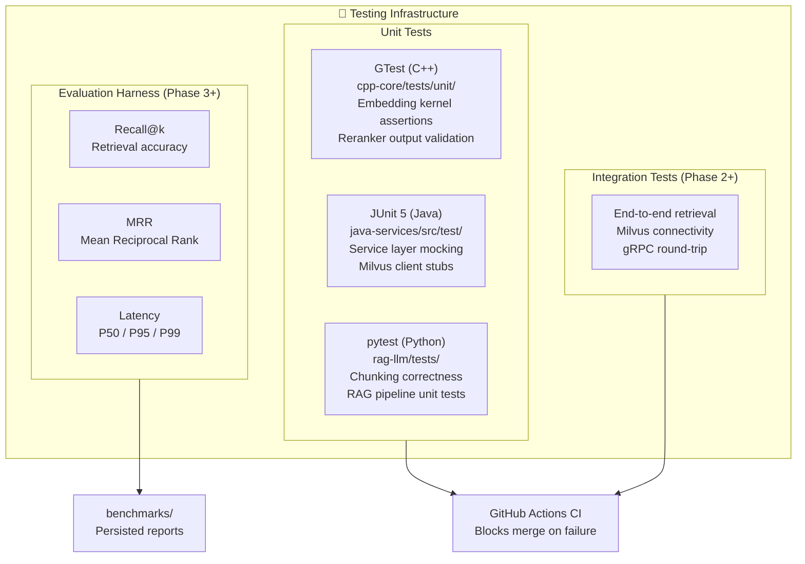

### 12.2 Test Directory Organization

```
cpp-core/tests/
├── CMakeLists.txt
└── unit/
    ├── test_embedding.cpp       # Embedding kernel output shape tests
    └── test_reranker.cpp        # ONNX re-ranker score range tests

java-services/src/test/
└── java/com/threatatlas/
    ├── service/
    │   ├── RetrievalServiceTest.java
    │   └── MilvusServiceTest.java
    └── controller/
        └── RetrievalControllerTest.java

rag-llm/tests/
├── test_chunker.py              # Sliding window, overlap, metadata
├── test_rag_orchestrator.py     # Pipeline integration (mocked Milvus)
└── test_benchmark.py            # Recall@k calculation correctness
```

---

## 13. Engineering Standards

### 13.1 Code Style Matrix

| Language | Formatter | Linter | Style Guide |
|---|---|---|---|
| C++ | clang-format | clang-tidy | Google C++ Style |
| Java | google-java-format | Checkstyle | Google Java Style |
| Python | black | ruff | PEP 8 + ruff defaults |
| Markdown | prettier | markdownlint | CommonMark |

### 13.2 Naming Conventions

| Construct | C++ | Java | Python |
|---|---|---|---|
| Classes | `PascalCase` | `PascalCase` | `PascalCase` |
| Functions | `snake_case` | `camelCase` | `snake_case` |
| Constants | `UPPER_SNAKE` | `UPPER_SNAKE` | `UPPER_SNAKE` |
| Files | `snake_case.cpp` | `PascalCase.java` | `snake_case.py` |
| Namespaces | `snake_case` | `com.threatatlas.*` | `threatatlas.*` |

### 13.3 Commit Message Convention

```
<type>(<scope>): <subject>

<body>

<footer>
```

Types: `feat`, `fix`, `docs`, `chore`, `refactor`, `test`, `ci`
Scopes: `cpp-core`, `java-services`, `rag-llm`, `docker`, `ci`, `docs`

**Examples:**
```
feat(cpp-core): add ONNX runtime embedding kernel skeleton
fix(java-services): correct Milvus connection timeout handling
ci(github): add Python lint step to ci-python.yml
docs(runbook): add Phase 1 diagnostic flowchart
```

### 13.4 Engineering Governance

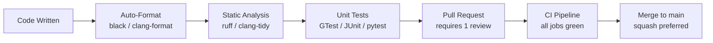

---

## 14. Operational Diagnostics

### 14.1 Environment Troubleshooting

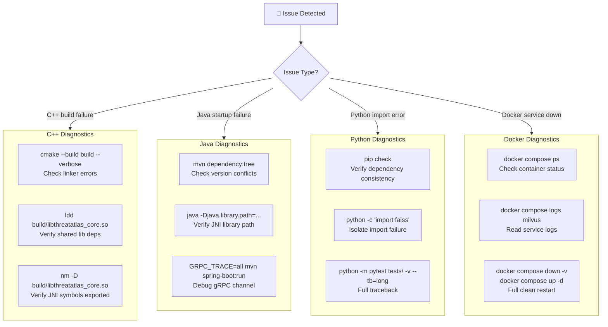

### 14.2 Common Issues & Resolutions

| Issue | Symptom | Resolution |
|---|---|---|
| GCC version mismatch | `error: 'std::format' not found` | `sudo update-alternatives --config gcc` → select gcc-13 |
| JNI library not found | `UnsatisfiedLinkError` at JVM startup | Set `java.library.path` to `cpp-core/build/` |
| Python venv deactivated | `ModuleNotFoundError: llama_cpp` | `source rag-llm/.venv/bin/activate` |
| Milvus unhealthy | `Connection refused :19530` | `docker compose logs milvus` — check etcd/minio health first |
| Maven download failure | `Could not resolve artifact` | `mvn clean install -U` — force snapshot update |
| Port conflict | `Address already in use :8080` | `lsof -i :8080 | kill -9 <PID>` |

---

## 15. Scalability Preparation

### 15.1 Why Modularity Enables Scaling

Every architectural decision in Phase 1 is made with horizontal and vertical scaling in mind:

The C++ embedding kernel is compiled as a shared library with no global state, enabling concurrent invocation from multiple JVM threads without locking. ONNX Runtime sessions are designed to be instantiated per-thread or pooled, a pattern directly supported by the current JNI bridge design.

The Java service layer uses Spring Boot's non-blocking I/O and gRPC's HTTP/2 multiplexing, which enables high-concurrency request handling without thread-per-connection overhead. The Milvus client is abstracted behind a service interface, enabling easy swap-out for a distributed Milvus cluster in Phase 4.

### 15.2 Scaling Architecture Roadmap

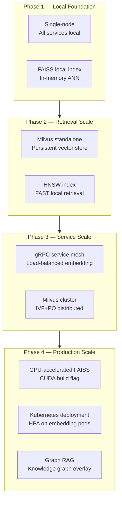

### 15.3 GPU Readiness

The CMake build system is designed for GPU flag injection without structural changes:

```cmake
# cmake/CompilerFlags.cmake — GPU readiness block
option(THREATATLAS_CUDA_ENABLED "Enable CUDA for FAISS GPU" OFF)

if(THREATATLAS_CUDA_ENABLED)
  enable_language(CUDA)
  find_package(CUDAToolkit REQUIRED)
  target_compile_definitions(threatatlas_core PRIVATE FAISS_GPU_ENABLED)
  target_link_libraries(threatatlas_core PRIVATE CUDA::cudart CUDA::cublas)
endif()
```

Enabling GPU at Phase 4 requires only `-DTHREATATLAS_CUDA_ENABLED=ON` — no structural code changes.

---

## 16. Phase 1 Deliverables

### 16.1 Milestone Completion Checklist

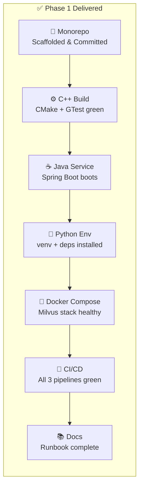

### 16.2 Acceptance Criteria

| Deliverable | Acceptance Criterion | Validation Command |
|---|---|---|
| Repository structure | All directories present per spec | `ls -la ThreatAtlas/` |
| C++ build | Clean Release build, all GTests pass | `cd cpp-core/build && ctest` |
| Java service | Spring Boot starts on :8080, /health returns 200 | `curl localhost:8080/health` |
| Python environment | All imports succeed, pytest runs | `pytest rag-llm/tests/ -v` |
| Docker infrastructure | Milvus healthcheck passes | `curl localhost:9091/healthz` |
| CI pipelines | All GitHub Actions workflows green on main | GitHub Actions UI |
| Documentation | Runbook renders correctly in GitHub | View on github.com |

---

## 17. Transition to Phase 2

### 17.1 What Phase 1 Enables

Phase 1 is deliberately minimal in scope but maximal in preparation. Every interface, directory, and build target defined in Phase 1 is a socket into which Phase 2 functionality plugs directly.

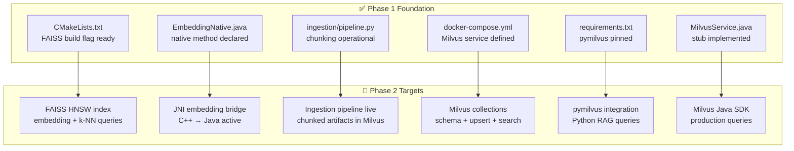

### 17.2 Phase 2 Implementation Sequence

| Week | Milestone | Module | Depends On |
|---|---|---|---|
| W1 | FAISS embedding + local k-NN demo | `cpp-core` | Phase 1 CMake |
| W2 | JNI bridge activation — embedding calls | `java-services` + `cpp-core` | Phase 1 JNI stubs |
| W3 | Ingestion pipeline live — chunks into Milvus | `rag-llm` + `java-services` | Phase 1 pipeline.py |
| W4 | Milvus search queries — end-to-end retrieval | All modules | All Phase 1 deliverables |

---

## 18. Final Engineering Notes

### Infrastructure Philosophy

ThreatAtlas is built on a single foundational conviction: the quality of an AI system's infrastructure determines the ceiling of its capability. A retrieval pipeline built on a fragile foundation cannot be scaled, cannot be debugged in production, and cannot be iterated on without fear. Phase 1 eliminates that fragility before any algorithm is written.

Every technology choice in ThreatAtlas is a deliberate trade-off: C++17 for compute density where Python's GIL and overhead are prohibitive; Java 21 for service orchestration where Spring Boot's production-grade observability, dependency injection, and gRPC integration are material; Python 3.11 for pipeline flexibility where the AI ecosystem's library depth outweighs raw execution speed.

### Long-Term Engineering Vision

The architecture of ThreatAtlas anticipates a trajectory from local prototype to distributed production system without requiring structural redesign at any phase transition. The module boundaries established in Phase 1, the interface contracts defined via gRPC protobuf, the build system GPU flags, the Milvus cluster-ready Docker Compose configuration — these are not premature optimizations. They are deliberate investments in architectural longevity.

The long-term vision is a platform capable of ingesting, embedding, indexing, retrieving, re-ranking, and generating explainable threat intelligence at scale — across heterogeneous document corpora, with millisecond-latency retrieval, with GPU-accelerated inference, and with a Graph RAG overlay that models entity relationships across the threat intelligence knowledge base.

Phase 1 is day one of that system.

### Scalable Architecture Principles

1. Interfaces are contracts. No module crosses another's boundary except through defined APIs.
2. Build systems are deterministic. Cold builds are reproducible given the same pinned dependencies.
3. Tests are not optional. No code reaches main without a corresponding test.
4. Infrastructure is code. Docker Compose, CI workflows, and CMake configurations are versioned artifacts with the same engineering care as application code.
5. Documentation is a deliverable. Runbooks, architecture diagrams, and API references ship with every phase.

---

<div align="center">

---

*Designed & Engineered by **Kunjkumar Savani***

*ThreatAtlas · Phase 1 Infrastructure Runbook · docs/runbook_phase1.md*

---

</div>
