# ThreatAtlas — RAG Infrastructure Runbook

> **docs/runbook_rag.md** · Retrieval-Augmented Generation Architecture, Orchestration & Engineering Reference

---

*Designed & Engineered by **Kunjkumar Savani***

---


---

## Table of Contents

1. [Executive Overview](#1-executive-overview)
2. [RAG System Philosophy](#2-rag-system-philosophy)
3. [High-Level RAG Architecture](#3-high-level-rag-architecture)
4. [End-to-End RAG Pipeline](#4-end-to-end-rag-pipeline)
5. [Document Ingestion Pipeline](#5-document-ingestion-pipeline)
6. [Chunking & Context Window Strategy](#6-chunking--context-window-strategy)
7. [Embedding Generation Architecture](#7-embedding-generation-architecture)
8. [Hybrid Retrieval Workflow](#8-hybrid-retrieval-workflow)
9. [Re-ranking Pipeline](#9-re-ranking-pipeline)
10. [Context Assembly Engine](#10-context-assembly-engine)
11. [Prompt Engineering Architecture](#11-prompt-engineering-architecture)
12. [llama.cpp Orchestration](#12-llamacpp-orchestration)
13. [Citation & Explainability Pipeline](#13-citation--explainability-pipeline)
14. [Hallucination Mitigation Strategy](#14-hallucination-mitigation-strategy)
15. [Performance Optimization](#15-performance-optimization)
16. [Evaluation & Diagnostics](#16-evaluation--diagnostics)
17. [Deployment & Operational Workflow](#17-deployment--operational-workflow)
18. [Security & Reliability](#18-security--reliability)
19. [Future RAG Roadmap](#19-future-rag-roadmap)
20. [Final Engineering Notes](#20-final-engineering-notes)

---

## 1. Executive Overview

ThreatAtlas is built on a foundational premise: threat intelligence reasoning cannot be delegated to a language model operating from static training data alone. The threat landscape evolves in hours. CVE disclosures, zero-day advisories, APT campaign intelligence, and SIEM log anomalies are time-sensitive artifacts that require retrieval from live, curated knowledge corpora — not hallucinated from parametric memory.

Retrieval-Augmented Generation (RAG) is not an add-on feature in ThreatAtlas. It is the primary reasoning mechanism. Every generated response is grounded in retrieved, ranked, and cited source passages. Every inference call to the local LLM is preceded by a retrieval phase that constrains the model's generative space to verified knowledge. Every output carries source attribution that makes the reasoning auditable by security engineers.

### Why RAG is Non-Negotiable in Threat Intelligence

Security operations cannot tolerate confident hallucinations. A language model that invents CVE details, fabricates MITRE ATT&CK technique IDs, or synthesizes plausible-but-false threat actor profiles is worse than no AI at all. ThreatAtlas solves this with a multi-stage retrieval pipeline that grounds every response in verified source material, annotates every factual claim with its origin passage, and applies semantic re-ranking to ensure the most relevant intelligence surfaces before generation.

### Explainable AI Retrieval Philosophy

ThreatAtlas enforces a strict explainability contract: every response generated by the system includes the source documents, passage offsets, relevance scores, and chunked context that produced it. Security engineers can trace any generated claim back to its originating threat intelligence artifact. This is not a UX feature — it is a reliability engineering requirement.

### Local-First LLM Infrastructure

ThreatAtlas runs inference locally via llama.cpp. No query leaves the infrastructure boundary. GGUF-quantized models execute on CPU with optional GPU acceleration, enabling air-gapped deployment in sensitive security operations environments. The system is designed from the ground up for zero-trust, local-first AI reasoning.

---

## 2. RAG System Philosophy

### 2.1 Why Retrieval Matters for LLMs

Large language models are powerful pattern synthesizers. They are not knowledge repositories. Their parametric memory is static, bounded by training cutoff, and prone to confident confabulation when queried on domain-specific, time-sensitive, or highly factual topics. Threat intelligence is precisely the intersection of all three failure modes.

Retrieval-Augmented Generation decouples the knowledge store from the generation model. The LLM's role is reduced to reasoning over a retrieved context window — not recalling facts from training. This architecture enables:

- **Knowledge freshness** — the retrieval corpus can be updated continuously without retraining the model
- **Factual grounding** — generated claims are constrained to the retrieved passage set
- **Auditability** — every response can be traced to source documents
- **Domain specificity** — the corpus is curated for threat intelligence, not general knowledge

### 2.2 Hallucination Reduction by Design

ThreatAtlas applies hallucination mitigation at three independent layers:

**Layer 1 — Retrieval grounding.** The prompt explicitly instructs the model to answer only from the provided context. Out-of-context claims are prohibited by instruction.

**Layer 2 — Re-ranking validation.** The cross-encoder re-ranker assigns semantic relevance scores to all retrieved candidates. Only passages exceeding a configurable relevance threshold enter the context window. Low-confidence candidates are dropped before prompt construction.

**Layer 3 — Citation enforcement.** The prompt template requires the model to cite every factual claim using a structured citation format referencing the source passage index. Uncited claims are flagged at response validation time.

### 2.3 Hybrid Retrieval Philosophy

ThreatAtlas uses a hybrid retrieval architecture combining approximate nearest neighbor search (FAISS HNSW for local, Milvus IVF+PQ for distributed) with metadata-filtered pre-selection. This hybrid approach captures both semantic similarity and structured signal (CVE ID, MITRE technique, threat actor attribution) to maximize retrieval precision on threat intelligence queries.

### 2.4 Accuracy vs. Latency Trade-offs

| Configuration | Retrieval Strategy | Latency Profile | Use Case |
|---|---|---|---|
| Local-fast | FAISS HNSW + no re-rank | < 50ms | Interactive query |
| Local-precise | FAISS HNSW + ONNX re-rank | 100–300ms | Analyst workstation |
| Distributed-precise | Milvus IVF+PQ + ONNX re-rank | 200–500ms | Production API |
| Full-pipeline | Milvus + re-rank + llama.cpp | 2–8s | Complete RAG response |

---

## 3. High-Level RAG Architecture

### 3.1 Complete System Architecture

```mermaid
flowchart TD
    QUERY(["🔍 User Query\n'Explain CVE-2024-... attack surface'"])

    subgraph EMBED_STAGE["① Embedding Stage · ~10ms"]
        TOKENIZE["Tokenize Query\nSentence-transformer tokenizer"]
        ONNX_EMBED["ONNX Runtime Inference\nEmbedding model · 384d vector"]
        NORMALIZE["L2 Normalize\nCosine similarity preparation"]
    end

    subgraph RETRIEVE_STAGE["② Hybrid Retrieval Stage · ~20–80ms"]
        FAISS_ANN["FAISS HNSW\nLocal ANN Search\nTop-100 candidates"]
        MILVUS_ANN["Milvus IVF+PQ\nDistributed ANN Search\nTop-100 candidates"]
        META_FILTER["Metadata Filter\nCVE ID / MITRE / actor"]
        MERGE["Candidate Merge\nReciprocal Rank Fusion"]
    end

    subgraph RERANK_STAGE["③ Re-ranking Stage · ~50–200ms"]
        CROSSENC["Cross-Encoder\nONNX Runtime inference\nPairwise relevance scoring"]
        SCORE_SORT["Score Sort\nRelevance-ordered candidates"]
        THRESHOLD["Threshold Filter\nscore ≥ 0.65"]
    end

    subgraph CONTEXT_STAGE["④ Context Assembly · ~5ms"]
        TOPK["Top-k Selection\nk = 5 (default)"]
        TOKBUDGET["Token Budget\n≤ 3072 context tokens"]
        DEDUP["Semantic Deduplication\nRemove near-duplicate passages"]
        CITE_TAG["Citation Tagging\n[SOURCE:1], [SOURCE:2]..."]
    end

    subgraph PROMPT_STAGE["⑤ Prompt Construction · ~2ms"]
        SYSPROMPT["System Prompt\nRole + Constraints + Format"]
        CTXINJECT["Context Injection\nRetrieved passages + citations"]
        USERINJECT["Query Injection\nOriginal user question"]
    end

    subgraph INFER_STAGE["⑥ LLM Inference · ~1–6s"]
        LLAMACPP["llama.cpp\nGGUF model · CPU/GPU"]
        STREAM["Token Streaming\nIncremental output"]
        VALIDATE["Response Validation\nCitation presence check"]
    end

    subgraph RESPONSE_STAGE["⑦ Explainable Response"]
        ANSWER["Generated Answer\nGrounded in retrieved context"]
        CITATIONS["Citation Block\n[SOURCE:1] → doc_id, offset, score"]
        CONFIDENCE["Confidence Metadata\nRetrieval scores, model temp"]
    end

    QUERY --> EMBED_STAGE
    EMBED_STAGE --> RETRIEVE_STAGE
    FAISS_ANN --- MERGE
    MILVUS_ANN --- MERGE
    META_FILTER --- MERGE
    RETRIEVE_STAGE --> RERANK_STAGE
    RERANK_STAGE --> CONTEXT_STAGE
    CONTEXT_STAGE --> PROMPT_STAGE
    PROMPT_STAGE --> INFER_STAGE
    INFER_STAGE --> RESPONSE_STAGE
```

### 3.2 Data Flow Across Modules

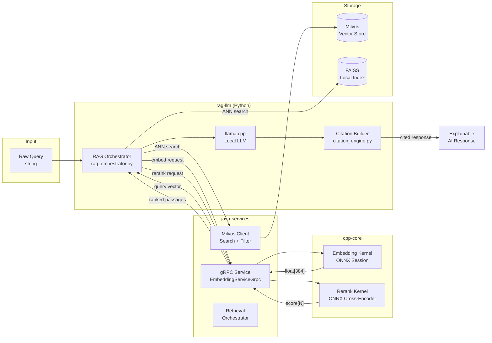

---

## 4. End-to-End RAG Pipeline

### 4.1 Query Lifecycle

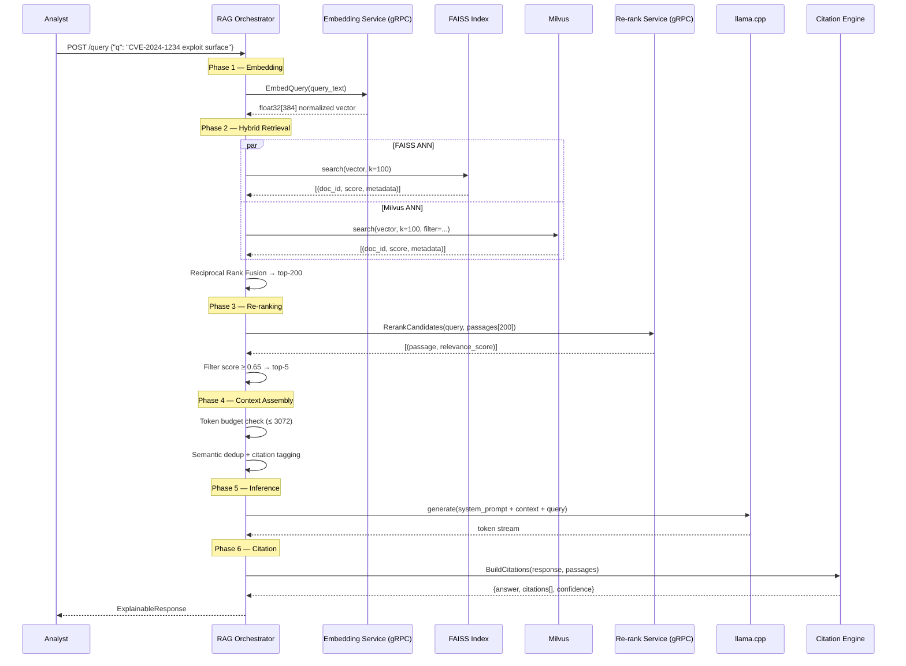

### 4.2 Orchestration State Machine

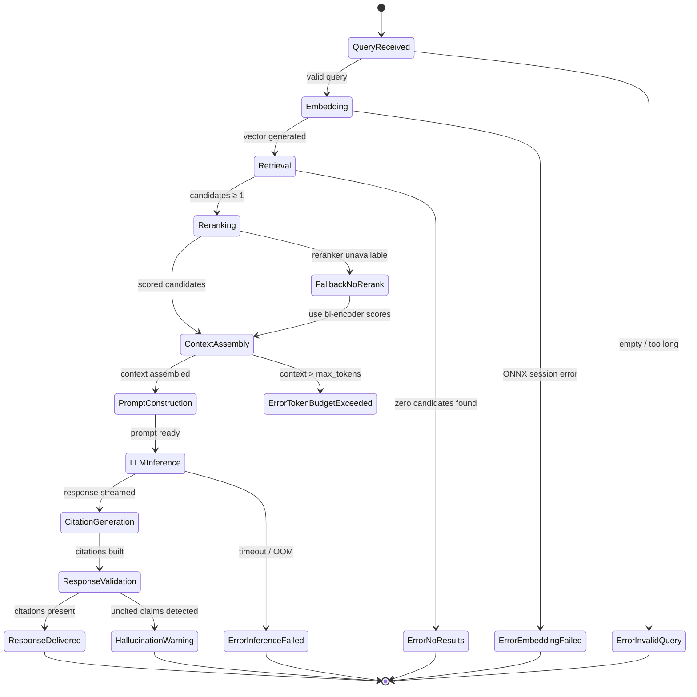

---

## 5. Document Ingestion Pipeline

### 5.1 Supported Corpus Types

| Corpus Type | Format | Metadata Fields | Priority |
|---|---|---|---|
| CVE Advisories | JSON / XML (NVD) | cve_id, cvss, cwe, published_date | Critical |
| APT Campaign Reports | PDF / Markdown | actor, campaign, ttps, target_sector | High |
| MITRE ATT&CK | JSON (STIX) | technique_id, tactic, platform, mitigations | High |
| SIEM Log Excerpts | Plain text / JSON | source_ip, timestamp, log_level, rule_id | Medium |
| Threat Intel Feeds | STIX / TAXII | ioc_type, confidence, tlp, source | High |
| Research Papers | PDF / Markdown | title, authors, venue, year | Low |

### 5.2 Ingestion Architecture

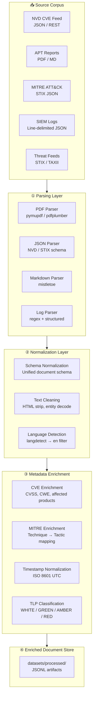

### 5.3 Unified Document Schema

```python
# ingestion/schema.py

from dataclasses import dataclass, field
from typing import Optional
from datetime import datetime

@dataclass
class ThreatDocument:
    doc_id: str                          # UUID v4
    source_type: str                     # cve | apt_report | mitre | log | feed
    source_url: Optional[str]            # Original URL or file path
    title: str
    body: str                            # Raw full text
    published_at: Optional[datetime]     # Publication timestamp (UTC)
    ingested_at: datetime                # Ingestion timestamp (UTC)

    # Threat intelligence metadata
    cve_id: Optional[str]                # CVE-YYYY-NNNNN
    cvss_score: Optional[float]          # 0.0 – 10.0
    cwe_id: Optional[str]                # CWE-NNN
    mitre_techniques: list[str] = field(default_factory=list)  # T1234.001
    threat_actors: list[str] = field(default_factory=list)
    affected_products: list[str] = field(default_factory=list)
    tlp_level: str = "WHITE"             # WHITE | GREEN | AMBER | RED

    # Processing state
    chunk_count: int = 0
    embedding_model: Optional[str] = None
    embedding_dim: Optional[int] = None
```

### 5.4 Ingestion Pipeline Code

```python
# ingestion/pipeline.py

import asyncio
from pathlib import Path
from ingestion.parsers import CveParser, AptReportParser, MitreParser
from ingestion.chunker import SlidingWindowChunker
from ingestion.metadata_extractor import MetadataExtractor

class IngestionPipeline:
    def __init__(self, config: dict):
        self.chunker = SlidingWindowChunker(
            window_size=config["chunk_size"],         # 512 tokens
            overlap=config["chunk_overlap"],          # 64 tokens
        )
        self.meta_extractor = MetadataExtractor()
        self.parsers = {
            "cve": CveParser(),
            "apt_report": AptReportParser(),
            "mitre": MitreParser(),
        }

    async def ingest(self, source_path: Path, source_type: str) -> list[dict]:
        # 1. Parse raw source
        parser = self.parsers[source_type]
        documents = await parser.parse(source_path)

        # 2. Enrich metadata
        documents = [self.meta_extractor.enrich(doc) for doc in documents]

        # 3. Chunk
        chunks = []
        for doc in documents:
            doc_chunks = self.chunker.chunk(doc)
            chunks.extend(doc_chunks)

        return chunks
```

---

## 6. Chunking & Context Window Strategy

### 6.1 Chunking Architecture Philosophy

Chunk design is one of the highest-leverage decisions in a RAG system. Chunks that are too large dilute relevance by combining unrelated content. Chunks that are too small lose contextual coherence and produce fragmented, unusable retrieved passages. ThreatAtlas uses a metadata-aware sliding window strategy calibrated for the retrieval granularity of threat intelligence artifacts.

### 6.2 Sliding Window Parameters

| Parameter | Default | Rationale |
|---|---|---|
| `window_size` | 512 tokens | Fits within re-ranker context limit; coherent for threat intel passages |
| `overlap` | 64 tokens | Prevents critical context loss at chunk boundaries |
| `min_chunk_tokens` | 32 tokens | Drop fragments shorter than a coherent sentence |
| `max_chunks_per_doc` | 512 | Cap memory usage for very long documents |
| `metadata_injection` | True | Prepend source metadata to each chunk body |

### 6.3 Chunk Lifecycle Diagram

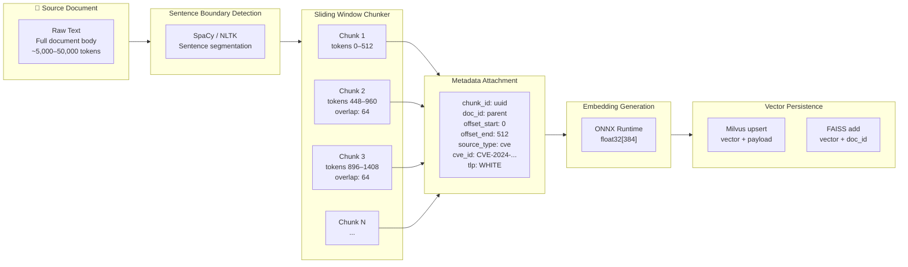

### 6.4 Chunk Implementation

```python
# ingestion/chunker.py

from dataclasses import dataclass
import uuid
from transformers import AutoTokenizer

@dataclass
class Chunk:
    chunk_id: str
    doc_id: str
    body: str
    token_count: int
    offset_start: int
    offset_end: int
    metadata: dict

class SlidingWindowChunker:
    def __init__(self, window_size: int = 512, overlap: int = 64,
                 model_name: str = "sentence-transformers/all-MiniLM-L6-v2"):
        self.window_size = window_size
        self.overlap = overlap
        self.stride = window_size - overlap
        self.tokenizer = AutoTokenizer.from_pretrained(model_name)

    def chunk(self, document) -> list[Chunk]:
        tokens = self.tokenizer.encode(document.body, add_special_tokens=False)
        chunks = []
        offset = 0

        while offset < len(tokens):
            end = min(offset + self.window_size, len(tokens))
            window_tokens = tokens[offset:end]

            # Skip fragments below minimum coherent length
            if len(window_tokens) < 32:
                break

            chunk_text = self.tokenizer.decode(window_tokens, skip_special_tokens=True)

            chunk = Chunk(
                chunk_id=str(uuid.uuid4()),
                doc_id=document.doc_id,
                body=f"[{document.source_type.upper()} | {document.cve_id or document.title}] {chunk_text}",
                token_count=len(window_tokens),
                offset_start=offset,
                offset_end=end,
                metadata={
                    "doc_id": document.doc_id,
                    "source_type": document.source_type,
                    "cve_id": document.cve_id,
                    "cvss_score": document.cvss_score,
                    "mitre_techniques": document.mitre_techniques,
                    "tlp_level": document.tlp_level,
                    "published_at": document.published_at.isoformat() if document.published_at else None,
                }
            )
            chunks.append(chunk)
            offset += self.stride

        return chunks
```

---

## 7. Embedding Generation Architecture

### 7.1 Embedding Model Selection

ThreatAtlas uses `sentence-transformers/all-MiniLM-L6-v2` as the default bi-encoder embedding model, exported to ONNX format and executed via ONNX Runtime for maximum inference efficiency and portability. The model produces 384-dimensional L2-normalized vectors optimized for cosine similarity search.

| Property | Value |
|---|---|
| Model | `all-MiniLM-L6-v2` (ONNX) |
| Embedding Dim | 384 |
| Max Input Tokens | 512 |
| Similarity Metric | Cosine (L2 normalized dot product) |
| Inference Backend | ONNX Runtime (C++ via JNI) |
| Batch Size | 32 (ingestion) / 1 (query time) |
| Execution Provider | CPUExecutionProvider / CUDAExecutionProvider |

### 7.2 Embedding Pipeline

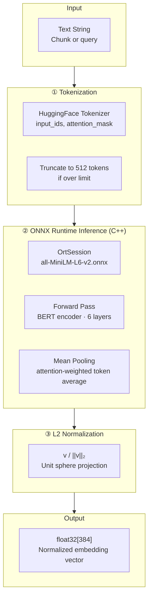

### 7.3 C++ Embedding Kernel

```cpp
// cpp-core/src/embedding/embedding_kernel.cpp

#include "threatatlas/embedding.h"
#include <onnxruntime/core/session/onnxruntime_cxx_api.h>
#include <numeric>
#include <cmath>

namespace threatatlas {

EmbeddingKernel::EmbeddingKernel(const std::string& model_path) {
    env_ = std::make_unique<Ort::Env>(ORT_LOGGING_LEVEL_WARNING, "ThreatAtlas");
    Ort::SessionOptions session_opts;
    session_opts.SetIntraOpNumThreads(4);
    session_opts.SetGraphOptimizationLevel(GraphOptimizationLevel::ORT_ENABLE_ALL);
    session_ = std::make_unique<Ort::Session>(*env_, model_path.c_str(), session_opts);
}

std::vector<float> EmbeddingKernel::embed(
    const std::vector<int64_t>& input_ids,
    const std::vector<int64_t>& attention_mask
) {
    // Prepare input tensors
    auto memory_info = Ort::MemoryInfo::CreateCpu(OrtArenaAllocator, OrtMemTypeDefault);
    std::vector<int64_t> shape = {1, static_cast<int64_t>(input_ids.size())};

    Ort::Value input_ids_tensor = Ort::Value::CreateTensor<int64_t>(
        memory_info, const_cast<int64_t*>(input_ids.data()), input_ids.size(),
        shape.data(), shape.size());

    Ort::Value attention_mask_tensor = Ort::Value::CreateTensor<int64_t>(
        memory_info, const_cast<int64_t*>(attention_mask.data()), attention_mask.size(),
        shape.data(), shape.size());

    // Run inference
    std::vector<const char*> input_names  = {"input_ids", "attention_mask"};
    std::vector<const char*> output_names = {"last_hidden_state"};
    std::vector<Ort::Value> inputs;
    inputs.push_back(std::move(input_ids_tensor));
    inputs.push_back(std::move(attention_mask_tensor));

    auto outputs = session_->Run(
        Ort::RunOptions{nullptr},
        input_names.data(), inputs.data(), inputs.size(),
        output_names.data(), output_names.size()
    );

    // Mean pool over sequence dimension
    auto* raw = outputs[0].GetTensorData<float>();
    size_t seq_len = input_ids.size();
    size_t hidden_dim = 384;
    std::vector<float> embedding(hidden_dim, 0.0f);

    int valid_tokens = 0;
    for (size_t t = 0; t < seq_len; ++t) {
        if (attention_mask[t] == 1) {
            for (size_t d = 0; d < hidden_dim; ++d)
                embedding[d] += raw[t * hidden_dim + d];
            ++valid_tokens;
        }
    }
    for (auto& v : embedding) v /= valid_tokens;

    // L2 normalize
    float norm = std::sqrt(std::inner_product(embedding.begin(), embedding.end(), embedding.begin(), 0.0f));
    if (norm > 1e-8f)
        for (auto& v : embedding) v /= norm;

    return embedding;
}

} // namespace threatatlas
```

---

## 8. Hybrid Retrieval Workflow

### 8.1 Retrieval Architecture

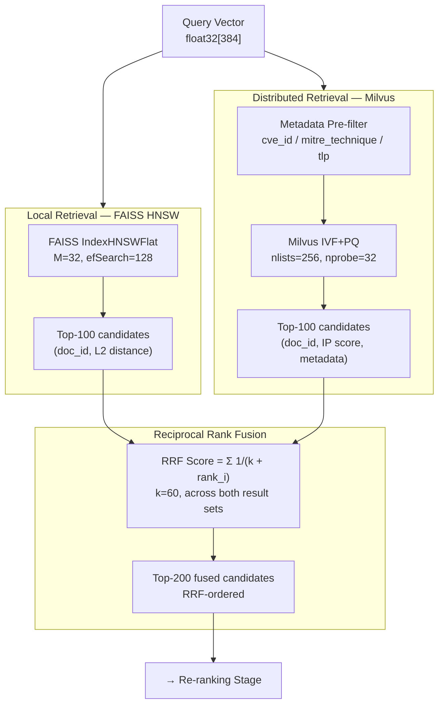

### 8.2 FAISS Index Configuration

```python
# retrieval/faiss_index.py

import faiss
import numpy as np

class FAISSRetriever:
    def __init__(self, dim: int = 384, M: int = 32, ef_construction: int = 200):
        self.dim = dim
        # HNSW: logarithmic search time, no training required
        self.index = faiss.IndexHNSWFlat(dim, M)
        self.index.hnsw.efConstruction = ef_construction
        self.doc_ids: list[str] = []

    def add(self, vectors: np.ndarray, doc_ids: list[str]):
        assert vectors.shape[1] == self.dim
        self.index.add(vectors.astype(np.float32))
        self.doc_ids.extend(doc_ids)

    def search(self, query: np.ndarray, k: int = 100, ef_search: int = 128) -> list[dict]:
        self.index.hnsw.efSearch = ef_search
        distances, indices = self.index.search(query.reshape(1, -1).astype(np.float32), k)
        results = []
        for dist, idx in zip(distances[0], indices[0]):
            if idx != -1:
                results.append({
                    "doc_id": self.doc_ids[idx],
                    "score": float(1.0 / (1.0 + dist)),  # distance → similarity
                    "source": "faiss"
                })
        return results
```

### 8.3 Reciprocal Rank Fusion

```python
# retrieval/fusion.py

def reciprocal_rank_fusion(
    result_lists: list[list[dict]],
    k: int = 60
) -> list[dict]:
    """
    Combine multiple ranked result lists into a single fused ranking.
    RRF score = Σ 1 / (k + rank_i) across all lists.
    """
    scores: dict[str, float] = {}
    doc_metadata: dict[str, dict] = {}

    for result_list in result_lists:
        for rank, result in enumerate(result_list, start=1):
            doc_id = result["doc_id"]
            scores[doc_id] = scores.get(doc_id, 0.0) + 1.0 / (k + rank)
            doc_metadata[doc_id] = result  # preserve metadata from last seen

    fused = sorted(scores.items(), key=lambda x: x[1], reverse=True)
    return [
        {**doc_metadata[doc_id], "rrf_score": score}
        for doc_id, score in fused
    ]
```

---

## 9. Re-ranking Pipeline

### 9.1 Why Bi-Encoder Retrieval Needs Re-ranking

Bi-encoder models (sentence-transformers) encode query and document independently, enabling fast approximate nearest neighbor search. However, this independence is a precision trade-off: the model cannot attend to fine-grained query-document interactions during encoding. Cross-encoder models process query and document jointly, enabling full attention-based relevance scoring at the cost of quadratic complexity — making them infeasible for full-corpus search but ideal for re-ranking a small candidate set.

ThreatAtlas uses a two-stage retrieval architecture: bi-encoder for fast candidate recall (top-200), cross-encoder for precise relevance scoring (top-5 from top-200).

### 9.2 Re-ranking Architecture

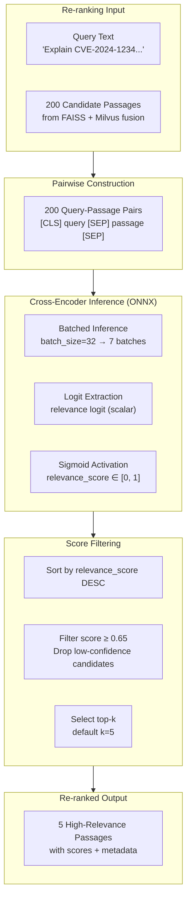

### 9.3 Re-ranking Score Comparison

| Stage | Candidate Count | Score Type | Precision Level |
|---|---|---|---|
| FAISS ANN | 100 | L2 distance (approximate) | Low |
| Milvus ANN | 100 | Inner product (approximate) | Low |
| RRF Fusion | 200 (deduplicated) | RRF score | Medium |
| Cross-Encoder | 200 → 5 | Relevance score [0,1] | High |

### 9.4 Cross-Encoder Reranker

```python
# retrieval/reranker.py

import numpy as np
from transformers import AutoTokenizer
import onnxruntime as ort

class OnnxCrossEncoderReranker:
    def __init__(self, model_path: str,
                 model_name: str = "cross-encoder/ms-marco-MiniLM-L-6-v2"):
        self.tokenizer = AutoTokenizer.from_pretrained(model_name)
        self.session = ort.InferenceSession(
            model_path,
            providers=["CUDAExecutionProvider", "CPUExecutionProvider"]
        )
        self.threshold = 0.65

    def rerank(self, query: str, passages: list[dict],
               batch_size: int = 32) -> list[dict]:
        texts = [(query, p["body"]) for p in passages]
        all_scores = []

        for i in range(0, len(texts), batch_size):
            batch = texts[i:i + batch_size]
            encoded = self.tokenizer.batch_encode_plus(
                batch, padding=True, truncation=True,
                max_length=512, return_tensors="np"
            )
            logits = self.session.run(
                ["logits"],
                {
                    "input_ids": encoded["input_ids"].astype(np.int64),
                    "attention_mask": encoded["attention_mask"].astype(np.int64),
                }
            )[0]
            scores = 1.0 / (1.0 + np.exp(-logits[:, 0]))  # sigmoid
            all_scores.extend(scores.tolist())

        # Attach scores and filter
        scored = [
            {**p, "rerank_score": score}
            for p, score in zip(passages, all_scores)
            if score >= self.threshold
        ]
        return sorted(scored, key=lambda x: x["rerank_score"], reverse=True)
```

---

## 10. Context Assembly Engine

### 10.1 Context Assembly Architecture

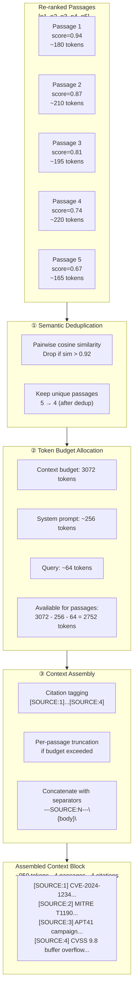

### 10.2 Token Budget Strategy

```python
# retrieval/context_assembler.py

from dataclasses import dataclass

@dataclass
class ContextAssemblyConfig:
    max_context_tokens: int = 3072
    system_prompt_reserve: int = 256
    query_reserve: int = 64
    separator_tokens: int = 8     # per passage separator overhead
    min_passage_tokens: int = 50  # don't include fragments

class ContextAssembler:
    def __init__(self, tokenizer, config: ContextAssemblyConfig = None):
        self.tokenizer = tokenizer
        self.config = config or ContextAssemblyConfig()

    @property
    def passage_budget(self) -> int:
        return (self.config.max_context_tokens
                - self.config.system_prompt_reserve
                - self.config.query_reserve)

    def assemble(self, passages: list[dict]) -> tuple[str, list[dict]]:
        """Returns (context_string, used_passages_with_citation_ids)"""
        # Dedup
        passages = self._semantic_dedup(passages)

        used = []
        budget_remaining = self.passage_budget
        context_parts = []

        for i, passage in enumerate(passages, start=1):
            token_count = len(self.tokenizer.encode(passage["body"]))
            overhead = self.config.separator_tokens

            if token_count + overhead > budget_remaining:
                # Truncate to fit
                allowed = budget_remaining - overhead
                if allowed < self.config.min_passage_tokens:
                    break
                tokens = self.tokenizer.encode(passage["body"])[:allowed]
                passage = {**passage, "body": self.tokenizer.decode(tokens)}
                token_count = allowed

            citation_id = f"SOURCE:{i}"
            context_parts.append(f"---{citation_id}---\n{passage['body']}\n")
            used.append({**passage, "citation_id": citation_id})
            budget_remaining -= (token_count + overhead)

        return "\n".join(context_parts), used

    def _semantic_dedup(self, passages: list[dict],
                        sim_threshold: float = 0.92) -> list[dict]:
        import numpy as np
        if len(passages) <= 1:
            return passages

        vectors = np.array([p["vector"] for p in passages if "vector" in p])
        if len(vectors) == 0:
            return passages

        keep = [True] * len(passages)
        for i in range(len(passages)):
            if not keep[i]:
                continue
            for j in range(i + 1, len(passages)):
                if not keep[j]:
                    continue
                if "vector" in passages[i] and "vector" in passages[j]:
                    sim = float(np.dot(passages[i]["vector"], passages[j]["vector"]))
                    if sim > sim_threshold:
                        keep[j] = False

        return [p for p, k in zip(passages, keep) if k]
```

---

## 11. Prompt Engineering Architecture

### 11.1 Prompt Construction Flow

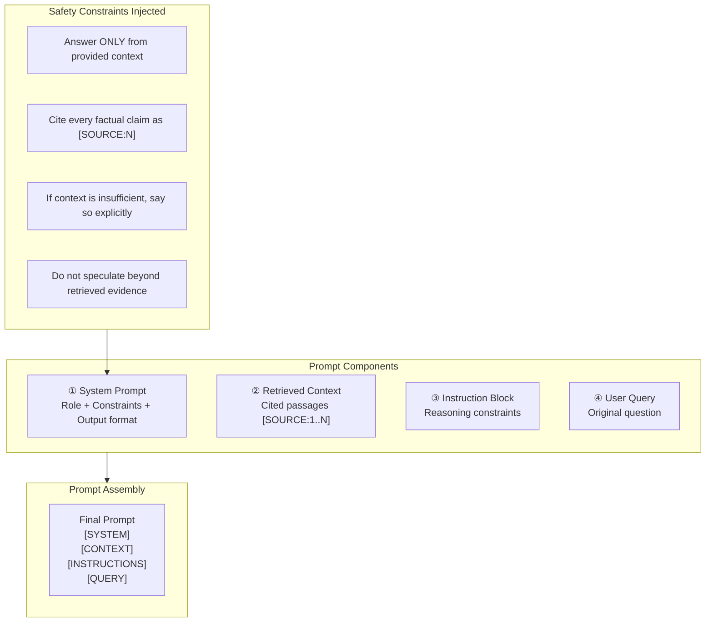

### 11.2 System Prompt Template

```
<|system|>
You are ThreatAtlas, an expert AI threat intelligence analyst.
You reason exclusively from the provided retrieved context passages.

HARD CONSTRAINTS:
1. Every factual claim MUST be cited using [SOURCE:N] notation.
2. If the context does not contain sufficient information to answer, respond:
   "The retrieved context does not contain sufficient information to answer this query confidently."
3. Do not hallucinate CVE IDs, MITRE technique IDs, threat actor names, or CVSS scores.
4. Do not reference knowledge outside the provided context passages.
5. Format your response as:
   ANSWER: <your grounded answer with inline [SOURCE:N] citations>
   CITATIONS: <list each source: [SOURCE:N] → doc_id, passage_offset, relevance_score>

OUTPUT FORMAT:
- Use structured sections: Summary, Technical Details, Mitigations (if applicable)
- Keep responses concise and actionable for security engineers
- Use MITRE ATT&CK notation where relevant (e.g., T1190 Exploit Public-Facing Application)
<|end|>
```

### 11.3 Full Prompt Structure

```
<|system|>
{system_prompt}
<|end|>

<|context|>
RETRIEVED THREAT INTELLIGENCE CONTEXT
======================================
{assembled_context}

[SOURCE:1] relevance_score=0.94 | doc_id=abc123 | type=cve | cve_id=CVE-2024-1234
...PASSAGE TEXT...

[SOURCE:2] relevance_score=0.87 | doc_id=def456 | type=mitre | technique=T1190
...PASSAGE TEXT...
<|end|>

<|instructions|>
Analyze the following analyst query using ONLY the context passages above.
Cite every factual claim. Flag any gaps in retrieved coverage.
<|end|>

<|user|>
{user_query}
<|end|>

<|assistant|>
```

### 11.4 Prompt Construction Implementation

```python
# retrieval/prompt_builder.py

class ThreatAtlasPromptBuilder:
    SYSTEM_PROMPT = """You are ThreatAtlas, an expert AI threat intelligence analyst.
You reason exclusively from the provided retrieved context passages.

HARD CONSTRAINTS:
1. Every factual claim MUST be cited using [SOURCE:N] notation.
2. If context is insufficient, state this explicitly.
3. Do not hallucinate CVE IDs, MITRE IDs, threat actor names, or CVSS scores.
4. Format: ANSWER: <grounded answer> | CITATIONS: <source list>
"""

    def build(self, query: str, context: str, passages: list[dict]) -> str:
        citation_block = "\n".join([
            f"[{p['citation_id']}] score={p['rerank_score']:.2f} | "
            f"doc_id={p['metadata']['doc_id']} | "
            f"type={p['metadata']['source_type']} | "
            f"cve={p['metadata'].get('cve_id', 'N/A')}"
            for p in passages
        ])

        return (
            f"<|system|>\n{self.SYSTEM_PROMPT}<|end|>\n\n"
            f"<|context|>\nRETRIEVED CONTEXT\n{'='*40}\n"
            f"{context}\n\nSOURCE INDEX:\n{citation_block}\n<|end|>\n\n"
            f"<|instructions|>\nAnalyze using ONLY the context above. "
            f"Cite every claim. Flag gaps.\n<|end|>\n\n"
            f"<|user|>\n{query}\n<|end|>\n\n"
            f"<|assistant|>\n"
        )
```

---

## 12. llama.cpp Orchestration

### 12.1 Local Inference Architecture

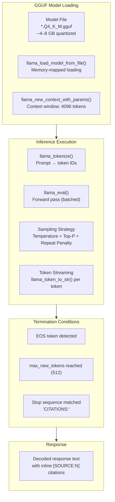

### 12.2 Quantization Strategy

| Quantization | Model Size | RAM Required | Quality Loss | Use Case |
|---|---|---|---|---|
| Q8_0 | ~7 GB | ~8 GB | Minimal | High-RAM workstations |
| Q4_K_M | ~4 GB | ~5 GB | Low | Default deployment |
| Q3_K_M | ~3 GB | ~4 GB | Moderate | Low-RAM edge nodes |
| Q2_K | ~2 GB | ~3 GB | High | Extreme resource constraint |

**Recommended**: `Q4_K_M` — optimal quality/size/latency for CPU-only threat intelligence reasoning.

### 12.3 llama.cpp Python Wrapper

```python
# llm/llamacpp_wrapper.py

from llama_cpp import Llama
from dataclasses import dataclass
from typing import Iterator

@dataclass
class InferenceConfig:
    model_path: str
    n_ctx: int = 4096           # Context window
    n_threads: int = 8          # CPU threads
    n_gpu_layers: int = 0       # 0 = CPU-only; set >0 for GPU offload
    temperature: float = 0.1    # Low temp for factual responses
    top_p: float = 0.9
    repeat_penalty: float = 1.1
    max_new_tokens: int = 512
    stop_sequences: list = None

class LlamaCppOrchestrator:
    def __init__(self, config: InferenceConfig):
        self.config = config
        self.llm = Llama(
            model_path=config.model_path,
            n_ctx=config.n_ctx,
            n_threads=config.n_threads,
            n_gpu_layers=config.n_gpu_layers,
            verbose=False,
        )

    def generate(self, prompt: str) -> str:
        response = self.llm(
            prompt,
            max_tokens=self.config.max_new_tokens,
            temperature=self.config.temperature,
            top_p=self.config.top_p,
            repeat_penalty=self.config.repeat_penalty,
            stop=self.config.stop_sequences or ["<|end|>", "<|user|>"],
            echo=False,
        )
        return response["choices"][0]["text"].strip()

    def stream(self, prompt: str) -> Iterator[str]:
        for chunk in self.llm(
            prompt,
            max_tokens=self.config.max_new_tokens,
            temperature=self.config.temperature,
            stream=True,
            stop=["<|end|>", "<|user|>"],
            echo=False,
        ):
            token = chunk["choices"][0]["text"]
            yield token
```

---

## 13. Citation & Explainability Pipeline

### 13.1 Citation Architecture

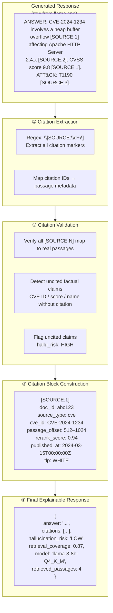

### 13.2 Citation Engine Implementation

```python
# retrieval/citation_engine.py

import re
from dataclasses import dataclass, field
from typing import Optional

@dataclass
class Citation:
    citation_id: str           # SOURCE:1
    doc_id: str
    source_type: str
    cve_id: Optional[str]
    passage_offset_start: int
    passage_offset_end: int
    rerank_score: float
    published_at: Optional[str]
    tlp_level: str
    body_preview: str          # First 200 chars of passage

@dataclass
class ExplainableResponse:
    answer: str
    citations: list[Citation]
    hallucination_risk: str    # LOW | MEDIUM | HIGH
    retrieval_coverage: float  # 0.0 – 1.0
    uncited_claims: list[str]
    model_id: str
    retrieved_passage_count: int
    total_context_tokens: int

ENTITY_PATTERNS = [
    r"CVE-\d{4}-\d{4,7}",           # CVE IDs
    r"T\d{4}(?:\.\d{3})?",          # MITRE ATT&CK techniques
    r"CVSS(?:\s+score)?\s+\d+\.\d+", # CVSS scores
    r"[A-Z][A-Za-z0-9\-]+\s+(?:APT|Group|Actor)", # Threat actors
]

class CitationEngine:
    def build(self, raw_response: str, passages: list[dict],
              model_id: str) -> ExplainableResponse:
        # Extract citation markers
        cited_ids = set(re.findall(r"\[SOURCE:(\d+)\]", raw_response))

        # Build citation objects
        citations = []
        for passage in passages:
            cid = passage["citation_id"].replace("SOURCE:", "")
            if cid in cited_ids:
                citations.append(Citation(
                    citation_id=passage["citation_id"],
                    doc_id=passage["metadata"]["doc_id"],
                    source_type=passage["metadata"]["source_type"],
                    cve_id=passage["metadata"].get("cve_id"),
                    passage_offset_start=passage.get("offset_start", 0),
                    passage_offset_end=passage.get("offset_end", 0),
                    rerank_score=passage.get("rerank_score", 0.0),
                    published_at=passage["metadata"].get("published_at"),
                    tlp_level=passage["metadata"].get("tlp_level", "WHITE"),
                    body_preview=passage["body"][:200],
                ))

        # Detect uncited factual claims
        uncited = self._detect_uncited(raw_response)
        hallu_risk = "HIGH" if len(uncited) > 2 else "MEDIUM" if uncited else "LOW"
        coverage = len(cited_ids) / max(len(passages), 1)

        return ExplainableResponse(
            answer=raw_response,
            citations=citations,
            hallucination_risk=hallu_risk,
            retrieval_coverage=coverage,
            uncited_claims=uncited,
            model_id=model_id,
            retrieved_passage_count=len(passages),
            total_context_tokens=0,  # populated by orchestrator
        )

    def _detect_uncited(self, text: str) -> list[str]:
        uncited = []
        for pattern in ENTITY_PATTERNS:
            for match in re.finditer(pattern, text):
                entity = match.group(0)
                # Check if followed by a citation within 50 chars
                remainder = text[match.end():match.end() + 50]
                if not re.search(r"\[SOURCE:\d+\]", remainder):
                    uncited.append(entity)
        return uncited
```

---

## 14. Hallucination Mitigation Strategy

### 14.1 Defense-in-Depth Hallucination Prevention

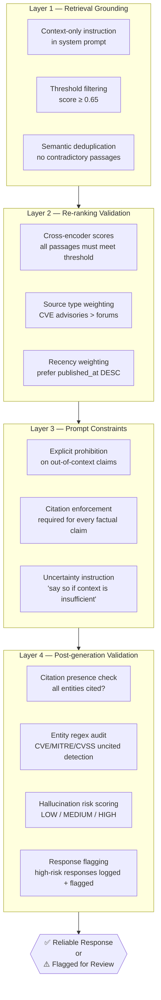

### 14.2 Hallucination Risk Thresholds

| Risk Level | Condition | Action |
|---|---|---|
| LOW | All entities cited, retrieval_coverage ≥ 0.8 | Deliver response |
| MEDIUM | 1–2 uncited entities OR coverage 0.5–0.8 | Deliver with warning |
| HIGH | ≥ 3 uncited entities OR coverage < 0.5 | Flag for human review; optionally withhold |

---

## 15. Performance Optimization

### 15.1 End-to-End Latency Budget

| Stage | Target Latency | Optimization Lever |
|---|---|---|
| Embedding (ONNX) | ≤ 15ms | ONNX graph optimization, INT8 quantization |
| FAISS HNSW search | ≤ 10ms | efSearch tuning, index pre-warming |
| Milvus search | ≤ 50ms | nprobe tuning, GPU index |
| RRF fusion | ≤ 5ms | In-memory sort, pre-allocated buffers |
| Cross-encoder (ONNX) | ≤ 150ms | Batch size 32, INT8 ONNX, CUDA EP |
| Context assembly | ≤ 5ms | Tokenizer caching, pre-allocated strings |
| Prompt construction | ≤ 2ms | Template pre-compilation |
| llama.cpp inference | ≤ 5s | Q4_K_M quant, thread tuning, GPU offload |
| Citation generation | ≤ 10ms | Regex pre-compilation |
| **Total pipeline** | **≤ 6s** | |

### 15.2 Optimization Architecture

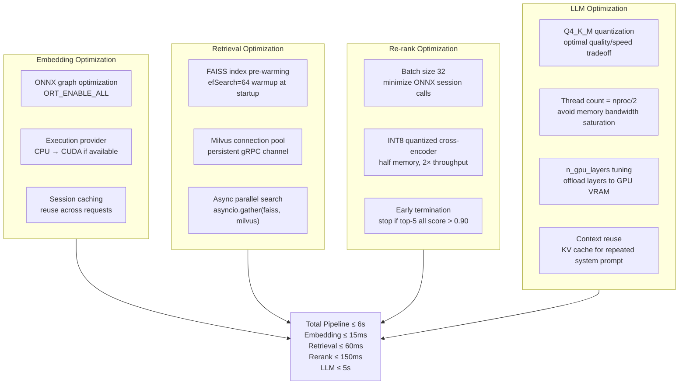

---

## 16. Evaluation & Diagnostics

### 16.1 Evaluation Framework

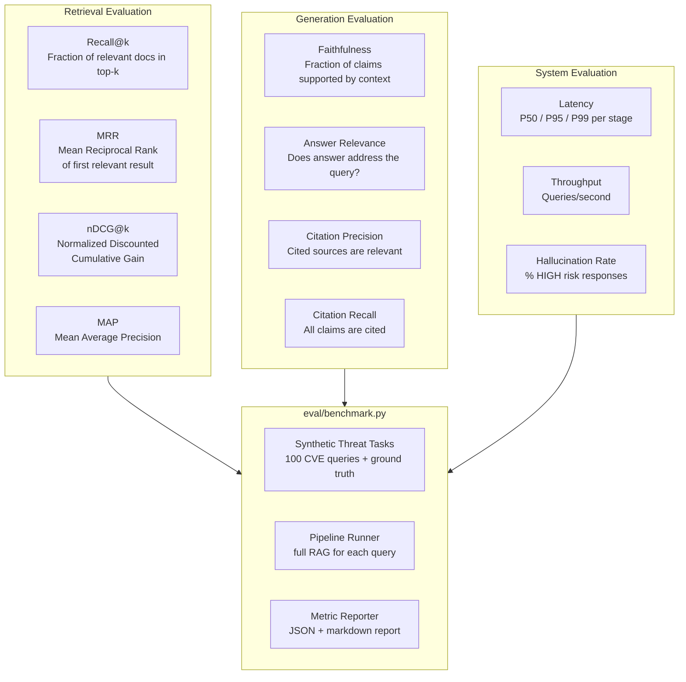

### 16.2 Benchmark Implementation

```python
# eval/benchmark.py

from dataclasses import dataclass
import json
from pathlib import Path

@dataclass
class BenchmarkResult:
    recall_at_1: float
    recall_at_5: float
    recall_at_10: float
    mrr: float
    faithfulness: float
    hallucination_rate: float
    p50_latency_ms: float
    p95_latency_ms: float
    p99_latency_ms: float

def recall_at_k(retrieved_ids: list[str], relevant_ids: set[str], k: int) -> float:
    return len(set(retrieved_ids[:k]) & relevant_ids) / max(len(relevant_ids), 1)

def mean_reciprocal_rank(retrieved_ids: list[str], relevant_ids: set[str]) -> float:
    for rank, doc_id in enumerate(retrieved_ids, start=1):
        if doc_id in relevant_ids:
            return 1.0 / rank
    return 0.0

def run_benchmark(pipeline, test_set_path: Path) -> BenchmarkResult:
    import time
    import numpy as np

    test_cases = json.loads(test_set_path.read_text())
    recalls_1, recalls_5, recalls_10, mrrs = [], [], [], []
    faithfulness_scores, hallu_flags = [], []
    latencies = []

    for case in test_cases:
        query = case["query"]
        relevant_ids = set(case["relevant_doc_ids"])

        t0 = time.perf_counter()
        result = pipeline.query(query)
        latency_ms = (time.perf_counter() - t0) * 1000

        retrieved_ids = [p["metadata"]["doc_id"] for p in result.retrieved_passages]

        recalls_1.append(recall_at_k(retrieved_ids, relevant_ids, 1))
        recalls_5.append(recall_at_k(retrieved_ids, relevant_ids, 5))
        recalls_10.append(recall_at_k(retrieved_ids, relevant_ids, 10))
        mrrs.append(mean_reciprocal_rank(retrieved_ids, relevant_ids))
        faithfulness_scores.append(result.retrieval_coverage)
        hallu_flags.append(1 if result.hallucination_risk == "HIGH" else 0)
        latencies.append(latency_ms)

    latencies_arr = np.array(latencies)
    return BenchmarkResult(
        recall_at_1=float(np.mean(recalls_1)),
        recall_at_5=float(np.mean(recalls_5)),
        recall_at_10=float(np.mean(recalls_10)),
        mrr=float(np.mean(mrrs)),
        faithfulness=float(np.mean(faithfulness_scores)),
        hallucination_rate=float(np.mean(hallu_flags)),
        p50_latency_ms=float(np.percentile(latencies_arr, 50)),
        p95_latency_ms=float(np.percentile(latencies_arr, 95)),
        p99_latency_ms=float(np.percentile(latencies_arr, 99)),
    )
```

---

## 17. Deployment & Operational Workflow

### 17.1 Deployment Topology

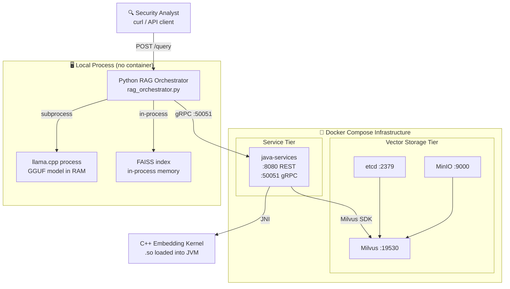

### 17.2 Startup Sequence

```bash
# ── Step 1: Start vector infrastructure ──────────────────────────────────────
docker compose up -d
docker compose ps   # All services healthy

# ── Step 2: Build C++ embedding kernel ───────────────────────────────────────
cd cpp-core && cmake -B build -G Ninja -DCMAKE_BUILD_TYPE=Release
cmake --build build && cd ..

# ── Step 3: Start Java service ────────────────────────────────────────────────
cd java-services && mvn spring-boot:run &
curl http://localhost:8080/health    # {"status":"UP"}

# ── Step 4: Activate Python environment ──────────────────────────────────────
cd rag-llm && source .venv/bin/activate

# ── Step 5: Run ingestion pipeline ───────────────────────────────────────────
python ingestion/pipeline.py \
  --input ../datasets/raw/ \
  --output ../datasets/processed/ \
  --source-type cve

# ── Step 6: Build FAISS index ─────────────────────────────────────────────────
python retrieval/build_index.py \
  --input ../datasets/processed/ \
  --index-path ../datasets/faiss.index

# ── Step 7: Query ─────────────────────────────────────────────────────────────
python rag_orchestrator.py \
  --query "Explain the attack surface of CVE-2024-1234" \
  --model-path ../models/llama-3-8b-q4_k_m.gguf \
  --faiss-index ../datasets/faiss.index \
  --top-k 5
```

---

## 18. Security & Reliability

### 18.1 Local-First Deployment Model

ThreatAtlas enforces a strict local-first deployment architecture. No query, no document, no embedding, and no generated response traverses an external network boundary. The entire RAG pipeline — from ingestion through LLM inference — executes within the operator's infrastructure perimeter.

This is not a product limitation; it is a security design requirement for threat intelligence operations. CVE analysis, APT campaign intelligence, and SIEM log reasoning may involve sensitive operational data classified at AMBER or RED TLP levels. Local-first inference ensures that no threat intelligence corpus is exposed to third-party AI API providers.

### 18.2 Security Architecture

| Component | Security Control |
|---|---|
| LLM Inference | llama.cpp local process — no external API calls |
| Embedding Model | ONNX model file — no external model loading |
| Vector Store | Milvus in Docker — network-isolated |
| TLP Enforcement | Metadata-filtered retrieval — RED TLP excluded by default |
| Model Files | Air-gapped download — SHA256 checksum verified |
| API Surface | localhost-only binding by default |

### 18.3 Operational Resilience

| Failure Mode | Detection | Recovery |
|---|---|---|
| Milvus connection lost | gRPC health check | Fallback to FAISS-only retrieval |
| ONNX session error | try/catch + metric | Re-initialize session; alert |
| llama.cpp OOM | Process exit code | Reduce n_ctx; restart with smaller model |
| FAISS index corruption | Checksum mismatch | Rebuild from processed dataset |
| Disk full (Milvus) | MinIO health check | Alert; pause ingestion |

---

## 19. Future RAG Roadmap

### 19.1 Phase Roadmap

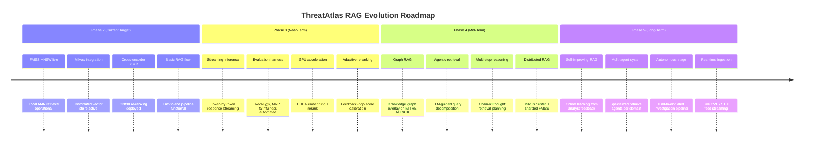

### 19.2 Graph RAG Architecture Preview

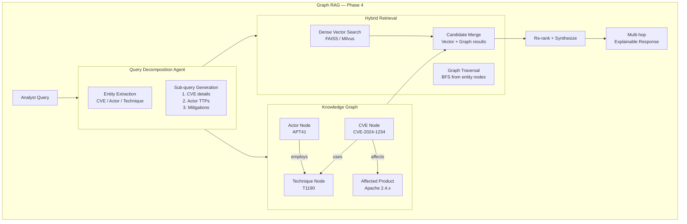

### 19.3 Agentic Retrieval Preview

Future agentic retrieval will enable the orchestrator to issue multiple retrieval rounds, where the LLM evaluates intermediate results and formulates follow-up queries before final generation. This enables multi-hop reasoning chains such as:

1. Retrieve CVE details → identify affected product
2. Retrieve APT actors known to exploit this product class → identify campaign context
3. Retrieve MITRE mitigations for the identified techniques → generate actionable remediation

---

## 20. Final Engineering Notes

### AI Infrastructure Philosophy

ThreatAtlas represents a deliberate architectural stance: AI systems operating in high-stakes security environments must be explainable, auditable, and local-first by design. The RAG architecture described in this runbook is not a convenience wrapper around a language model. It is a precision retrieval system that uses the LLM as a reasoning synthesizer over verified evidence — not as a knowledge oracle.

Every design decision in this runbook — the threshold-filtered re-ranking, the citation enforcement, the hallucination risk scoring, the local llama.cpp inference, the metadata-enriched chunking — reflects a single engineering conviction: in security operations, the cost of a wrong answer is measured in breaches, not in user experience.

### Explainable AI Principles

The citation architecture in ThreatAtlas implements a practical form of explainable AI. It does not require interpretability research or model transparency. It requires engineering discipline: every claim is attributed, every source is traceable, and every response carries a confidence signal that reflects retrieval quality. Security engineers can interrogate any generated output, pull up the source passages, and independently verify the reasoning. This is explainability at the operational layer.

### Scalable Retrieval Systems Mindset

The retrieval architecture is designed to scale without structural redesign. Adding a new corpus type requires a new parser and chunker — not a new retrieval system. Scaling from local FAISS to distributed Milvus cluster requires a configuration change — not a code rewrite. Adding GPU-accelerated embedding requires a CMake flag and ONNX execution provider switch — not a new inference framework. This is the compound dividend of infrastructure-first engineering.

### Future AI-Native Infrastructure Direction

The trajectory of ThreatAtlas leads toward a fully agentic threat intelligence platform: a system capable of autonomously ingesting new threat feeds, identifying knowledge gaps, issuing targeted retrieval queries, updating its vector index incrementally, and generating proactive threat assessments without analyst prompting. The RAG architecture described here is the foundation of that system. Every component is a building block toward autonomous, explainable, local-first AI-native threat intelligence.

---

<div align="center">

---

*Designed & Engineered by **Kunjkumar Savani***

*ThreatAtlas · RAG Infrastructure Runbook · docs/runbook_rag.md*

---

</div>
